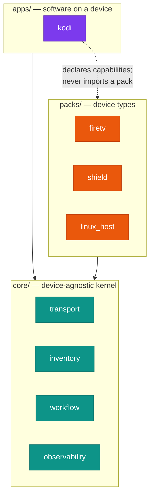

<h1 align="center">fleetctl</h1>

<p align="center">
  <em>Plugin-based fleet management for the devices around your house —<br>
  Fire TV sticks, NVIDIA Shields, PCs — plus the software running on them.</em>
</p>

<p align="center">
  <a href="https://github.com/salvuswarez/fleetctl/actions/workflows/ci.yml"></a>
  <a href="LICENSE"></a>
  
  
  
  
</p>

> [!IMPORTANT]
> **Status: pre-alpha.** The architecture is settled (see
> [docs/architecture.md](docs/architecture.md)); the implementation is being
> built in stages. Nothing here manages a real device yet.

## Why

`fleetctl` separates three things that usually get tangled together:

| Ring | Knows about | Examples |
|---|---|---|
| **core** | nothing device-specific | transport, inventory, discovery, artifacts, operations, workflows, audit |
| **packs** | what a device *is* | `firetv`, `shield`, `linux_host` |
| **apps** | software *on* a device | `kodi` |

Dependencies point inward only. An app pack never imports a device pack — it
declares the capabilities it needs (`files.push`, `exec`, `state.restore`)
and the engine resolves which pack provides them. That's what lets the same
Kodi build deploy to a Fire Stick and a Shield without either knowing the
other exists.



<details>
<summary><b>Build status by stage</b> — what exists today vs. what's planned</summary>

| Stage | Contents | Status |
|---|---|---|
| **S0** | Repo bootstrap, CI, quality gate | ✅ done |
| **S1** | Core kernel — transport, artifacts, operations, observability | ⬜ next |
| **S2** | `packs/firetv` + `apps/kodi`, hardware parity | ⬜ |
| **S3** | Config-as-code + workflows | ⬜ |
| **S4** | Policy engine + audit hardening | ⬜ |
| **S5** | `packs/shield` — validates the seams | ⬜ |
| **S6** | MCP adapter | ⬜ |
| **S7** | Home Assistant cutover | ⬜ |
| **S8** | `linux_host` / SSH, HTTP API if needed | ⬜ |

Full detail and ordering constraints: [docs/roadmap.md](docs/roadmap.md).

</details>

## Install

Requires Python 3.12+ and [uv](https://docs.astral.sh/uv/).

```bash
git clone https://github.com/salvuswarez/fleetctl.git
cd fleetctl
uv sync --all-extras
uv run fleetctl --version
```

## Development

```bash
uv sync --all-extras           # install everything, including dev tools
uv run pytest                  # tests
uv run pytest --cov=src        # with coverage
uv run black src tests         # format
uv run isort src tests         # import order
uv run mypy                    # strict type checking
uv build                       # wheel + sdist
```

CI runs all of the above on every push and pull request.

## Configuration

> [!NOTE]
> Not yet implemented — this is the settled design, landing with the config
> loader. Documented here so the shape is clear.

Config is YAML and lives under `config/`, which is **gitignored** — only
`*.example` files are tracked.

Config files hold secret *references*, never secret values:

```yaml
artifacts:
  smb:
    host: 192.168.1.50
    user: !ref env:FLEETCTL_SMB_USER
    password: !ref env:FLEETCTL_SMB_PASS
```

References resolve differently per consumer — environment variables for the
CLI, the config entry for Home Assistant, the OS keyring for a headless
runner — so a `fleet.yml` is safe to paste into a bug report.

## Safety

`fleetctl` runs destructive operations against real hardware: wiping app
profiles, disabling system packages, rebooting devices. Three things keep
that honest:

- **Effect classification.** Every step declares itself `READ`, `MUTATING`,
  or `DESTRUCTIVE`. Policy keys off the class, not a list of names.
- **Protected devices.** Devices can be marked off-limits for named steps.
- **Audit trail.** Every state-changing command is recorded — actor, target,
  outcome, duration — in an append-only, hash-chained log.

See [docs/architecture.md](docs/architecture.md) §10–§11 and
[SECURITY.md](SECURITY.md).

## Licence

MIT — see [LICENSE](LICENSE).
