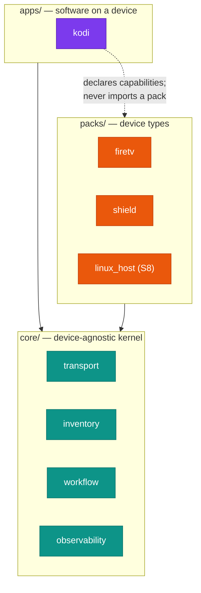

<h1 align="center">fleetctl</h1>

<p align="center">
  <em>Plugin-based fleet management for the devices around your house —<br>
  Fire TV sticks, NVIDIA Shields, PCs — plus the software running on them.</em>
</p>

<p align="center">
  <a href="https://github.com/salvuswarez/fleetctl/actions/workflows/ci.yml"></a>
  <a href="LICENSE"></a>
  
  
  
  
</p>

<sub align="center" style="display: block; text-align: center; color: #64748b;">Last verified 2026-08-02</sub>

<blockquote style="border-left: 4px solid #7ab9d5; background-color: rgba(122, 185, 213, 0.08); padding: 14px 18px; margin: 16px 0; border-radius: 10px;">

**Status:** S0–S6 are complete — `fleetctl` discovers devices, captures and rebuilds Kodi profiles, and deploys them over ADB, verified against real Fire TV hardware. S7 (Home Assistant cutover) has not started; see [`docs/roadmap.md`](docs/roadmap.md).

</blockquote>

<h2 style="border-left: 6px solid #005288; padding: 4px 0 10px 16px; margin: 40px 0 16px; border-bottom: 1px solid rgba(0, 82, 136, 0.25); background-image: url(data:image/svg+xml;utf8,%3Csvg%20xmlns%3D%27http%3A%2F%2Fwww.w3.org%2F2000%2Fsvg%27%20width%3D%27100%25%27%20height%3D%27100%25%27%3E%3Cdefs%3E%3Cpattern%20id%3D%27h%27%20width%3D%2720%27%20height%3D%2735%27%20patternUnits%3D%27userSpaceOnUse%27%3E%3Cpath%20d%3D%27M10%2023L0%2018V6L10%200l10%206v12L10%2023zm0%200v12%27%20fill%3D%27none%27%20stroke%3D%27%23005288%27%20stroke-opacity%3D%270.22%27%2F%3E%3C%2Fpattern%3E%3ClinearGradient%20id%3D%27lg%27%20x1%3D%270%25%27%20x2%3D%27100%25%27%3E%3Cstop%20offset%3D%270%25%27%20stop-color%3D%27white%27%20stop-opacity%3D%271%27%2F%3E%3Cstop%20offset%3D%2785%25%27%20stop-color%3D%27white%27%20stop-opacity%3D%270%27%2F%3E%3C%2FlinearGradient%3E%3Cmask%20id%3D%27f%27%3E%3Crect%20width%3D%27100%25%27%20height%3D%27100%25%27%20fill%3D%27url%28%23lg%29%27%2F%3E%3C%2Fmask%3E%3C%2Fdefs%3E%3Crect%20width%3D%27100%25%27%20height%3D%27100%25%27%20fill%3D%27url%28%23h%29%27%20mask%3D%27url%28%23f%29%27%2F%3E%3C%2Fsvg%3E); background-size: 100% 100%; background-repeat: no-repeat; border-radius: 3px;">Why</h2>

`fleetctl` separates three things that usually get tangled together:

| Ring | Knows about | Examples |
|---|---|---|
| **core** | nothing device-specific | transport, inventory, discovery, artifacts, operations, workflows, audit |
| **packs** | what a device *is* | `firetv`, `shield`, `linux_host` (planned S8) |
| **apps** | software *on* a device | `kodi` |

Dependencies point inward only. An app pack never imports a device pack — its steps declare the `Capability` values they need (`exec`, `files`, `state`, ...) and the engine resolves which pack on the target actually provides them. That's what lets one Kodi build deploy to a Fire Stick and a Shield without either knowing the other exists.



<details>
<summary><b>Build status by stage</b> — what exists today vs. what's planned</summary>

| Stage | Contents | Status |
|---|---|---|
| **S0** | Repo bootstrap, CI, quality gate | ✅ done |
| **S1** | Core kernel — transport, artifacts, operations, observability | ✅ done |
| **S2** | `packs/firetv` + `apps/kodi`, hardware parity | ✅ done |
| **S3** | Config-as-code + workflows | ✅ done |
| **S4** | Policy engine + audit hardening | ✅ done |
| **S5** | `packs/shield` — validates the seams | ✅ done |
| **S6** | MCP adapter | ✅ done |
| **S7** | Home Assistant cutover | ⬜ not started |
| **S8** | `linux_host` / SSH, HTTP API if needed | ⬜ not started |

Full detail and ordering constraints: [docs/roadmap.md](docs/roadmap.md).

</details>

<h2 style="border-left: 6px solid #005288; padding: 4px 0 10px 16px; margin: 40px 0 16px; border-bottom: 1px solid rgba(0, 82, 136, 0.25); background-image: url(data:image/svg+xml;utf8,%3Csvg%20xmlns%3D%27http%3A%2F%2Fwww.w3.org%2F2000%2Fsvg%27%20width%3D%27100%25%27%20height%3D%27100%25%27%3E%3Cdefs%3E%3Cpattern%20id%3D%27h%27%20width%3D%2720%27%20height%3D%2735%27%20patternUnits%3D%27userSpaceOnUse%27%3E%3Cpath%20d%3D%27M10%2023L0%2018V6L10%200l10%206v12L10%2023zm0%200v12%27%20fill%3D%27none%27%20stroke%3D%27%23005288%27%20stroke-opacity%3D%270.22%27%2F%3E%3C%2Fpattern%3E%3ClinearGradient%20id%3D%27lg%27%20x1%3D%270%25%27%20x2%3D%27100%25%27%3E%3Cstop%20offset%3D%270%25%27%20stop-color%3D%27white%27%20stop-opacity%3D%271%27%2F%3E%3Cstop%20offset%3D%2785%25%27%20stop-color%3D%27white%27%20stop-opacity%3D%270%27%2F%3E%3C%2FlinearGradient%3E%3Cmask%20id%3D%27f%27%3E%3Crect%20width%3D%27100%25%27%20height%3D%27100%25%27%20fill%3D%27url%28%23lg%29%27%2F%3E%3C%2Fmask%3E%3C%2Fdefs%3E%3Crect%20width%3D%27100%25%27%20height%3D%27100%25%27%20fill%3D%27url%28%23h%29%27%20mask%3D%27url%28%23f%29%27%2F%3E%3C%2Fsvg%3E); background-size: 100% 100%; background-repeat: no-repeat; border-radius: 3px;">Install</h2>

Requires Python 3.12+ and [uv](https://docs.astral.sh/uv/).

<div align="left" style="margin-bottom: -16px;"></div>

```bash
git clone https://github.com/salvuswarez/fleetctl.git
cd fleetctl
uv sync --all-extras
uv run fleetctl --version
```

Then see [docs/getting-started.md](docs/getting-started.md) for first-run config and pointing it at a real device.

<h2 style="border-left: 6px solid #005288; padding: 4px 0 10px 16px; margin: 40px 0 16px; border-bottom: 1px solid rgba(0, 82, 136, 0.25); background-image: url(data:image/svg+xml;utf8,%3Csvg%20xmlns%3D%27http%3A%2F%2Fwww.w3.org%2F2000%2Fsvg%27%20width%3D%27100%25%27%20height%3D%27100%25%27%3E%3Cdefs%3E%3Cpattern%20id%3D%27h%27%20width%3D%2720%27%20height%3D%2735%27%20patternUnits%3D%27userSpaceOnUse%27%3E%3Cpath%20d%3D%27M10%2023L0%2018V6L10%200l10%206v12L10%2023zm0%200v12%27%20fill%3D%27none%27%20stroke%3D%27%23005288%27%20stroke-opacity%3D%270.22%27%2F%3E%3C%2Fpattern%3E%3ClinearGradient%20id%3D%27lg%27%20x1%3D%270%25%27%20x2%3D%27100%25%27%3E%3Cstop%20offset%3D%270%25%27%20stop-color%3D%27white%27%20stop-opacity%3D%271%27%2F%3E%3Cstop%20offset%3D%2785%25%27%20stop-color%3D%27white%27%20stop-opacity%3D%270%27%2F%3E%3C%2FlinearGradient%3E%3Cmask%20id%3D%27f%27%3E%3Crect%20width%3D%27100%25%27%20height%3D%27100%25%27%20fill%3D%27url%28%23lg%29%27%2F%3E%3C%2Fmask%3E%3C%2Fdefs%3E%3Crect%20width%3D%27100%25%27%20height%3D%27100%25%27%20fill%3D%27url%28%23h%29%27%20mask%3D%27url%28%23f%29%27%2F%3E%3C%2Fsvg%3E); background-size: 100% 100%; background-repeat: no-repeat; border-radius: 3px;">Development</h2>

<div align="left" style="margin-bottom: -16px;"></div>

```bash
uv sync --all-extras           # install everything, including dev tools
uv run pytest                  # tests (500+)
uv run pytest --cov=src        # with coverage (gate: 90%)
uv run black src tests         # format
uv run isort src tests         # import order
uv run mypy                    # strict type checking
uv build                       # wheel + sdist
```

CI runs all of the above on every push and pull request.

<h2 style="border-left: 6px solid #005288; padding: 4px 0 10px 16px; margin: 40px 0 16px; border-bottom: 1px solid rgba(0, 82, 136, 0.25); background-image: url(data:image/svg+xml;utf8,%3Csvg%20xmlns%3D%27http%3A%2F%2Fwww.w3.org%2F2000%2Fsvg%27%20width%3D%27100%25%27%20height%3D%27100%25%27%3E%3Cdefs%3E%3Cpattern%20id%3D%27h%27%20width%3D%2720%27%20height%3D%2735%27%20patternUnits%3D%27userSpaceOnUse%27%3E%3Cpath%20d%3D%27M10%2023L0%2018V6L10%200l10%206v12L10%2023zm0%200v12%27%20fill%3D%27none%27%20stroke%3D%27%23005288%27%20stroke-opacity%3D%270.22%27%2F%3E%3C%2Fpattern%3E%3ClinearGradient%20id%3D%27lg%27%20x1%3D%270%25%27%20x2%3D%27100%25%27%3E%3Cstop%20offset%3D%270%25%27%20stop-color%3D%27white%27%20stop-opacity%3D%271%27%2F%3E%3Cstop%20offset%3D%2785%25%27%20stop-color%3D%27white%27%20stop-opacity%3D%270%27%2F%3E%3C%2FlinearGradient%3E%3Cmask%20id%3D%27f%27%3E%3Crect%20width%3D%27100%25%27%20height%3D%27100%25%27%20fill%3D%27url%28%23lg%29%27%2F%3E%3C%2Fmask%3E%3C%2Fdefs%3E%3Crect%20width%3D%27100%25%27%20height%3D%27100%25%27%20fill%3D%27url%28%23h%29%27%20mask%3D%27url%28%23f%29%27%2F%3E%3C%2Fsvg%3E); background-size: 100% 100%; background-repeat: no-repeat; border-radius: 3px;">Configuration</h2>

Config is YAML and lives under `config/`, which is **gitignored** — only `*.example` files are tracked. Config files hold secret *references*, never secret values:

<div align="left" style="margin-bottom: -16px;"></div>

```yaml
artifacts:
  smb:
    host: 192.168.1.50
    user: !ref env:SMB_USER
    password: !ref env:SMB_PASS
```

`!ref env:NAME` resolves against the process environment at load time and is wrapped in a `Secret` afterward, so a `fleet.yml` is safe to paste into a bug report. Full field reference: [docs/configuration.md](docs/configuration.md).

<h2 style="border-left: 6px solid #005288; padding: 4px 0 10px 16px; margin: 40px 0 16px; border-bottom: 1px solid rgba(0, 82, 136, 0.25); background-image: url(data:image/svg+xml;utf8,%3Csvg%20xmlns%3D%27http%3A%2F%2Fwww.w3.org%2F2000%2Fsvg%27%20width%3D%27100%25%27%20height%3D%27100%25%27%3E%3Cdefs%3E%3Cpattern%20id%3D%27h%27%20width%3D%2720%27%20height%3D%2735%27%20patternUnits%3D%27userSpaceOnUse%27%3E%3Cpath%20d%3D%27M10%2023L0%2018V6L10%200l10%206v12L10%2023zm0%200v12%27%20fill%3D%27none%27%20stroke%3D%27%23005288%27%20stroke-opacity%3D%270.22%27%2F%3E%3C%2Fpattern%3E%3ClinearGradient%20id%3D%27lg%27%20x1%3D%270%25%27%20x2%3D%27100%25%27%3E%3Cstop%20offset%3D%270%25%27%20stop-color%3D%27white%27%20stop-opacity%3D%271%27%2F%3E%3Cstop%20offset%3D%2785%25%27%20stop-color%3D%27white%27%20stop-opacity%3D%270%27%2F%3E%3C%2FlinearGradient%3E%3Cmask%20id%3D%27f%27%3E%3Crect%20width%3D%27100%25%27%20height%3D%27100%25%27%20fill%3D%27url%28%23lg%29%27%2F%3E%3C%2Fmask%3E%3C%2Fdefs%3E%3Crect%20width%3D%27100%25%27%20height%3D%27100%25%27%20fill%3D%27url%28%23h%29%27%20mask%3D%27url%28%23f%29%27%2F%3E%3C%2Fsvg%3E); background-size: 100% 100%; background-repeat: no-repeat; border-radius: 3px;">Safety</h2>

`fleetctl` runs destructive operations against real hardware: wiping app profiles, disabling system packages, deploying to every tagged device. Three things keep that honest:

- **Effect classification.** Every step declares itself `read`, `mutating`, or `destructive`. Policy keys off the class, not a list of names.
- **Protected devices.** Devices can be marked off-limits for named steps via config, no code change.
- **Audit trail.** Every mutating or destructive command is recorded — actor, target, outcome, duration — in an append-only, hash-chained log.

See [docs/safety.md](docs/safety.md) and [SECURITY.md](SECURITY.md).

<h2 style="border-left: 6px solid #005288; padding: 4px 0 10px 16px; margin: 40px 0 16px; border-bottom: 1px solid rgba(0, 82, 136, 0.25); background-image: url(data:image/svg+xml;utf8,%3Csvg%20xmlns%3D%27http%3A%2F%2Fwww.w3.org%2F2000%2Fsvg%27%20width%3D%27100%25%27%20height%3D%27100%25%27%3E%3Cdefs%3E%3Cpattern%20id%3D%27h%27%20width%3D%2720%27%20height%3D%2735%27%20patternUnits%3D%27userSpaceOnUse%27%3E%3Cpath%20d%3D%27M10%2023L0%2018V6L10%200l10%206v12L10%2023zm0%200v12%27%20fill%3D%27none%27%20stroke%3D%27%23005288%27%20stroke-opacity%3D%270.22%27%2F%3E%3C%2Fpattern%3E%3ClinearGradient%20id%3D%27lg%27%20x1%3D%270%25%27%20x2%3D%27100%25%27%3E%3Cstop%20offset%3D%270%25%27%20stop-color%3D%27white%27%20stop-opacity%3D%271%27%2F%3E%3Cstop%20offset%3D%2785%25%27%20stop-color%3D%27white%27%20stop-opacity%3D%270%27%2F%3E%3C%2FlinearGradient%3E%3Cmask%20id%3D%27f%27%3E%3Crect%20width%3D%27100%25%27%20height%3D%27100%25%27%20fill%3D%27url%28%23lg%29%27%2F%3E%3C%2Fmask%3E%3C%2Fdefs%3E%3Crect%20width%3D%27100%25%27%20height%3D%27100%25%27%20fill%3D%27url%28%23h%29%27%20mask%3D%27url%28%23f%29%27%2F%3E%3C%2Fsvg%3E); background-size: 100% 100%; background-repeat: no-repeat; border-radius: 3px;">Licence</h2>

MIT — see [LICENSE](LICENSE).

<br/><br/>

<hr style="border: 0; border-top: 1px solid rgba(100, 116, 139, 0.35); margin: 24px 0;"/>

<br/>

<table>
<tr>
<td width="22%" valign="top" align="center">

<br/>
<strong>fleetctl</strong>
<br/><br/>
<sub>Overview</sub>

</td>
<td width="26%" valign="top">

<h4><ins style="color: #2a8b93; text-decoration: none;">Documentation</ins></h4>

- [Getting Started](docs/getting-started.md)
- [CLI Reference](docs/cli-reference.md)
- [Configuration](docs/configuration.md)
- [Architecture](docs/architecture.md)
- [Documentation Index](docs/README.md)

</td>
<td width="26%" valign="top">

<h4><ins style="color: #2a8b93; text-decoration: none;">Repositories</ins></h4>

- [fleetctl](https://github.com/salvuswarez/fleetctl)
- [firestick_manager](https://github.com/salvuswarez/firestick_manager) &mdash; predecessor
- [ha-cyberpunk](https://github.com/salvuswarez/ha-cyberpunk) &mdash; S7 consumer

<h4><ins style="color: #2a8b93; text-decoration: none;">References</ins></h4>

- [Safety & Policy](docs/safety.md)
- [Roadmap](docs/roadmap.md)
- [Security Policy](SECURITY.md)

</td>
<td width="26%" valign="top">

<h4><ins style="color: #2a8b93; text-decoration: none;">About</ins></h4>

- Plugin-based home device fleet manager
- MIT licensed

<h4><ins style="color: #2a8b93; text-decoration: none;">Status</ins></h4>

- S0&ndash;S6 done &middot; S7 (HA cutover) not started

</td>
</tr>
</table>

<br/>

<hr style="border: 0; border-top: 1px solid rgba(100, 116, 139, 0.35); margin: 24px 0;"/>

<div align="center">
  <sub>fleetctl</sub>
</div>
