# `fleetctl` — a plugin-based home device fleet suite

**Architecture plan — 2026-08-01 · decisions locked**

Successor to `firestick_manager`. Built as a **new repository**, not an
in-place refactor: a plugin architecture where device types and the software
running on them are packs, Kodi is demoted from "the point of the repo" to
"one app pack", and Home Assistant is a first-class consumer rather than a
downstream wrapper.

**Near-term drivers:** an NVIDIA Shield Pro arriving soon (the proof the
seams work), and a public open-source release — which sets the quality bar
for licensing, config hygiene, CI, and audit design throughout.

All twelve open questions from the review are resolved — see **§14
Decisions** for the full record. Highlights:

| | |
|---|---|
| **Name** | `fleetctl` — new repo |
| **Workflow engine** | yes, YAML-defined |
| **Android base** | deep shared base; Shield Pro is near-term |
| **Phones** | presence-only discovery, no management |
| **Secrets** | HA-standard: never in config files, resolved per consumer |
| **Config format** | YAML for everything user-facing |
| **Audit** | SMB share by default, local option, 90-day default retention |
| **Hash chain** | yes — this ships publicly |
| **Logs** | separate files/dirs by subsystem; routed by effect class |
| **MCP** | stdio transport |
| **Agent scope** | any step or workflow, gated by user approval |
| **HA** | becomes an actor under the policy layer |

---

## 1. Where the code actually is today

4,452 lines across 28 modules. Split by what the code is *about*:

| Concern | Modules | Lines | Share |
|---|---|---:|---:|
| **Generic infrastructure** (transport, artifact store, ops, inventory, discovery, wiring) | `_adb`, `_smb`, `operations`, `device_store`, `_merge`, `_workspace`, `scanner`, `models`, `service`, `cli`, `jobs/_runner` | 2,337 | **52%** |
| **Kodi** (profile capture/shape/deploy + Arctic Fuse UI) | `_hub_layout`, `_settings_overrides`, `_addon_policy`, `_view_types`, `_device_settings`, `_kodi`, `_artifacts`, `jobs/{capture,build,deploy,display,fetch_base}` | 1,954 | **44%** |
| **Actual Fire TV device management** | `jobs/maintain` + `BLOAT_PACKAGES`/prune lists in `const` | ~161 | **4%** |

> **The headline.** Kodi is roughly **12× larger** than Fire-TV device
> management. The repo is named after the device but is overwhelmingly about
> the app running on it. That's the strongest single argument for the split
> proposed below — and it matches your instinct that "for firesticks there
> are only so many actions, and the rest is Kodi."

### Current module map

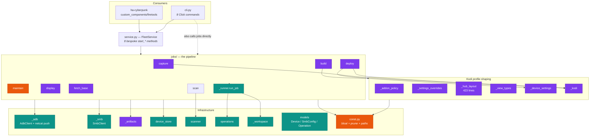

<sub>Purple = Kodi · orange = Fire-OS specific · teal = genuinely generic</sub>

---

## 2. Friction points — the deepening opportunities

Each is stated as a **seam that doesn't exist yet**, using the depth
vocabulary: a *shallow* module has an interface nearly as complex as its
implementation; a *deep* one puts a lot of behaviour behind a small one.

### F1 — There is no transport seam. ADB *is* the architecture.

Every job constructs `AdbClient(ip, adb_keys)` inline. Six of seven jobs
import `_adb` directly. Nothing in the code can express "talk to this
device" without meaning "talk to it over ADB".

A Shield is also ADB (nearly free). A PC is SSH or WinRM. A phone may be
ADB, or presence-only. Today none of those can be added without editing
every job.

The precedent already exists and is good: `AdbShellRunner` is a real
`(ip, cmd) -> str` adapter satisfying `Scanner`'s `adb_runner` parameter.
That is a seam with **one adapter** — hypothetical. Making it two makes it
real.

### F2 — `Device` is Fire-TV-and-Kodi shaped

```python
class Device(BaseModel):
    ip, mac, name, model, serial, android_version
    display:  dict   # ← Kodi resolution/overscan calibration
    settings: dict   # ← Kodi setting overrides, keyed by userdata path
```

Two of eight fields on the *core inventory record* are Kodi state. A PC in
this store carries a `display` field meaning "Kodi videoscreen.resolution".
`android_version` is meaningless for half the future fleet.

### F3 — `FleetService` is a shallow fan-out

Eight `start_*` methods, each: `_require_idle` → mint `f"{kind}_{ip}_{ts}"`
→ `operations.start` → `functools.partial(job, ...)` → `_dispatch`. The
interface (8 signatures) is nearly as complex as the implementation. Worse,
`rerun_operation` has to carry a hand-maintained `dict` mapping every
`OperationType` back to its starter — a second place to forget.

`OperationType` is a **closed enum**. Adding a job type today means editing:
the enum, `FleetService`, `rerun_operation`'s dispatch dict, `cli.py`, and
the HA frontend. That's an Open/Closed violation at five sites.

*Deletion test:* delete the eight methods → the complexity reappears in both
consumers, so the module earns its keep. But it should be **one** `start`
method over a task registry, not eight.

### F4 — `cli.py` repeats the same wiring eight times

Every command re-derives `_build_config()`, `_adb_keys()`, `_smb(config)`,
then builds its own `functools.partial`. The `.claude/rules/cli.md` rule
"every command needs `--batch` symmetry" is enforced by discipline, not by
structure — `capture` and `apply-display` don't have it.

### F5 — The Kodi domain has no package boundary

`_hub_layout.py` (423 lines of Arctic Fuse `HomeSwitcher` slot generation),
`_view_types.py` (Kodi skin boolean expressions), `_settings_overrides.py`,
`_addon_policy.py` all sit as private siblings of `_adb.py` and `_smb.py`.
Nothing structurally prevents a Kodi transform from reaching for an ADB
client, or vice-versa.

Meanwhile the capture→build→deploy *shape* — pull artifact, transform it,
publish it, push it, apply per-device deltas — is a genuinely generic
pattern that any app pack would want.

### F6 — Domain knowledge is hardcoded Python, not config

Every one of these is **data** living in `.py`:

| Data | Where | Size |
|---|---|---|
| `BLOAT_PACKAGES` | `const.py` | ~90 package ids |
| `PRE_CAPTURE_PRUNE_PATHS` / `MAINTENANCE_PRUNE_PATHS` | `const.py` | 2 path lists |
| `WHITELIST_ADDONS` / `REQUIRED_PREFIXES` | `_addon_policy.py` | 13 + 6 |
| `SETTING_OVERRIDES` | `_settings_overrides.py` | nested dict |
| `VIEW_EXPRESSION_OVERRIDES` | `_view_types.py` | 3 skin expressions |
| `HUBS` | `_hub_layout.py` | the entire home screen |

Adding a Shield means a second bloat list. Adding a second Kodi profile
("kids build", "guest build") means forking Python. This is exactly where
config-as-code belongs.

### F7 — Discovery hard-codes "a device is something with `ro.product.model`"

`Scanner._probe_adb` returns `None` when `getprop ro.product.model` is
empty — so a PC, a phone, or a printer on the subnet is *by definition* not
a device. Discovery and device-type identification are fused into one
method.

### F8 — `ArtifactStore` is `SmbClient`, concretely

`jobs/*` take `smb: SmbClient` as a typed parameter. `OperationSink`
already got this right — a `Protocol` with two adapters (SMB, Null). The
artifact store has one adapter and no protocol.

### F9 — There is no audit trail, and diagnostics are discarded

`Operation.logs` is a progress narrative, not a record of effects: one line
covers ~90 `pm disable-user` calls whose failures are swallowed by design.
`LOGGER` output carries no correlation id and is **dropped entirely in CLI
runs** — nothing calls `logging.basicConfig`. Two credential-leak paths sit
one careless log line away. Fully worked in **§10**, which is where the
observability design lives; the summary here is that this is a first-class
architectural concern, not a polish item, because the fix (§10's
`AuditingTransport`) only works if F1's transport seam exists.

---

## 3. Target architecture — three rings

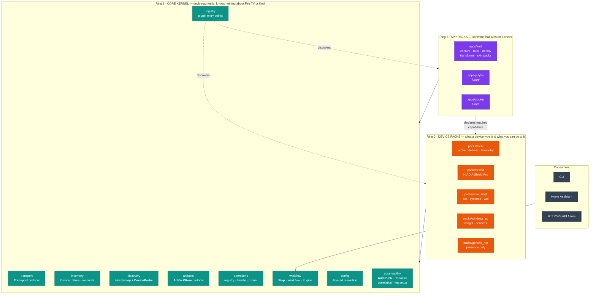

**The dependency rule:** rings point *inward only*. Ring 3 never imports
Ring 2 directly — it declares the *capabilities* it needs and the engine
resolves which device pack provides them. That's what lets `apps/kodi`
deploy to a Fire Stick and a Shield without knowing either exists.

### Proposed package layout

```text
src/fleetctl/
├── core/
│   ├── transport/     _base.py (Transport protocol) · adb.py · ssh.py · local.py · winrm.py
│   │                  auditing.py  ← decorator, wraps any Transport (§10)
│   ├── inventory/     device.py · store.py · reconcile.py
│   ├── discovery/     sweep.py (ping/ARP/mDNS) · probe.py (DeviceProbe protocol)
│   ├── artifacts/     store.py (ArtifactStore protocol) · smb.py · local.py · ref.py
│   ├── operations/    registry.py · handle.py · runner.py · workspace.py
│   ├── workflow/      step.py · workflow.py · engine.py · plan.py
│   ├── config/        loader.py · layering.py · schema.py · secrets.py
│   ├── observability/ audit.py (AuditSink protocol · event schema · hash chain)
│   │                  redact.py · correlation.py (ContextVar + logging.Filter)
│   │                  logsetup.py · forensics.py (failure bundles)
│   └── registry.py    entry-point plugin discovery
├── packs/
│   ├── android/       shared ADB base — the deep one (probe · apps · settings
│   │                  · power · files · cleanup). Composed, never subclassed.
│   ├── firetv/        data/bloat.yml · data/telemetry.yml + Fire OS quirks
│   ├── shield/        NVIDIA Shield Pro — data/bloat.yml + its own probe
│   ├── linux_host/
│   └── generic_net/   presence-only claimer (phones, IoT) — no management
├── apps/
│   └── kodi/
│       ├── capture.py · build.py · deploy.py     (the three steps)
│       ├── transforms/  addons.py · settings.py · hub_layout.py · view_types.py
│       ├── skins/arctic_fuse3/                    (skin-specific knowledge)
│       └── data/profiles/gold.yml                 (the recipe, as config)
└── cli/               registry-driven Click group

config/                              # ← config-as-code, gitignored where private
├── fleet.yml                        # incl. observability: audit dest, retention, redaction rules
├── inventory/devices.yml
├── profiles/kodi/{gold,kids}.yml
└── workflows/{kodi-refresh,weekly-maintenance}.yml

~/.fleetctl/                         # runtime state, never in the repo
├── adb_keys/
├── staging/                         # per-op workspaces
└── logs/                            # see §10 for the full layout
```

**On the ring diagram's `generic_net`:** phones and IoT get *discovery only*
— they land in the inventory as presence-only devices so the fleet view is
complete, and declare no management capabilities. Nothing tries to ADB into
your phone.

### The Android base is the deep one

With a Shield Pro arriving, `packs/android` is not a placeholder — it's
where most device behaviour actually lives:

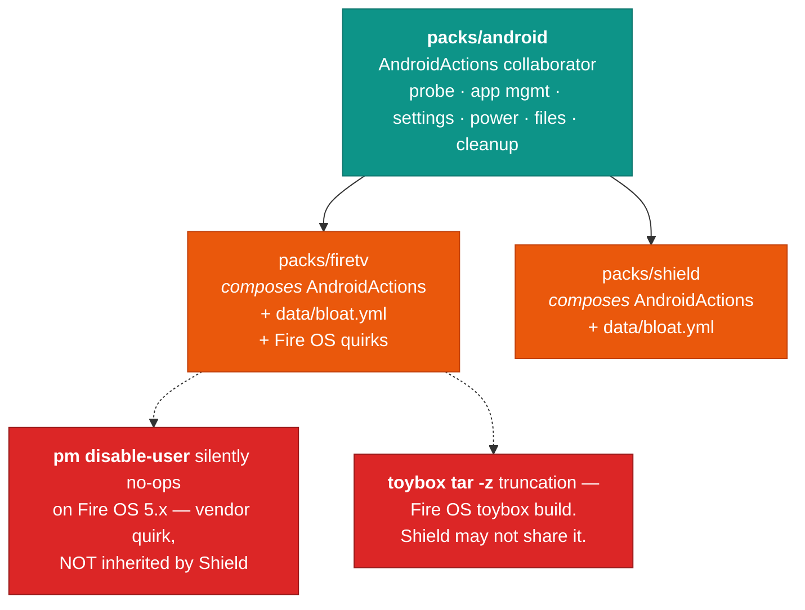

**Composition, not inheritance — and the quirks are exactly why.** Two of
this project's hardest-won gotchas are *Fire OS vendor quirks*, not Android
facts: `pm disable-user` silently no-ops on Fire OS 5.x, and toybox's
`tar -z` produces truncated archives on that build. If `ShieldPack`
inherited `FireTvPack`, it would inherit two workarounds for bugs it may not
have — and the two-step `tar cf` + `gzip` dance costs real time on a large
profile. Each pack composes the shared collaborator and declares its own
quirks as data.

---

## 4. The generalized action vocabulary

The core question you raised: *what are the common actions against any
device?* Here's the proposed verb set. A device pack implements what it can
and **declares the rest as unsupported** — the engine then skips or fails a
workflow step cleanly instead of blowing up mid-run.

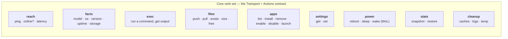

| Verb | Fire TV | Shield Pro | Linux/PC | Phone / IoT |
|---|:--:|:--:|:--:|:--:|
| `reach` | ✅ | ✅ | ✅ | ✅ |
| `facts` | ✅ adb getprop | ✅ | ✅ ssh | ⚠️ mDNS/ARP/DHCP only |
| `exec` | ✅ | ✅ | ✅ | ❌ |
| `files` | ✅ nc push / adb pull | ✅ | ✅ sftp | ❌ |
| `apps` | ✅ `pm` | ✅ `pm` | ✅ apt/winget | ❌ |
| `settings` | ✅ `settings put` | ✅ | ✅ | ❌ |
| `power` | ✅ reboot | ✅ | ✅ + WoL | ❌ |
| `state` | ✅ tar profile | ✅ | ✅ | ❌ |
| `cleanup` | ✅ | ✅ | ✅ | ❌ |

✅ full · ⚠️ partial/conditional · ❌ declared unsupported

Phones and IoT are deliberately `reach`-only (**D4**). They appear in the
inventory so the fleet view is complete and presence is usable in HA, but
`generic_net` declares no management capabilities — so a workflow targeting
them fails at plan time rather than attempting anything.

**Capabilities are the contract between rings.** An app pack step says:

```python
class KodiDeploy(Step):
    requires = {"files.push", "exec", "apps.install", "state.restore"}
```

and the engine refuses to schedule it against a device whose pack doesn't
declare those — at **plan time**, before touching anything.

### The transport seam, concretely

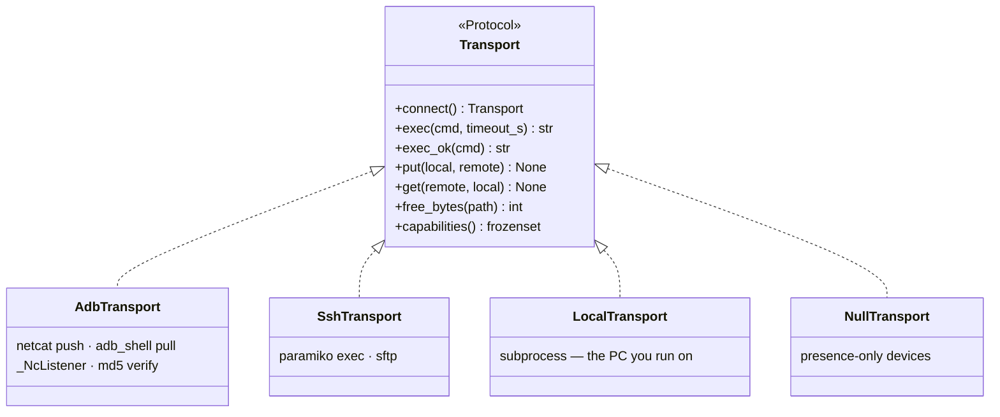

All the hard-won ADB knowledge — netcat upload, the non-backgroundable
listener, the md5 tail check, size-scaled timeouts — moves **behind**
`AdbTransport` unchanged. That's the depth win: callers get `put()`; the
1,000 words of gotcha stay in one implementation.

---

## 5. Config as code

### Layered resolution

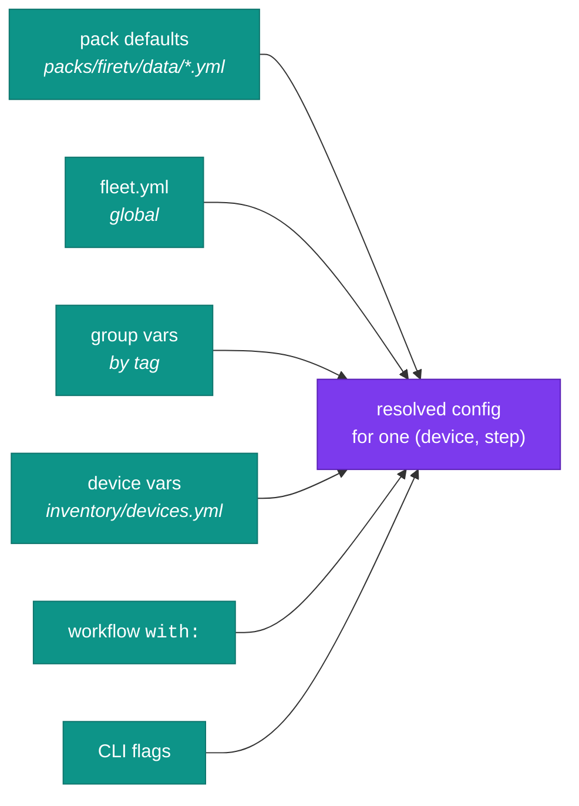

Later layers win. Every layer is inspectable via a `fleet config show <device>`
command, so "why did this stick get that setting?" is answerable without
reading Python.

### Inventory becomes type-aware

```yaml
# config/inventory/devices.yml
defaults:
  transport: adb

groups:
  livingroom: { tags: [kodi, tv] }

devices:
  - id: bedroom-stick
    type: firetv                    # ← selects the device pack
    address: 192.168.1.50
    mac: aa:bb:cc:dd:ee:ff
    tags: [kodi, gold]
    vars:
      kodi:
        display: { resolution_index: 18, overscan: {left: 0, top: 0, right: 1920, bottom: 1080} }
        settings:
          guisettings.xml: { audiooutput.channels: "1" }

  - id: shield-den
    type: shield
    address: 192.168.1.60
    tags: [kodi]

  - id: workshop-pc
    type: linux_host
    address: 192.168.1.70
    transport: ssh
    vars: { ssh: { user: ops, key_ref: env:WORKSHOP_KEY } }

  - id: pixel
    type: generic_net
    mac: aa:bb:cc:11:22:33
    tags: [presence]
```

Note what happened to F2: `display` and `settings` are gone from the core
record and live under `vars.kodi` — namespaced by the app pack that owns
them. The core `Device` shrinks to identity + address + type + tags + vars.

### The Kodi profile becomes a recipe

```yaml
# config/profiles/kodi/gold.yml
extends: base
base_apk: { source: kodi-mirror, arch: armeabi-v7a, channel: stable }

addons:
  allow: [skin.arctic.fuse.3, plugin.video.umbrella, plugin.video.themoviedb.helper, ...]
  allow_prefixes: [script.module., service., metadata., resource., inputstream., repository.]

prune:
  pre_capture: [userdata/Thumbnails, userdata/Database/Textures13.db, ...]

settings:
  addon_data/skin.arctic.fuse.3/settings.xml:
    startup.enablehubpreloading: "false"
    homeswitcher.1108.toggle: ""

skin:
  id: skin.arctic.fuse.3
  hubs:                              # ← what _hub_layout.py's HUBS dict is now
    - slot: 1101
      name: Movies
      rows: [trending, popular, now_playing, top_rated]
    - slot: 1102
      name: Series
      rows: [trending, popular, airing_today]
    - slot: 1104
      name: Browse
      kind: index
```

A "kids build" is now `profiles/kodi/kids.yml` with `extends: gold` and a
shorter allow-list — no Python.

### Format: YAML everywhere user-facing (D6)

YAML for `fleet.yml`, inventory, profiles and workflows. It matches
`devices.yml` today, supports comments (which config-as-code lives or dies
on), and is what every Home Assistant user already reads and writes — and HA
is the primary consumer.

TOML stays where it's already correct: `pyproject.toml`. The one place it
would earn a second look is a future machine-written lockfile — a resolved
`fleet.lock` pinning which build each device actually runs — where TOML's
unambiguous typing beats YAML's. Not needed yet; noted so the door stays open.

### Secrets: the Home Assistant model (D5)

HA's own standard is unambiguous, and since HA is the core target, `fleetctl`
adopts it wholesale:

> Credentials are collected through a **config flow** and stored in the
> integration's config entry (HA-managed storage). They never appear in
> `configuration.yaml`, never in a YAML file the user hand-edits, and never
> in the repo.

Generalized: **`fleetctl` config files contain references, never values.**

```yaml
# config/fleet.yml — safe to commit, safe to share in a bug report
artifacts:
  smb:
    host: 192.168.1.50
    share: Kodi
    user: !ref env:FLEETCTL_SMB_USER
    password: !ref env:FLEETCTL_SMB_PASS

devices:
  - id: workshop-pc
    transport: ssh
    vars: { ssh: { user: ops, key: !ref keyring:fleetctl/workshop } }
```

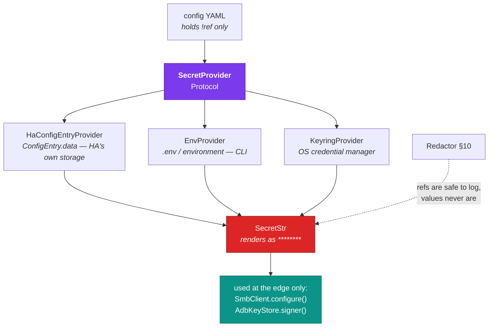

Three adapters means this is a **real seam**, not a hypothetical one — and
each consumer resolves secrets its own idiomatic way without the core
knowing: HA from its config entry, the CLI from environment/`.env`, a
future headless runner from the OS keyring.

Consequences:

- **Config files become shareable.** A user can paste their `fleet.yml` into
  a GitHub issue. Given this repo's history — real device data once reached a
  committed doc and needed a history rewrite to scrub — that property is
  worth designing for, not hoping for.
- **`SecretStr` throughout** kills S1 by construction: `str(secret)` renders
  `**********`, and you must call `.get_secret_value()` deliberately at the
  one edge that needs it.
- **Audit records the ref, never the value** (§10).
- **The ADB key gets the same treatment**: `!ref` to a path, permissions
  enforced (0700/0600), and every use recorded as an `AUTH` event.

---

## 6. Workflows

Today's pipeline is implicit: you know to run capture → build → deploy in
that order because the docs say so. A workflow makes the ordering, the
targeting, and the artifact handoff explicit and inspectable.

```yaml
# config/workflows/kodi-refresh.yml
name: kodi-refresh
description: Rebuild the gold profile and roll it to every Kodi device.

steps:
  - id: base
    use: kodi.fetch_base
    targets: none                    # fleet-level, no device

  - id: build
    use: kodi.build
    targets: none
    with: { profile: gold, source: latest_gold_capture }

  - id: maintain
    use: device.maintain             # ← resolved per device type
    targets: { tags: [kodi] }
    concurrency: 4
    on_error: continue

  - id: deploy
    use: kodi.deploy
    targets: { tags: [kodi] }
    with: { build: "{{ steps.build.artifact }}" }
    concurrency: 2
    on_error: continue
```

`device.maintain` resolves per device: the Fire Stick runs
`packs/firetv`'s debloat list, the Shield runs `packs/shield`'s, a PC
runs `apt autoremove`. One workflow, heterogeneous fleet.

### Execution

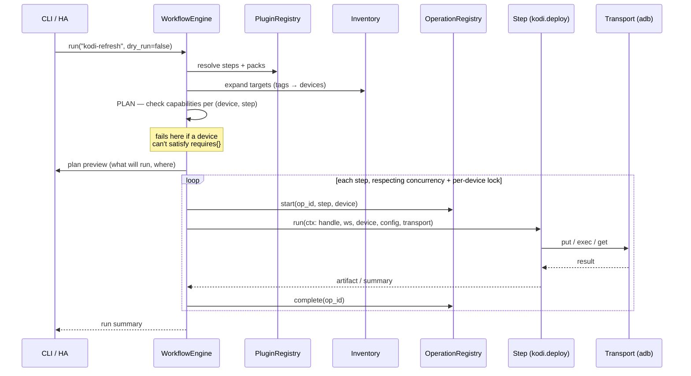

**What this preserves from today:** `OperationRegistry`, `OperationHandle`,
`_runner.run_job`, and `_workspace` already implement the per-operation
logging, cancellation, and staging-dir lifecycle the engine needs. The
engine is a layer *above* them, not a replacement.

**What it adds:** dry-run/plan, capability pre-checks, artifact passing
between steps, per-device locking generalized beyond `_require_idle`,
declarative concurrency, and `on_error` policy.

---

## 7. Plugin registration

```python
# packs/firetv/__init__.py
from fleetctl.core.registry import device_pack

@device_pack(
    id="firetv",
    transport="adb",
    capabilities={"reach", "facts", "exec", "files", "apps", "settings", "power", "state", "cleanup"},
    data_dir="data",
)
class FireTvPack:
    def probe(self, host: ProbeContext) -> DeviceIdentity | None:
        model = host.exec_ok("getprop ro.product.model")
        manufacturer = host.exec_ok("getprop ro.product.manufacturer")
        if "Amazon" not in manufacturer:
            return None
        return DeviceIdentity(type="firetv", model=model, ...)

    def actions(self) -> dict[str, Action]:
        return {"maintain": DebloatAction(self.data("bloat.yml")), ...}
```

```toml
# pyproject.toml — third-party packs can register the same way
[project.entry-points."fleetctl.packs"]
firetv     = "fleetctl.packs.firetv:FireTvPack"
shield     = "fleetctl.packs.shield:ShieldPack"
linux_host = "fleetctl.packs.linux_host:LinuxHostPack"

[project.entry-points."fleetctl.apps"]
kodi = "fleetctl.apps.kodi:KodiApp"
```

This is what closes F3: `OperationType` stops being an enum. A step's id
is a string the registry knows about, so adding a job type touches exactly
one file — the pack that adds it. CLI commands and HA operation types are
both generated from the registry.

### Discovery becomes claim-based (closes F7)

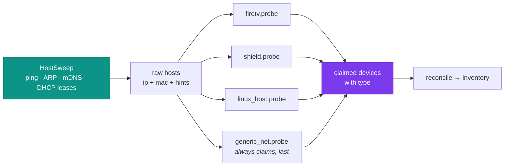

Probes run in declared priority order; the first to claim a host wins.
`generic_net` claims anything left over, so a phone or printer lands in the
inventory as a presence-only device instead of vanishing.

---

## 8. Design principles the structure has to satisfy

### SOLID, concretely

| Principle | Violated today by | Satisfied in the target by |
|---|---|---|
| **S** — Single Responsibility | `scanner.py` does ping sweep **and** device identification. `jobs/deploy.py` does transfer **and** APK versioning **and** per-device settings. `const.py` holds ADB paths, Kodi prune lists, Fire OS bloat and SMB defaults. | `HostSweep` (find hosts) vs `DeviceProbe` (identify one). `DeployStep` transfers; `BaseImageStep` versions; `DeviceVarsStep` applies deltas. `const.py` dissolves into pack/app data. |
| **O** — Open/Closed | `OperationType` is a closed enum; a new job edits 5 files. `rerun_operation` hand-maps every type. `Scanner._probe_adb` hardcodes "device == has `ro.product.model`". | Packs/apps register via entry points. Adding a device type or step adds a module and registers it — no existing file changes. Probes are an ordered list, extended by registration. |
| **L** — Liskov Substitution | Not really violated — there's no inheritance to violate. But `SmbClient` is passed where "an artifact store" is meant, so a `LocalArtifactStore` couldn't be substituted at all. | Every `Transport`, `ArtifactStore`, `DeviceProbe`, `ProfileTransform` adapter is fully substitutable; the engine only ever holds the protocol type. Capability sets make "can't do this" explicit data rather than a surprise exception. |
| **I** — Interface Segregation | `AdbClient` exposes `shell`, `shell_ok`, `pull`, `push_file`, `free_bytes`, `reconnect` — `jobs/scan` needs one of those, `jobs/display` needs one. Everyone depends on all of it. | Split protocols: `CommandRunner` (`exec`/`exec_ok`), `FileTransfer` (`put`/`get`/`free_bytes`), `Reachable` (`ping`). `Transport` is their composition. A probe depends on `CommandRunner` only. |
| **D** — Dependency Inversion | `jobs/*` import the concrete `AdbClient` and construct it inline (`with AdbClient(ip, adb_keys) as adb:`). High-level policy depends on low-level transport detail. | Steps receive a `Transport` they never construct. All construction happens in one composition root per consumer. |

### Interface segregation, drawn

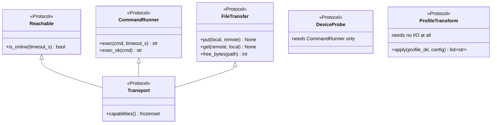

`ProfileTransform` is the sharpest case: `prune_addons`, `apply_setting_overrides`,
`apply_hub_layout`, `apply_view_type_overrides` are already pure
directory-in / changes-out functions. Giving them a shared protocol makes
the build step a **chain of substitutable transforms driven by config**,
which is both the OCP win and the whole testability story for the 700-odd
lines of Kodi shaping logic.

### Dependency injection — one composition root per consumer

Today, construction is scattered: `cli.py` builds `AdbKeyStore`/`SmbClient`
in eight commands; jobs construct `AdbClient` and `Scanner` internally;
`FleetService` constructs its own `ThreadPoolExecutor` and
`AdbShellRunner`. That's the DIP violation in practice — you cannot run a
job without it reaching for real hardware.

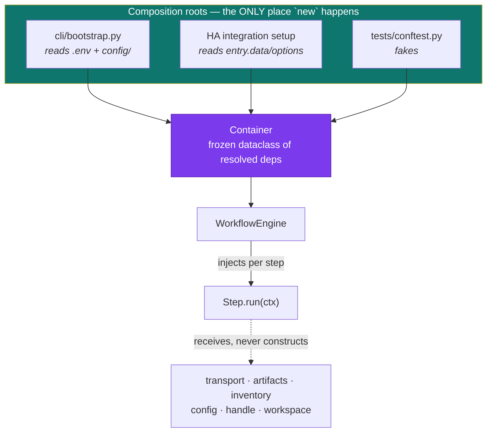

```python
@dataclass(frozen=True, slots=True)
class StepContext:
    """Everything a step is allowed to touch. Injected, never constructed."""

    device: Device | None
    transport: Transport
    artifacts: ArtifactStore
    inventory: DeviceStore
    config: Mapping[str, Any]      # already layer-resolved for this (device, step)
    handle: OperationHandle
    workspace: Path
```

Note what is **absent**: no audit sink, no logger, no redactor. A step
cannot and need not emit audit records — `transport` is already an
`AuditingTransport` by the time it arrives, and correlation ids ride a
`ContextVar` the engine set. Auditing is a property of the wiring, not an
obligation on the author (§10).

Consequences worth naming:

- **A step is testable with a `FakeTransport` and a tmpdir** — no device, no
  SMB, no network. That is the single biggest reason this repo has no tests.
- **Transport lifetime moves to the engine**, so the "one connection per
  job" property that `AdbClient`'s docstring is proud of gets *enforced*
  rather than depending on every job remembering the `with` block.
- **No module-level singletons** anywhere — matches the standing convention
  in the global Python standards.
- **Cross-cutting concerns attach by decoration, not by convention.**
  Auditing, redaction, retry, and rate-limiting all wrap a `Transport`
  without any step knowing. That is only possible because DIP put an
  interface between policy and transport in the first place — the same
  seam pays for F1 and F9 at once.

### OOP judgement calls

Not everything should become a class. Proposed split:

| Use | For | Why |
|---|---|---|
| `Protocol` | `Transport`, `ArtifactStore`, `DeviceProbe`, `ProfileTransform`, `Step`, `OperationSink` | Structural typing, no inheritance required — an adapter satisfies it by shape. Already the house style (`OperationSink`, `AdbRunner`). |
| `@dataclass(frozen=True, slots=True)` | `StepContext`, `ArtifactRef`, `DeviceIdentity`, resolved config objects | Immutable value objects; cheap, hashable, no accidental mutation across threads. |
| Pydantic `BaseModel` | `Device`, `BackupMeta`, every YAML-loaded config schema | Validation at the boundary — config-as-code needs real error messages, not `KeyError`. |
| Plain functions | the transforms, `reconcile`, parsers, planners | A class with one method and no state is a function wearing a costume. Register the *function*. |
| Classes with state | `WorkflowEngine`, `OperationRegistry`, `DeviceStore`, transports | Genuine lifecycle/identity/locking. |

**Composition over inheritance** for the Android family: `packs/firetv` and
`packs/shield` do **not** subclass a base pack. They *compose* a shared
`AndroidActions` collaborator and supply their own data files. Inheritance
here would force the Shield to inherit Fire-OS assumptions (`pm disable-user`
quirks, Amazon package names) it doesn't share.

### PEP 8 and the house Python standards

These carry over from the existing global standards and are unchanged by
this design — listing them so the target isn't a chance to drift:

- `from __future__ import annotations` at the top of every module; modern
  union syntax (`str | None`), builtin generics (`list[T]`, `dict[K, V]`).
- Fully annotated signatures; must pass `mypy --strict` (the package is
  clean today — that shouldn't regress during the move).
- Black `line-length = 160`, isort `profile = "black"`, 4-space indent,
  2 blank lines between top-level definitions.
- Naming: `snake_case` functions, `PascalCase` classes/protocols,
  `UPPER_SNAKE_CASE` constants, `_leading_underscore` privates,
  `_prefixed.py` private modules.
- Module-level `LOGGER = logging.getLogger(__name__)`, `%s` lazy formatting,
  never log inside an exception constructor.
- Exception hierarchy rooted at one base (`FleetError`), with domain context
  as instance attributes and `raise ... from exc` chaining. Today's
  `AdbError`/`AdbCommandError` become transport-layer members of it, so a
  step can catch `TransportError` without knowing whether it was ADB or SSH.
- Google-style docstrings per the `py-docstring` skill.

One deliberate change: **public modules stop being `_`-prefixed at the
package root.** `_adb`, `_smb`, `_artifacts` are private-by-name but are
imported by every job — the underscore is currently signalling "internal to
`fire_tools`", which stops being true once packs and apps are separate
packages importing across the boundary. Under the target layout,
`core/transport/adb.py` is genuinely public API for pack authors; `_`
returns to meaning "internal to this subpackage".

---

## 9. How today's code maps onto the target

| Today | Becomes | Change |
|---|---|---|
| `_adb.py` | `core/transport/adb.py` | move + implement `Transport`; internals unchanged |
| `_smb.py` | `core/artifacts/smb.py` | move behind `ArtifactStore` protocol |
| `_artifacts.py` | `core/artifacts/ref.py` | generalize `BackupRef` → `ArtifactRef` (kind: capture/build/apk) |
| `device_store.py`, `_merge.py` | `core/inventory/` | `Device` loses `display`/`settings` → `vars` |
| `scanner.py` | `core/discovery/sweep.py` + `packs/*/probe` | split sweep from identification |
| `operations.py`, `_workspace.py`, `jobs/_runner.py` | `core/operations/` | mostly as-is; `_workspace` gains failure-bundle capture before teardown (G5) |
| `OperationSink` + `SmbOperationSink` | `core/operations/sink.py` | unchanged — already a correct two-adapter seam; stays the *timeline* stream, distinct from audit |
| *(nothing today)* | `core/observability/` | new: `AuditSink`, event schema, hash chain, `Redactor`, correlation `ContextVar`, CLI log setup |
| `AdbError`/`AdbCommandError` | `core/transport/errors.py` under `FleetError` | so a step catches `TransportError` without knowing ADB vs SSH |
| `service.py` | `core/workflow/engine.py` | 8 methods → `start(step_id, target, params)` |
| `cli.py` | `cli/` | registry-driven command generation |
| `jobs/maintain.py` + `BLOAT_PACKAGES` | `packs/firetv/` + `data/bloat.yml` | code → config |
| `jobs/scan.py` | `core/discovery` step | generalized |
| `jobs/{capture,build,deploy,display}.py` | `apps/kodi/` | become app-pack steps |
| `jobs/fetch_base.py` | `apps/kodi/base_image.py` | Kodi-specific |
| `_addon_policy`, `_settings_overrides`, `_view_types`, `_hub_layout` | `apps/kodi/transforms/` | behind a `ProfileTransform` protocol; data → `profiles/*.yml` |
| `_device_settings.py` | `apps/kodi/deploy.py` | reads `device.vars.kodi.settings` |
| `_kodi.py` | `apps/kodi/probe.py` | Kodi facts, not device facts |
| `const.py` | dissolved | paths → pack/app data; SMB defaults → `fleet.yml` |

### The build pipeline, generalized

The capture→build→deploy shape survives — it just stops being Kodi's
private property:

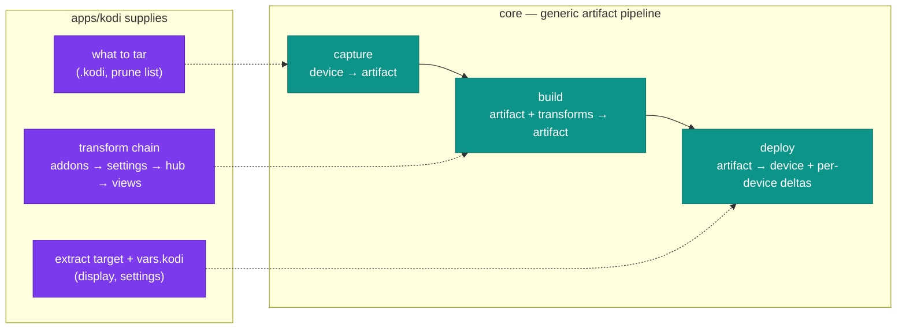

The CLAUDE.md rule "a new profile transform goes in `build`, never `deploy`"
becomes **structurally enforced**: `build` receives a transform chain and no
transport; `deploy` receives a transport and no transform chain. You
*can't* put a transform in deploy — it has nothing to call.

---

## 10. Logging, audit trail & forensics

### What exists today

Two parallel channels, and **neither is an audit trail**:

| Channel | What it is | Consumer | Persistence |
|---|---|---|---|
| `LOGGER` (`logging`) | 29 calls — 15 `debug`, 9 `warning`, 3 `info`, 2 `exception` | developer | wherever the consumer configured it |
| `Operation.logs` | free-text `{time, message}` appended by jobs via `handle.log()` | the UI / CLI echo | `SmbOperationSink` → one JSON per op on SMB |

`OperationRegistry` is genuinely well-built for what it is — one owning
lock, debounced flush, bounded retention, malformed records skipped,
`running` records marked failed on restart. The problem isn't quality, it's
**category**: it's a progress narrative, not an audit record.

### The gaps, concretely

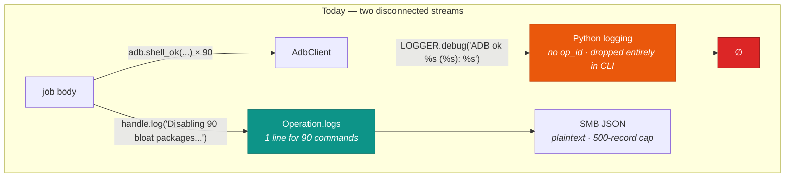

**G1 — Nothing correlates the two streams.** `LOGGER` lines carry no
operation id. `FleetService` runs up to 8 jobs concurrently on a
`ThreadPoolExecutor`; interleaved log output from two simultaneous deploys
is unattributable after the fact.

**G2 — The CLI never configures logging at all.** There is no
`logging.basicConfig` anywhere in `cli.py`. Python's last-resort handler
emits `WARNING`+ to stderr, so **every `debug` and `info` call — including
the entire record of which ADB commands ran — is silently discarded on
every CLI run.** The 15 `LOGGER.debug` calls are effectively dead code
outside Home Assistant.

**G3 — No record of what was actually executed or whether it worked.**
`handle.log(f"Disabling {len(BLOAT_PACKAGES)} bloat packages...")` is one
line covering ~90 `pm disable-user` calls, each issued through `shell_ok`,
which swallows failures to `""` by design. Combined with the known Fire OS
gotcha that `pm disable-user` *silently no-ops* on older hardware, the
question "which packages actually got disabled on this stick, and when?"
is **unanswerable from the record**. Same shape for the 14 `rm -rf` prune
paths in capture and maintain.

**G4 — No before/after state on destructive operations.** `_extract_on_device`
`rm -rf`s `addons/`, `userdata/` and `media/` before extracting. Nothing
records what was there. A bad build overwrites a device with no trace of
the prior contents.

**G5 — Forensics are deleted on failure.** `_workspace.workspace()`
`rmtree`s the staging directory in a `finally`, on every exit path. When a
deploy fails mid-extract, the exact archive that failed — the single most
useful artifact for running it down — is destroyed before you can look at it.

**G6 — Retention is memory-shaped, not audit-shaped.** `_MAX_OPERATIONS = 500`
with age-based eviction is right for a UI list and wrong for an audit trail,
which wants append-only with time-based retention. Records are also
mutable-in-place JSON files: nothing detects truncation or tampering.

**G7 — Audit failure is silent.** `SmbOperationSink.save` catches everything
and `LOGGER.warning`s — which, per G2, goes nowhere in CLI runs. An audit
trail that quietly stops recording is worse than none.

**G8 — Two bare `except: pass`.** `service.py:392` and `service.py:406`
(`get_base_info`, `check_update`) discard the exception entirely. No log,
no trace, no reason.

**G9 — No actor.** Nothing records whether an operation came from the CLI,
the HA panel, or a scheduled automation. With a third consumer (the HTTP
API in the design), "who deployed at 3am" has no answer.

### Security-specific findings

**S1 — `SmbConfig` will print its own password.** It's a
`@dataclass(frozen=True, slots=True)` with `smb_pass: str` and no
`repr=False`. The generated `__repr__` includes the credential. Nothing
logs it *today*, but one `LOGGER.debug("config=%s", config)` — or any
traceback renderer that dumps locals — leaks it. This is a one-line fix
worth making regardless of the refactor.

**S2 — `AdbClient.shell` logs full commands at DEBUG**, including the first
200 chars of output. `_device_settings.apply_device_settings` builds `sed`
commands by interpolating values straight out of `devices.yml` — and that
module's own docstring example is an IPTV `m3uPath`, a URL type that
routinely embeds `username=`/`password=`. Turn on DEBUG in HA and those
land in the Home Assistant log.

**S3 — Operation records are written to SMB in plaintext**, on a share
reachable by anything on the household network. Today they hold only
progress narrative — but that's a convention, not a control.

**S4 — The ADB private key is a standing authorization token** for every
paired device, and there is no record of when it was used against which
device. `AdbKeyStore` gets the filesystem permissions right (0700/0600),
but if the key leaks there's no way to scope the blast radius. This matters
more once a second key identity exists — which it already does, since the
HA integration holds a separate one.

---

### Target design: three streams, deliberately separated

They have different consumers, different retention, and different security
postures — conflating them is what produces both G3 and S2.

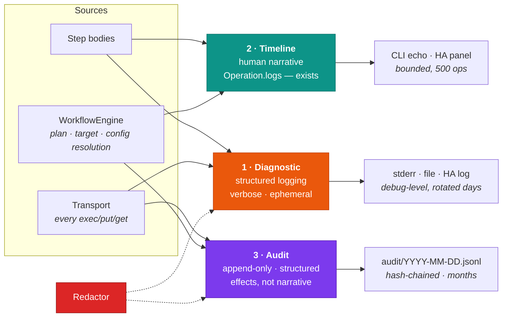

### The key move: audit lives at the Transport seam

This is the payoff of §8's dependency inversion. Because **every** side
effect on **every** device goes through `exec`/`put`/`get`, wrapping the
transport in a decorator captures all of them — automatically, for every
step ever written, including third-party packs that don't know auditing
exists.

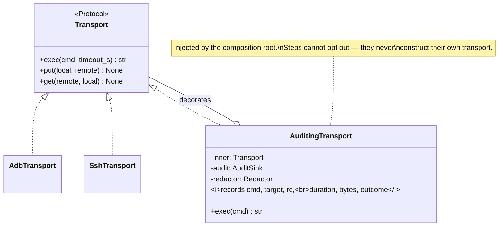

That closes **G3** structurally: the 90 `pm disable-user` calls become 90
audit records with per-command outcomes, without any step author writing a
single logging line. It also closes **G9** — the actor is bound once at the
composition root and carried on every record.

### Correlation: one id hierarchy, propagated automatically

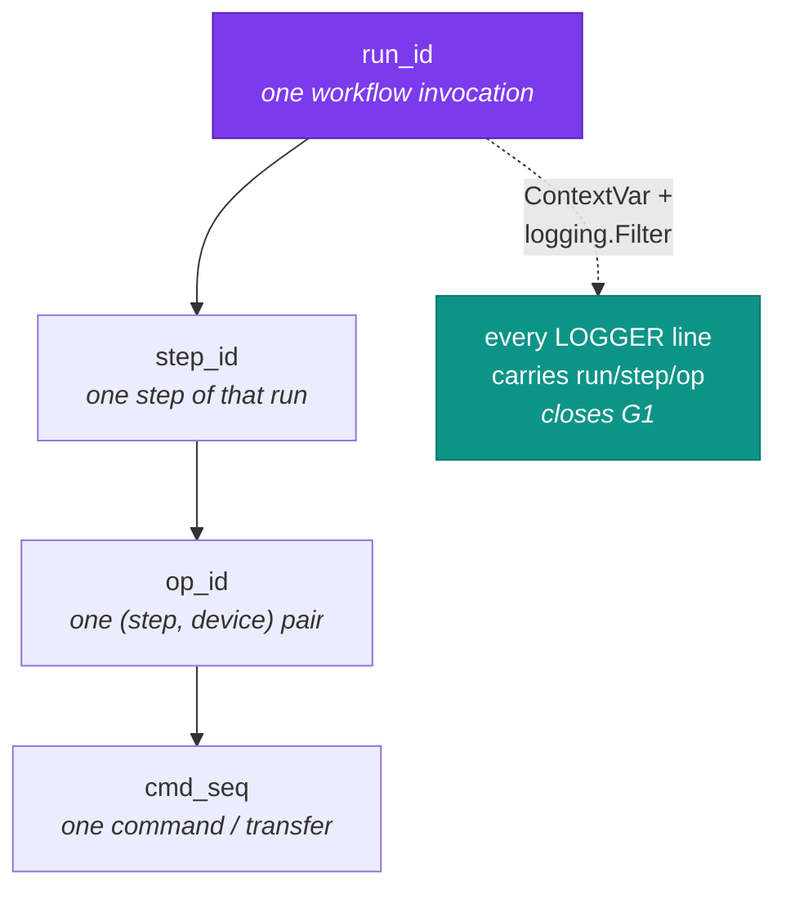

A `ContextVar` set by the engine plus a `logging.Filter` injecting it into
every record means correlation costs step authors nothing and cannot be
forgotten. This is also what lets you grep one deploy out of eight
concurrent ones.

### Audit event schema

```python
@dataclass(frozen=True, slots=True)
class AuditEvent:
    """One recorded effect. Append-only; never updated after write."""

    ts: str                      # ISO-8601, UTC
    run_id: str
    step_id: str
    op_id: str
    seq: int
    actor: str                   # "cli:alice" | "ha:automation.nightly" | "api:token#3"
    device_id: str | None
    device_addr: str | None
    kind: AuditKind              # EXEC | PUT | GET | PLAN | CONFIG | DECISION | AUTH
    action: str                  # "pm disable-user" | "artifact.push"
    detail: Mapping[str, Any]    # redacted
    outcome: Outcome             # OK | FAILED | SKIPPED | UNSUPPORTED
    error: str | None
    duration_ms: int
    prev_hash: str               # hash chain over the preceding record
    hash: str
```

Written as **JSONL, one file per day**, appended never rewritten. The
`prev_hash` chain makes truncation or mid-file edits detectable with a
cheap `fleet audit verify` — which is what turns G6 from "a log" into
"a record you can trust when running something down."

Beyond raw commands, three event kinds are worth recording that today have
no representation at all:

- **`CONFIG`** — the *resolved* config for a `(device, step)`, plus which
  layer won each key. This is the answer to "why did this stick get that
  setting?" without reading Python, and it's only possible because §5 makes
  layering explicit.
- **`DECISION`** — engine choices: which build was selected as "latest",
  why a device was skipped, which pack claimed a host during discovery.
- **`AUTH`** — every use of the ADB key against a device, closing **S4**.
  If a key leaks you can enumerate exactly which devices it touched and when.

### Where it all lands (D7, D9)

Separate files and directories per subsystem, so "what did the ADB layer do"
and "what did the Kodi build do" are different files rather than one
interleaved stream.

```text
~/.fleetctl/logs/                    # diagnostic — local, rotated, short-lived
├── core/
│   ├── engine.log                   # planning, targeting, scheduling
│   ├── operations.log               # lifecycle, cancellation
│   └── config.log                   # layer resolution, secret ref lookups
├── transport/
│   ├── adb.log                      # every command + outcome (READ included)
│   └── ssh.log
├── discovery/sweep.log
├── packs/{firetv,shield,linux_host}.log
└── apps/kodi.log

<smb>/fleetctl/audit/                # audit — durable, 90d, hash-chained
├── 2026-08-01.jsonl
├── 2026-08-02.jsonl
└── .chain                           # head hash, for `fleetctl audit verify`

<smb>/fleetctl/forensics/<op_id>/    # failure bundles only, capped
```

Routing is by **effect class**, which resolves the volume question (D9)
without dropping information:

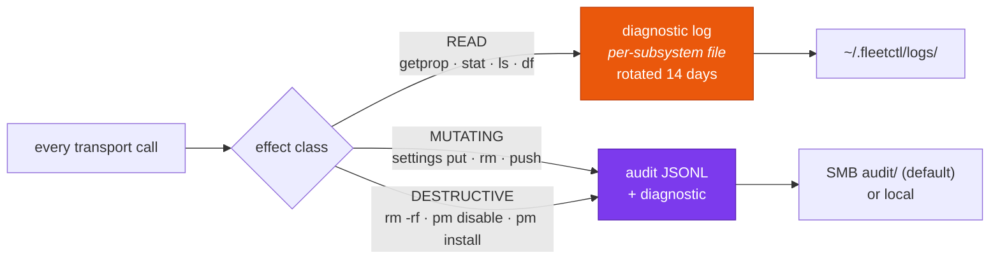

A `--batch` maintain across the fleet produces thousands of `READ` probes
that stay in a rotating diagnostic file, and a few hundred `pm disable-user`
records that go in the durable audit. Nothing is lost; the durable stream
stays reviewable.

```yaml
# config/fleet.yml
observability:
  logs:
    dir: ~/.fleetctl/logs
    level: info                     # per-subsystem overrides supported
    rotate: { when: midnight, keep_days: 14 }
  audit:
    destination: smb                # smb (default) | local
    path: fleetctl/audit
    retention_days: 90              # D7
    hash_chain: true                # D8
    record_reads: false             # READ stays diagnostic-only
  forensics:
    enabled: true
    keep_failures: 20
```

**On the SMB default:** I'd flagged (S3) that a household-network share is a
weaker home for an audit trail than local disk. Decision is SMB — it's the
one location every consumer (CLI, HA, a future agent) already reaches, which
matters more here than the exposure does. Two things carry that decision:
redaction is applied *before* write and is not optional, and the hash chain
makes tampering on a shared path detectable rather than silent. `local` stays
a one-line config change.

### Redaction as a type, not a convention

Fixing S1 and S2 by remembering to be careful will fail. Structural fixes:

| Finding | Fix |
|---|---|
| S1 — `SmbConfig` repr leaks password | `smb_pass: SecretStr` (pydantic), or `field(repr=False)`. `str(secret)` renders `**********`; you must call `.get_secret_value()` deliberately. |
| S2 — commands logged verbatim | A `Redactor` at the diagnostic + audit boundary, driven by config-declared sensitive paths (`vars.kodi.settings.*.m3uPath`), plus regex patterns for URL credentials and bearer tokens. Applied **inside** `AuditingTransport`, so it cannot be bypassed. |
| S3 — plaintext audit on a shared SMB path | **SMB is the chosen default (D7).** Mitigated by mandatory pre-write redaction and the hash chain; `destination: local` is a one-line change. |
| S4 — no record of ADB key use | `AUTH` events on every signer use, per device. |
| Secrets in config-as-code | Config holds `!ref` only, resolved per consumer via `SecretProvider` (§5). Audit records the ref, never the value. |

### Forensics: keep the evidence (closes G4, G5)

- **Failure bundle.** On a non-cancelled failure, before `workspace()`
  tears the staging dir down, collect a bundle — the failing archive's
  name/size/digest, device free space, installed versions, last N lines of
  the device's own log — and persist it under `artifacts/failures/<op_id>/`.
  Retention capped, off by default for successes.
- **Pre-destruction manifest.** Before `deploy` wipes `addons/`/`userdata/`/
  `media/`, record a cheap manifest (top-level entries + sizes) as an audit
  `detail`. Not a backup — a record that answers "what did we just replace?"
- **`--dry-run` output is an audit artifact.** The engine's plan (§6) is
  recorded as `PLAN` events whether or not you then execute, so intent and
  effect are both on the record.

### Worth backporting to `firestick_manager` now

`firestick_manager` keeps running until S7 cutover, so three of these gaps
stay live for months. All three are small and independent of the rewrite:

1. `logging.basicConfig` in the CLI with a `-v/--verbose` flag — turns 15
   dead `LOGGER.debug` calls into working diagnostics (**G2**).
2. `smb_pass` → `SecretStr` / `repr=False` (**S1**).
3. Replace the two bare `except: pass` in `service.py` with a logged
   warning (**G8**).

---

## 11. Consumers: CLI, Home Assistant, HTTP API, MCP

### First: don't wrap the CLI

The instinct is understandable, but apply the deletion test to
"MCP server that shells out to the `fleetctl` CLI":

| | Wrapping the CLI | A fourth adapter on the core |
|---|---|---|
| What it adds | subprocess spawn, argv construction, stdout parsing | a schema and a transport |
| Type fidelity | everything becomes strings, then gets re-parsed | Pydantic models end-to-end |
| Long operations | blocks on a subprocess, or orphans it | `op_id` + poll, already modelled |
| Cancellation | kill a process mid-`tar` on a device | `handle.check_cancelled()` at step boundaries |
| Errors | exit code + scraped text | typed `FleetError` subclasses |
| Audit actor | indistinguishable from a human CLI run | `actor="mcp:claude"` on every record |
| Deletion test | complexity *moves* (into parsing) — a pass-through | complexity *concentrates* — earns its keep |

Wrapping the CLI is a **shallow module** in the precise sense: its interface
would be nearly as complex as its implementation, and it would actively
destroy information the core already has. The CLI is itself just a thin
adapter — wrapping it means adapting an adapter.

### Ports and adapters

The design already implies this; making it explicit is the point:

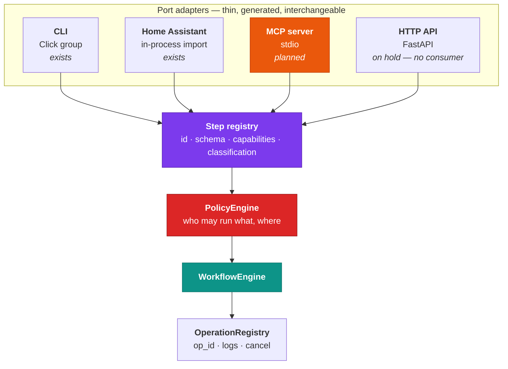

**One registration, four surfaces.** This is the concrete payoff of §7's
plugin registry combined with §5's Pydantic config schemas. A pack author
declares a step once:

```python
@step(
    id="kodi.deploy",
    summary="Deploy a built Kodi profile to a device.",
    params=KodiDeployParams,           # Pydantic model
    requires={"files.push", "exec", "state.restore"},
    effect=Effect.DESTRUCTIVE,         # ← see policy, below
)
```

and gets, with no further work:

| Surface | Derived from |
|---|---|
| `fleetctl kodi deploy --device X` | id + `params` → Click options |
| HA service `fleetctl.kodi_deploy` | id + `params` → voluptuous service schema |
| MCP tool `kodi_deploy` | id + `summary` + `params.model_json_schema()` |
| `POST /steps/kodi.deploy` | id + `params` → request body |

That kills F3 and F4 in one move, and it means adding MCP is **not** a
per-command porting exercise — it's one adapter module.

### The long-running-operation problem

MCP tools are request/response. A deploy takes minutes. Fortunately
`OperationRegistry` already models exactly the right thing, so the MCP
surface is small:

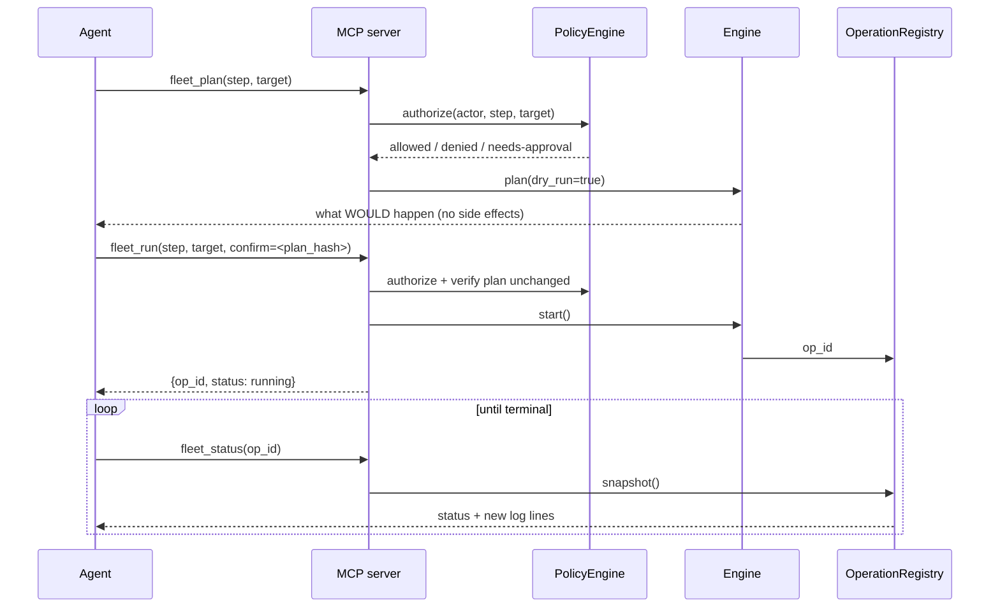

**Tools** (actions): `fleet_plan`, `fleet_run`, `fleet_status`,
`fleet_cancel`.
**Resources** (read-only, no confirmation): inventory, device detail,
available builds, workflow catalog, recent operations, audit tail.

Splitting reads into MCP *resources* rather than tools matters — it keeps
the mutating tool surface tiny and reviewable, which is the whole game
below.

### Safety: the part that actually needs designing

An agent holding these tools can wipe a device's Kodi profile
(`rm -rf addons/ userdata/ media/`), disable ~90 system packages, reboot
every device in the house, or push a bad build fleet-wide. This is not a
reason to skip MCP — it's the reason the policy layer must exist *before*
MCP does.

**The standing rule this codebase already has** is the sharpest example.
From project memory: the gold source device *"should only be deployed to
once we know everything is perfect. cant mess that one up."* Today that
rule lives in a memory file and in your head. It is enforced by nobody. An
agent with a `kodi_deploy` tool and a device list will not know it exists.

So it becomes **declarative policy**, enforced in the engine for every
consumer:

```yaml
# config/fleet.yml
policy:
  protected:
    - match: { tags: [gold] }
      deny: [kodi.deploy, device.maintain]
      reason: >
        Gold capture source. Prove changes on a disposable device first,
        then redeploy through the pipeline — never hand-edit.

  actors:
    # D11 — an agent may run ANY registered step or workflow. The gate is
    # approval, not an allow-list, so new packs don't silently expand or
    # restrict what it can reach.
    "mcp:*":
      allow:   ["*"]
      confirm: [MUTATING, DESTRUCTIVE]     # by effect class, not by name
      require_plan: true

    # D12 — HA is an actor like any other. Its automations run unattended,
    # so it gets standing approval for the routine steps and stops at
    # destructive ones.
    "ha:*":
      allow:   ["*"]
      confirm: [DESTRUCTIVE]

    "cli:*":
      allow:   ["*"]
      confirm: []                          # a human at a terminal is the approval

  defaults:
    max_devices_per_run: 3                 # blast-radius cap
```

Three properties worth naming:

- **Confirmation keys off effect class, not step names.** A new pack that
  adds a destructive step is gated automatically. An allow-list would have
  silently permitted it.
- **`protected` outranks everything.** No actor — CLI included — deploys to
  a `gold`-tagged device without editing this file. That is the point: the
  rule stops living in a memory file and in your head.
- **HA becomes an actor (D12).** Today the integration can do anything the
  package can. Under the policy layer it's `ha:*`, which is more correct and
  is a **behaviour change for existing automations** — expect to update the
  automations and the Cyberpunk panel after cutover, as agreed.

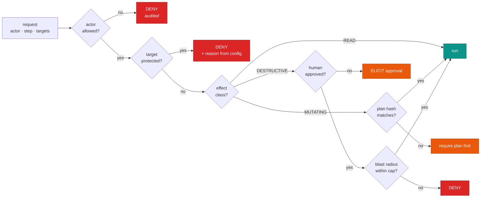

Supporting pieces:

- **Effect classification is declared on the step**, not inferred:
  `READ` / `MUTATING` / `DESTRUCTIVE`. A pack author who adds a wipe must
  say so, and the policy layer keys off it.
- **Plan-then-run with a hash.** `fleet_run` requires the hash of a plan the
  agent just fetched. If the fleet changed underneath (a device came online,
  a newer build appeared), the hash mismatches and the agent has to re-plan.
  This prevents "planned against 1 device, ran against 6."
- **Blast-radius cap.** `--batch`-equivalent fan-out is bounded per actor.
- **§10's audit is no longer optional.** `actor="mcp:claude"` on every
  record is precisely what makes an agent-driven fleet reviewable. Denials
  are audited too — a policy that silently refuses is undebuggable.
- **Secrets never cross the port.** MCP returns device *ids* and refs, not
  SMB credentials or ADB key material; §10's `Redactor` applies to tool
  output as well as logs.

### Decisions

- **MCP: yes**, over **stdio** (D10). One local agent, no listening socket,
  no auth surface of its own, and it's what Claude Code / Claude Desktop
  expect. SSE/HTTP only if a remote agent ever needs in — and by then the
  policy layer and audit trail already exist, which is the hard part.
- **Agent scope: any step or workflow (D11)**, gated by approval rather than
  by an allow-list. Workflows are exposed as tools too, so "run the
  kodi-refresh workflow" is one approved call rather than four.
- **HTTP API: on hold (D4-adjacent).** No consumer needs it. HA imports the
  package in-process, strictly better than a network hop. Same adapter shape
  as MCP, so adding it later is cheap — that's the argument for the ports
  design, not for building all four ports now.
- **Ordering is non-negotiable:** `PolicyEngine` and §10's audit trail land
  **before** the MCP adapter. Shipping agent-facing tools over a fleet with
  no policy layer and no audit record is the one sequencing mistake in this
  plan that's genuinely hard to walk back.

---

## 12. Testability — what this buys

The repo has **zero tests** today, and the reason is visible in the code:
almost nothing can be exercised without a live Fire Stick and an SMB share.

| Seam | What becomes testable without hardware |
|---|---|
| `Transport` protocol | Every job/step, against a `FakeTransport` recording commands |
| `ArtifactStore` protocol | build/deploy against an in-memory or tmpdir store |
| `DeviceProbe` protocol | discovery against canned `getprop` output |
| `ProfileTransform` protocol | each Kodi transform as pure fixture-dir in → assertions out |
| Config layering | pure data in → resolved config out |
| `WorkflowEngine` plan | targeting + capability checks with zero I/O |
| `AuditingTransport` decorator | **assert on effects, not mocks** — a maintain test asserts "90 `pm disable-user` events, all `OK`" from the audit stream rather than reaching into a mock's call list |
| `Redactor` | pure: sensitive value in → masked out; regression-testable against the S1/S2 leak paths |
| `AuditSink` protocol | in-memory adapter for tests, JSONL for real runs — the second adapter that makes it a real seam |

`_merge.reconcile` is already pure and was extracted for exactly this
reason — the note in its docstring says so. This generalizes that instinct
to the whole codebase.

---

## 13. Open-source readiness

`fleetctl` ships publicly (D8), which changes several defaults from
"household tool" to "someone else will run this against their hardware."

| Area | Requirement | Why it matters here specifically |
|---|---|---|
| **Config hygiene** | No real IPs, MACs, hostnames or credentials anywhere in the repo — including docs, skills, agent files and comments. `.example` files are the tracked reference. | This exact failure has already happened once: real device data reached a committed skill doc and needed a history rewrite to scrub. The `!ref` secrets model (§5) makes the safe path the default path. |
| **Licensing** | **MIT** (decided 2026-08-01). | Chosen for simplicity and permissiveness; retrofitting a licence across contributors is painful, so it was settled before first push. |
| **Versioning** | SemVer, with the **pack API** versioned separately from the CLI. | Third-party packs pin against the pack API, not the app. |
| **Testing** | Real suite from day one — the seams in §12 exist to make this cheap. Target: every pure transform and the whole plan path covered without hardware. | The current repo has zero tests. Shipping a fleet tool that can `rm -rf` remote devices with no test suite is not defensible publicly. |
| **CI** | GitHub Actions: `black --check`, `isort --check-only`, `mypy --strict`, `pytest`, build. | The existing codebase is already `mypy --strict` clean — don't regress that during the port. |
| **Docs** | README with a 5-minute quickstart, a pack-authoring guide, and a **safety page** covering policy/protected devices/audit. | The pack-authoring guide is what makes the plugin architecture real rather than theoretical. |
| **Security posture** | `SECURITY.md`, documented threat model, and an explicit statement that ADB keys are standing credentials. | Users will point this at their own networks. |
| **Hardware honesty** | Pack docs state what was actually verified against real hardware vs. inferred. | This project's own history shows the cost: a borrowed bloat list turned out to contain fabricated package names. |

A useful side effect: a public tool can't rely on tribal knowledge, so the
gotchas currently living in memory files (toybox `tar -z`, `adb_shell push`,
`pm disable-user` on Fire OS 5.x) become documented pack behaviour with
citations — which is where they belonged anyway.

---

## 14. Build plan

This is a **new repository**, not an in-place refactor — which is simpler
than the migration originally sketched. `firestick_manager` keeps running
untouched the whole time and is retired only at cutover.

```mermaid
flowchart LR
    subgraph now["Today"]
        FM["firestick_manager<br/><i>keeps running</i>"]
        HAOLD["HA integration<br/>pins fire_tools@tag"]
        FM --> HAOLD
    end
    subgraph build["Build fleetctl in parallel"]
        S1["S1 core"] --> S2["S2 firetv + kodi<br/><i>parity</i>"] --> S3["S3 config + workflows"] --> S4["S4 policy + audit"] --> S5["S5 Shield"] --> S6["S6 MCP"]
    end
    S2 -.->|"verify against<br/>same devices"| FM
    S4 --> CUT["Cutover:<br/>HA repins to fleetctl"]
    CUT --> RET["firestick_manager<br/>archived"]

    style FM fill:#334155,stroke:#1e293b,color:#fff
    style CUT fill:#dc2626,stroke:#991b1b,color:#fff
    style RET fill:#334155,stroke:#1e293b,color:#fff
```

### Stages

| # | Stage | Contents | Exit criterion |
|---|---|---|---|
| **S0** | Repo bootstrap | uv + hatchling, `src/fleetctl/`, licence, CI (black/isort/mypy --strict/pytest), `.gitignore` incl. `config/` real data, `.example` files | CI green on an empty package |
| **S1** | Core kernel | `Transport` protocol + `AdbTransport`; `ArtifactStore` + SMB **and** local adapters; inventory; operations; `SecretProvider` (env + keyring); observability (audit sink, redactor, correlation, log setup) | `FakeTransport` + `LocalArtifactStore` let a trivial step run end-to-end in tests, with audit records asserted |
| **S2** | First pack + first app | `packs/android` (deep base) → `packs/firetv`; `apps/kodi` with all four transforms; capture/build/deploy steps | **Feature parity**: capture → build → deploy a real device, verified against what `firestick_manager` produces |
| **S3** | Config-as-code + workflows | bloat/prune/allow/settings/hub-layout → YAML; layered resolution; `Workflow` + engine + plan/dry-run; registry-driven CLI | `fleetctl run kodi-refresh --dry-run` prints a correct plan; `config show <device>` explains every resolved key |
| **S4** | Policy + audit hardening | `PolicyEngine`, effect classification on every step, protected-device rules, blast-radius cap, hash chain + `audit verify` | Gold device is **structurally** undeployable-to without a config edit |
| **S5** | Shield Pro | `packs/shield`; whatever quirks turn out to be Fire-OS-only get pushed down into `packs/firetv` | Same Kodi build deploys to a Stick and a Shield from one workflow |
| **S6** | MCP adapter | stdio server; tools from the step/workflow registry; resources for inventory/builds/audit; approval flow | Agent completes a full `kodi-refresh` with per-step approval, fully audited |
| **S7** | HA cutover | HA integration repinned to `fleetctl`; becomes actor `ha:*`; services regenerated from the registry; panel + automations updated | Live panel runs on `fleetctl`; `firestick_manager` archived |
| **S8** | Later | `packs/linux_host` + SSH transport; HTTP API if a consumer appears; `fleet.lock` | — |

### Open before S1 — six decisions the architecture review surfaced

An architecture review of this plan (2026-08-01, against the S0 scaffold)
found six decisions that are **unmade or wrong as written**, all cheap to
settle now and expensive once `packs/firetv` and `apps/kodi` exist. The ring
model is sound; the *contract between rings* is underspecified, and that is
where the leak will happen.

| # | Issue | Why it can't wait |
|---|---|---|
| **1** | **`Transport.exec()` has no effect-class parameter**, yet §10 routes every call by effect class. As drawn, `AuditingTransport` could only classify by pattern-matching command strings — putting `getprop`/`pm`/`settings put` vocabulary *inside `core/`*, which `/ring-check` is built to reject. Also, step-level effect (policy) and command-level effect (audit routing) are never reconciled. | It's a signature change on the interface every pack, app and third-party plugin codes against. Free in S1; breaks the versioned pack API in S5. **Proposed:** the caller declares effect per call, defaulting to `MUTATING` (fail-safe — an unlabelled command gets audited, not dropped). |
| **2** | **One `StepContext` for three kinds of step.** Fleet-level steps (`kodi.build`, `fetch_base`) have no device but are handed a `Transport`. Worse, the headline guarantee — *"`build` gets a transform chain and no transport, so you can't put a transform in deploy"* — is **currently false**: `StepContext` has no transform-chain field and gives `transport` to every step. The guarantee is enforced by discipline, exactly the failure mode §2 criticizes. | **Proposed:** split into `FleetStepContext` / `DeviceStepContext` / `TransformStepContext`, and type `config` per step from its own Pydantic model rather than `Mapping[str, Any]` — an `Any` hole at the centre of a `mypy --strict` codebase. |
| **3** | **The `apps/` → `packs/` decoupling doesn't survive the concrete Kodi case.** Deploy must know the on-device Kodi path (half app knowledge, half *device layout*), the staging dir for the free-space check (pure device knowledge), and issue the `gzip -d`/`tar xf` split — which is a **Fire OS quirk owned by `packs/firetv`**. The capability verb set has no verb for path resolution or archive extraction; `state` is the only candidate and is the least-specified verb in the document. | Either make `state` the deep verb (the pack owns tar/gzip/staging/headroom, and `apps/kodi` never issues a transfer shell command), or let quirks flow as typed pack-default config. The docs currently imply the latter without saying so, and finding 2 leaves it unvalidated. **Decide before S2**, or S5's validation criterion fires late and expensively. |
| **4** | **S2 can't obey its own rules without S3's config loader.** `packs.md` and `apps.md` require package lists and recipes to live in `data/*.yml`; `build-stages` says no config loader before S3; §14 puts firetv+kodi in S2. S2 must therefore hardcode Python constants (breaking two rules, guaranteeing a rewrite) or write a throwaway YAML reader. | **Proposed:** split S3 — move pack-data loading and layered resolution (pure, no I/O, no device) into S1 or the front of S2; leave workflows and the registry-driven CLI in S3. |
| **5** | **The ring rule is enforced by a Claude command, not by CI.** `/ring-check` is a grep an agent runs on request; CI runs black/isort/mypy/pytest and no import check. The single highest-consequence invariant is the one thing CI doesn't verify. | **Proposed:** add `import-linter` (layered contract: `core` < `packs`/`apps`, plus a forbidden `apps -> packs`) or a short `tests/test_architecture.py` walking the AST — wired into CI in **S1, while there are zero modules to fix**. It also forces the `packs/android` exception to be encoded explicitly. |
| **6** | **`Step` returns `str`, but the workflow DSL depends on `{{ steps.build.artifact }}`.** A human-readable summary string has no `.artifact`. | **Proposed:** `StepResult(summary, artifacts, facts)`. Fix in S1 — it's the second-most-implemented interface after `Transport`. |

Further findings that don't block starting: the **hash chain has no concurrency
story** (a chain needs a total order over a single writer, but steps run at
`concurrency: 4` with CLI and HA writing simultaneously — and 90-day retention
deletes the head of the chain, so daily files need independent anchors);
**capability truth lives in two places** (on `Transport` and on `@device_pack`,
with no stated precedence); **`packs/android` is an undrawn fourth ring** and
`AndroidActions` as specified owns six concerns — the same shape as the
predecessor's `const.py` that §2 criticizes; and the **"two adapters" rule is
vacuous as written**, since a test double always exists if you write one — the
device-pack seam in particular has exactly one real adapter until S5.

The review's recommendation on the workflow DSL is worth recording: keep
plan/targeting/capability-checking (needed regardless, and what policy's
blast-radius cap and MCP's plan hash are built on), but **defer the
`{{ }}` templating** — the predecessor already solves artifact handoff by
querying the store for the latest build, which is simpler and needed anyway.
Let workflows be registered Python callables first; add YAML as a thin
front-end over the same plan model once a second real workflow exists.

### Sequencing rules

1. **S1 before everything.** Both `ArtifactStore` adapters land in S1 — one
   adapter is a hypothetical seam, two make it real, and the local adapter
   is what makes S2 testable at all.
2. **S4 before S6.** Policy and audit precede the MCP adapter. This is the
   one ordering in the plan that is genuinely hard to walk back.
3. **S2 is the honesty gate.** Parity against real hardware before any of
   the interesting work. If `fleetctl` can't reproduce a working deploy,
   nothing after it matters.
4. **S5 validates the whole design.** If adding the Shield requires touching
   `core/` or `apps/kodi/`, the seams are in the wrong place — that's the
   signal to stop and fix, not to work around.
5. **S7 is a coordinated release** across two repos, and the HA side has its
   own deploy quirks (manual manifest bump + restart, feature branch not
   `main`). Budget for it as its own piece of work.

### Carried forward from `firestick_manager`

These are hard-won and must survive the port intact — they're the reason
`fleetctl` starts from working code rather than a blank page:

- **Netcat upload** and the two constraints behind it (listener can't be
  backgrounded; `nc` drops its buffered tail, so the md5 check is
  load-bearing) → `AdbTransport.put()`.
- **`tar cf` + separate `gzip`**, never `tar czf` — toybox truncation. Now
  declared as a `packs/firetv` quirk rather than a global assumption.
- **Flat build archives** (`addons/`/`userdata/`/`media/` at the tar root).
- **Single-archive transfer**, never per-file sync.
- **Size-scaled timeouts** for transfer and on-device unpack.
- **`OperationRegistry`'s** working cancellation, debounced flush, and
  restart handling — port as-is.
- **`_merge.reconcile`'s** MAC → serial → IP matching and its
  "only overwrite when the probe returned something" rule.
- **The gold-device rule** — but as enforced policy (S4), not a memory file.

---

## 15. Decisions

Recorded so future architecture reviews don't re-litigate them.

| # | Question | Decision | Rationale |
|---|---|---|---|
| **D1** | Name | **`fleetctl`**, new repo | Fresh start beats an in-place rename; `firestick_manager` stays working until cutover |
| **D2** | Workflow engine? | **Yes**, YAML-defined | Ordering, targeting and artifact handoff become explicit and inspectable instead of tribal |
| **D3** | Shared Android base depth | **Deep** — `packs/android` holds most behaviour; vendor packs compose it | Shield Pro is imminent; Fire OS quirks must not be inherited by it |
| **D4** | Phones | **Presence-only**, no management | Complete fleet view at near-zero cost; ADB-into-your-phone is a different project |
| **D5** | Secrets | **HA model**: config holds `!ref` only; `SecretProvider` resolves per consumer (HA config entry / env / keyring) | HA is the core target, and its standard is the strictest of the three |
| **D6** | Config format | **YAML** for everything user-facing; TOML stays for packaging | Comments matter for config-as-code; HA users already read YAML |
| **D7** | Audit destination & retention | **SMB by default**, `local` option, **90 days**, config-driven | Every consumer already reaches the share; exposure mitigated by mandatory redaction + hash chain |
| **D8** | Hash chain | **Yes** | Ships publicly — build it right |
| **D9** | Log organisation & volume | **Separate files/dirs per subsystem**; route by effect class — `READ` to rotating diagnostics, `MUTATING`/`DESTRUCTIVE` to durable audit | Keeps the durable stream reviewable without losing detail |
| **D10** | MCP transport | **stdio** | Local agent, no listening socket, no auth surface of its own |
| **D11** | Agent scope | **Any step or workflow**, gated by approval keyed on effect class | An allow-list would silently permit new destructive steps |
| **D12** | HA under policy? | **Yes** — HA becomes actor `ha:*` | More correct; automations and panel updated after cutover, accepted |

---

*Architecture plan — decisions locked. Build progress is tracked in §14;
see the README for current status.*
