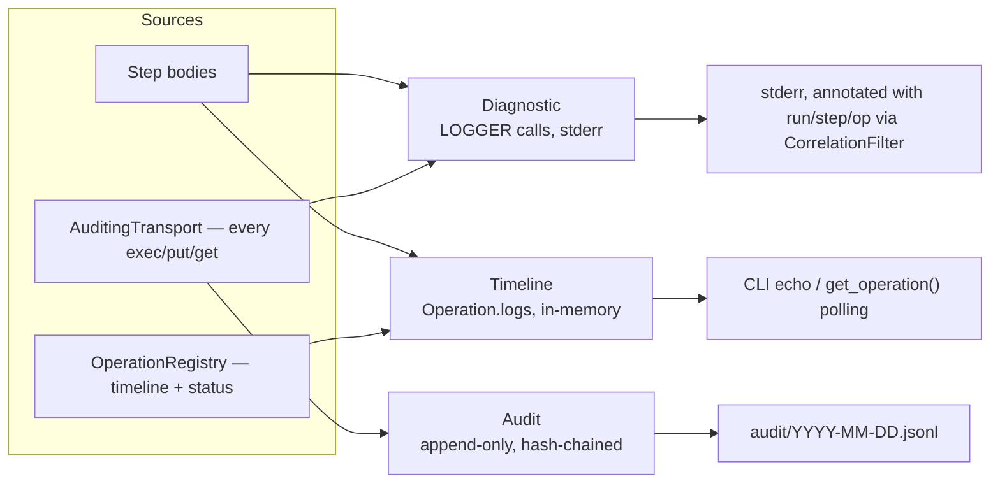
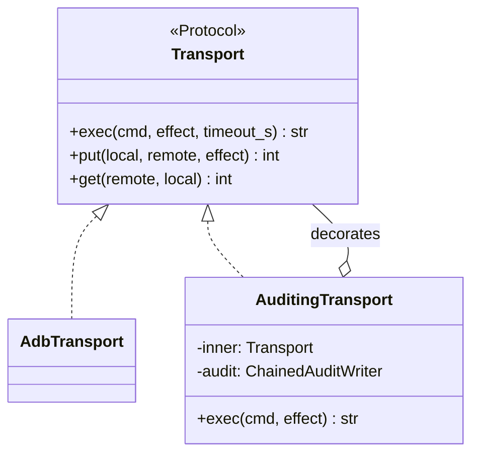
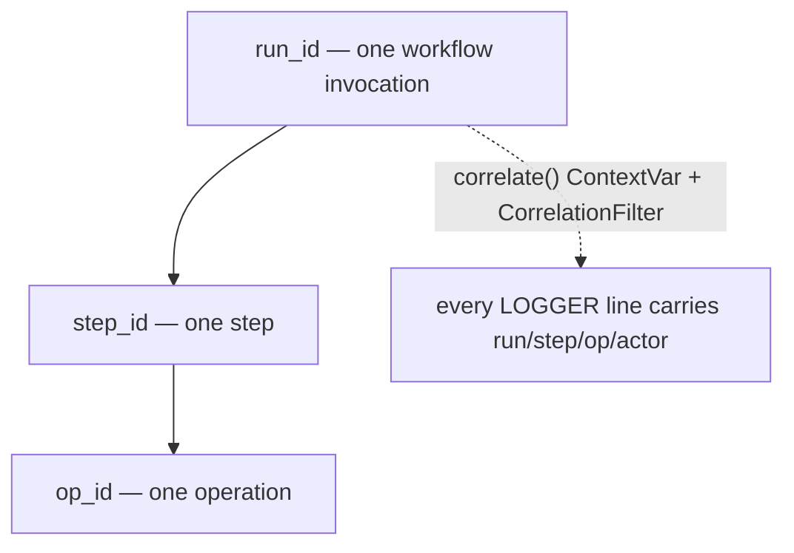

<h1 style="margin: 0 0 8px 0; padding: 0; border: 0; font-size: 2em;">Observability</h1>
<div style="color: #64748b; font-size: 15px; margin: 0 0 16px 0;">Three separate streams, why they're separate, and how correlation ids tie them together.</div>

<hr style="border: 0; border-top: 2px solid #005288; margin: 0 0 32px 0;"/>

<sub style="color: #64748b;">Last verified 2026-08-02</sub>

<h2 style="border-left: 6px solid #005288; padding: 4px 0 10px 16px; margin: 40px 0 16px; border-bottom: 1px solid rgba(0, 82, 136, 0.25); background-image: url(data:image/svg+xml;utf8,%3Csvg%20xmlns%3D%27http%3A%2F%2Fwww.w3.org%2F2000%2Fsvg%27%20width%3D%27100%25%27%20height%3D%27100%25%27%3E%3Cdefs%3E%3Cpattern%20id%3D%27h%27%20width%3D%2720%27%20height%3D%2735%27%20patternUnits%3D%27userSpaceOnUse%27%3E%3Cpath%20d%3D%27M10%2023L0%2018V6L10%200l10%206v12L10%2023zm0%200v12%27%20fill%3D%27none%27%20stroke%3D%27%23005288%27%20stroke-opacity%3D%270.22%27%2F%3E%3C%2Fpattern%3E%3ClinearGradient%20id%3D%27lg%27%20x1%3D%270%25%27%20x2%3D%27100%25%27%3E%3Cstop%20offset%3D%270%25%27%20stop-color%3D%27white%27%20stop-opacity%3D%271%27%2F%3E%3Cstop%20offset%3D%2785%25%27%20stop-color%3D%27white%27%20stop-opacity%3D%270%27%2F%3E%3C%2FlinearGradient%3E%3Cmask%20id%3D%27f%27%3E%3Crect%20width%3D%27100%25%27%20height%3D%27100%25%27%20fill%3D%27url%28%23lg%29%27%2F%3E%3C%2Fmask%3E%3C%2Fdefs%3E%3Crect%20width%3D%27100%25%27%20height%3D%27100%25%27%20fill%3D%27url%28%23h%29%27%20mask%3D%27url%28%23f%29%27%2F%3E%3C%2Fsvg%3E); background-size: 100% 100%; background-repeat: no-repeat; border-radius: 3px;">Three Streams, Deliberately Separated</h2>

`fleetctl` keeps three observability streams that look similar on the surface but serve different consumers and carry different security postures. Conflating them — which is what happened in `firestick_manager`, whose CLI never called `logging.basicConfig` so every diagnostic line was silently discarded — produces both an unreadable audit trail and a real risk of credential leaks in debug output.

| Stream | What it is | Consumer | Retention |
|---|---|---|---|
| **Diagnostic logging** | `LOGGER` calls, `%s`-formatted, to stderr via `configure_logging()` | Developer debugging a run, `-v`/`-vv` | Not persisted by fleetctl itself — a caller (systemd, HA, a container) owns rotation if it wants any |
| **Operation timeline** | Human-readable progress — one line per major step, held on the `Operation` record | CLI echo, `fleetctl audit tail`-adjacent polling via `get_operation` | In-memory, bounded to 500 operations, oldest finished ones evicted first |
| **Audit trail** | Append-only, structured, hash-chained JSONL — one record per auditable effect | Anyone reviewing what happened, when, and who did it | Files accumulate under `audit_dir`; no automatic expiry today |



<h2 style="border-left: 6px solid #005288; padding: 4px 0 10px 16px; margin: 40px 0 16px; border-bottom: 1px solid rgba(0, 82, 136, 0.25); background-image: url(data:image/svg+xml;utf8,%3Csvg%20xmlns%3D%27http%3A%2F%2Fwww.w3.org%2F2000%2Fsvg%27%20width%3D%27100%25%27%20height%3D%27100%25%27%3E%3Cdefs%3E%3Cpattern%20id%3D%27h%27%20width%3D%2720%27%20height%3D%2735%27%20patternUnits%3D%27userSpaceOnUse%27%3E%3Cpath%20d%3D%27M10%2023L0%2018V6L10%200l10%206v12L10%2023zm0%200v12%27%20fill%3D%27none%27%20stroke%3D%27%23005288%27%20stroke-opacity%3D%270.22%27%2F%3E%3C%2Fpattern%3E%3ClinearGradient%20id%3D%27lg%27%20x1%3D%270%25%27%20x2%3D%27100%25%27%3E%3Cstop%20offset%3D%270%25%27%20stop-color%3D%27white%27%20stop-opacity%3D%271%27%2F%3E%3Cstop%20offset%3D%2785%25%27%20stop-color%3D%27white%27%20stop-opacity%3D%270%27%2F%3E%3C%2FlinearGradient%3E%3Cmask%20id%3D%27f%27%3E%3Crect%20width%3D%27100%25%27%20height%3D%27100%25%27%20fill%3D%27url%28%23lg%29%27%2F%3E%3C%2Fmask%3E%3C%2Fdefs%3E%3Crect%20width%3D%27100%25%27%20height%3D%27100%25%27%20fill%3D%27url%28%23h%29%27%20mask%3D%27url%28%23f%29%27%2F%3E%3C%2Fsvg%3E); background-size: 100% 100%; background-repeat: no-repeat; border-radius: 3px;">Routing by Effect Class</h2>

Whether an effect is audited is keyed off the same classification steps already declare for policy purposes (see [`safety.md`](safety.md)) — `Effect.is_auditable` is true for `mutating` and `destructive`, false for `read`. A `read` call still logs diagnostically; it just never reaches the audit trail. A fleet-wide maintenance run produces hundreds of `read` probes that never touch the durable stream, and the handful of `pm disable-user` calls that do change something end up as individual audit records — nothing is lost either way, and the durable stream stays small enough to actually review.

<div align="left" style="margin-bottom: -16px;"></div>

```yaml
# config/fleet.yml
observability:
  audit_dir: audit    # relative to --home, default ~/.fleetctl
```

That's the entire config surface today — one path. Routing, redaction, and hash-chaining are not configurable; they're structural.

<h2 style="border-left: 6px solid #005288; padding: 4px 0 10px 16px; margin: 40px 0 16px; border-bottom: 1px solid rgba(0, 82, 136, 0.25); background-image: url(data:image/svg+xml;utf8,%3Csvg%20xmlns%3D%27http%3A%2F%2Fwww.w3.org%2F2000%2Fsvg%27%20width%3D%27100%25%27%20height%3D%27100%25%27%3E%3Cdefs%3E%3Cpattern%20id%3D%27h%27%20width%3D%2720%27%20height%3D%2735%27%20patternUnits%3D%27userSpaceOnUse%27%3E%3Cpath%20d%3D%27M10%2023L0%2018V6L10%200l10%206v12L10%2023zm0%200v12%27%20fill%3D%27none%27%20stroke%3D%27%23005288%27%20stroke-opacity%3D%270.22%27%2F%3E%3C%2Fpattern%3E%3ClinearGradient%20id%3D%27lg%27%20x1%3D%270%25%27%20x2%3D%27100%25%27%3E%3Cstop%20offset%3D%270%25%27%20stop-color%3D%27white%27%20stop-opacity%3D%271%27%2F%3E%3Cstop%20offset%3D%2785%25%27%20stop-color%3D%27white%27%20stop-opacity%3D%270%27%2F%3E%3C%2FlinearGradient%3E%3Cmask%20id%3D%27f%27%3E%3Crect%20width%3D%27100%25%27%20height%3D%27100%25%27%20fill%3D%27url%28%23lg%29%27%2F%3E%3C%2Fmask%3E%3C%2Fdefs%3E%3Crect%20width%3D%27100%25%27%20height%3D%27100%25%27%20fill%3D%27url%28%23h%29%27%20mask%3D%27url%28%23f%29%27%2F%3E%3C%2Fsvg%3E); background-size: 100% 100%; background-repeat: no-repeat; border-radius: 3px;">Audit Lives at the Transport Seam</h2>

Every side effect on every device — regardless of which pack issued it — goes through `Transport.exec` / `.put` / `.get`. Wrapping the transport in `AuditingTransport` captures all of them automatically, for every step ever written, including a future third-party pack that doesn't know auditing exists.



`AuditingTransport` is constructed once, by the composition root (`cli/bootstrap.py::Container.transport_for`) — a step receives it already wrapped and cannot opt out, because it never constructs its own transport. This is what makes auditing a property of the wiring rather than an obligation every pack author has to remember.

<h2 style="border-left: 6px solid #005288; padding: 4px 0 10px 16px; margin: 40px 0 16px; border-bottom: 1px solid rgba(0, 82, 136, 0.25); background-image: url(data:image/svg+xml;utf8,%3Csvg%20xmlns%3D%27http%3A%2F%2Fwww.w3.org%2F2000%2Fsvg%27%20width%3D%27100%25%27%20height%3D%27100%25%27%3E%3Cdefs%3E%3Cpattern%20id%3D%27h%27%20width%3D%2720%27%20height%3D%2735%27%20patternUnits%3D%27userSpaceOnUse%27%3E%3Cpath%20d%3D%27M10%2023L0%2018V6L10%200l10%206v12L10%2023zm0%200v12%27%20fill%3D%27none%27%20stroke%3D%27%23005288%27%20stroke-opacity%3D%270.22%27%2F%3E%3C%2Fpattern%3E%3ClinearGradient%20id%3D%27lg%27%20x1%3D%270%25%27%20x2%3D%27100%25%27%3E%3Cstop%20offset%3D%270%25%27%20stop-color%3D%27white%27%20stop-opacity%3D%271%27%2F%3E%3Cstop%20offset%3D%2785%25%27%20stop-color%3D%27white%27%20stop-opacity%3D%270%27%2F%3E%3C%2FlinearGradient%3E%3Cmask%20id%3D%27f%27%3E%3Crect%20width%3D%27100%25%27%20height%3D%27100%25%27%20fill%3D%27url%28%23lg%29%27%2F%3E%3C%2Fmask%3E%3C%2Fdefs%3E%3Crect%20width%3D%27100%25%27%20height%3D%27100%25%27%20fill%3D%27url%28%23h%29%27%20mask%3D%27url%28%23f%29%27%2F%3E%3C%2Fsvg%3E); background-size: 100% 100%; background-repeat: no-repeat; border-radius: 3px;">Correlation: One Id Hierarchy, Propagated Automatically</h2>



`core/observability/correlation.py::correlate()` binds `run_id`/`step_id`/`op_id`/`actor` on a `ContextVar` for the duration of a block; `CorrelationFilter` (a `logging.Filter`) injects the current values into every log record. This closes a concrete gap in `firestick_manager`: its service runs several jobs concurrently on a thread pool, and interleaved log output from simultaneous deploys is unattributable after the fact. `fleetctl`'s background `Dispatcher` binds correlation inside each worker thread specifically because context variables don't cross a thread boundary on their own — losing that would have reintroduced the same gap.

<h2 style="border-left: 6px solid #005288; padding: 4px 0 10px 16px; margin: 40px 0 16px; border-bottom: 1px solid rgba(0, 82, 136, 0.25); background-image: url(data:image/svg+xml;utf8,%3Csvg%20xmlns%3D%27http%3A%2F%2Fwww.w3.org%2F2000%2Fsvg%27%20width%3D%27100%25%27%20height%3D%27100%25%27%3E%3Cdefs%3E%3Cpattern%20id%3D%27h%27%20width%3D%2720%27%20height%3D%2735%27%20patternUnits%3D%27userSpaceOnUse%27%3E%3Cpath%20d%3D%27M10%2023L0%2018V6L10%200l10%206v12L10%2023zm0%200v12%27%20fill%3D%27none%27%20stroke%3D%27%23005288%27%20stroke-opacity%3D%270.22%27%2F%3E%3C%2Fpattern%3E%3ClinearGradient%20id%3D%27lg%27%20x1%3D%270%25%27%20x2%3D%27100%25%27%3E%3Cstop%20offset%3D%270%25%27%20stop-color%3D%27white%27%20stop-opacity%3D%271%27%2F%3E%3Cstop%20offset%3D%2785%25%27%20stop-color%3D%27white%27%20stop-opacity%3D%270%27%2F%3E%3C%2FlinearGradient%3E%3Cmask%20id%3D%27f%27%3E%3Crect%20width%3D%27100%25%27%20height%3D%27100%25%27%20fill%3D%27url%28%23lg%29%27%2F%3E%3C%2Fmask%3E%3C%2Fdefs%3E%3Crect%20width%3D%27100%25%27%20height%3D%27100%25%27%20fill%3D%27url%28%23h%29%27%20mask%3D%27url%28%23f%29%27%2F%3E%3C%2Fsvg%3E); background-size: 100% 100%; background-repeat: no-repeat; border-radius: 3px;">Audit Event Schema</h2>

<div align="left" style="margin-bottom: -16px;"></div>

```python
@dataclass(frozen=True, slots=True)
class AuditEvent:
    """One recorded effect. Never updated after it is written."""

    kind: AuditKind               # exec | put | get | plan | config | decision | auth
    action: str                   # "pm disable-user" | "artifact.put"
    effect: Effect = Effect.MUTATING
    outcome: Outcome = Outcome.OK  # ok | failed | skipped | denied
    target: str = ""              # device address or id
    detail: Mapping[str, Any] = field(default_factory=dict)   # redacted before write
    error: str | None = None
    duration_ms: int = 0
    ts: str = ...                 # ISO-8601 UTC
    run_id: str = "-"
    step_id: str = "-"
    op_id: str = "-"
    actor: str = "-"
    seq: int = 0
    prev_hash: str = ""           # hash chain over the preceding record
    hash: str = ""
```

Written as JSONL, one file per day, appended and never rewritten. `prev_hash` chains each record to the one before it, so `fleetctl audit verify` can detect truncation or a mid-file edit cheaply — the difference between "a log" and "a record you can trust when running an incident down." The chain resumes correctly across process restarts: a fresh CLI invocation continues the existing day's chain rather than re-anchoring at genesis.

Four event kinds beyond raw `exec`/`put`/`get` are worth naming:

- **`config`** — a resolved configuration decision, so "why did this stick get that setting?" is answerable without reading Python.
- **`decision`** — a policy verdict: an approval requirement, a denial, a blast-radius cap hit. Every branch that denies is itself an audited event.
- **`auth`** — recorded around ADB key use where relevant.
- **`plan`** — a workflow plan, recorded whether or not a run follows, so intent is on the record even when nothing executes (see [`safety.md`](safety.md)'s plan-then-run flow).

<h2 style="border-left: 6px solid #005288; padding: 4px 0 10px 16px; margin: 40px 0 16px; border-bottom: 1px solid rgba(0, 82, 136, 0.25); background-image: url(data:image/svg+xml;utf8,%3Csvg%20xmlns%3D%27http%3A%2F%2Fwww.w3.org%2F2000%2Fsvg%27%20width%3D%27100%25%27%20height%3D%27100%25%27%3E%3Cdefs%3E%3Cpattern%20id%3D%27h%27%20width%3D%2720%27%20height%3D%2735%27%20patternUnits%3D%27userSpaceOnUse%27%3E%3Cpath%20d%3D%27M10%2023L0%2018V6L10%200l10%206v12L10%2023zm0%200v12%27%20fill%3D%27none%27%20stroke%3D%27%23005288%27%20stroke-opacity%3D%270.22%27%2F%3E%3C%2Fpattern%3E%3ClinearGradient%20id%3D%27lg%27%20x1%3D%270%25%27%20x2%3D%27100%25%27%3E%3Cstop%20offset%3D%270%25%27%20stop-color%3D%27white%27%20stop-opacity%3D%271%27%2F%3E%3Cstop%20offset%3D%2785%25%27%20stop-color%3D%27white%27%20stop-opacity%3D%270%27%2F%3E%3C%2FlinearGradient%3E%3Cmask%20id%3D%27f%27%3E%3Crect%20width%3D%27100%25%27%20height%3D%27100%25%27%20fill%3D%27url%28%23lg%29%27%2F%3E%3C%2Fmask%3E%3C%2Fdefs%3E%3Crect%20width%3D%27100%25%27%20height%3D%27100%25%27%20fill%3D%27url%28%23h%29%27%20mask%3D%27url%28%23f%29%27%2F%3E%3C%2Fsvg%3E); background-size: 100% 100%; background-repeat: no-repeat; border-radius: 3px;">Redaction Runs Before Every Write</h2>

`core/observability/redact.py::Redactor` strips a default set of sensitive key names (`password`, `secret`, `token`, `api_key`, `auth`, `credential`, `private_key`, and close variants) out of anything headed for the audit trail or a log line, applied inside `AuditingTransport` so no step or transport implementation can bypass it. Separately, config values wrapped in `Secret` (`core/config/secrets.py`) render as a fixed mask under `str()`/`repr()` — a caller must call `.reveal()` deliberately to get the underlying value, which is the one thing standing between a resolved `!ref` and it leaking into a log line or an accidental `print()`.

<h2 style="border-left: 6px solid #005288; padding: 4px 0 10px 16px; margin: 40px 0 16px; border-bottom: 1px solid rgba(0, 82, 136, 0.25); background-image: url(data:image/svg+xml;utf8,%3Csvg%20xmlns%3D%27http%3A%2F%2Fwww.w3.org%2F2000%2Fsvg%27%20width%3D%27100%25%27%20height%3D%27100%25%27%3E%3Cdefs%3E%3Cpattern%20id%3D%27h%27%20width%3D%2720%27%20height%3D%2735%27%20patternUnits%3D%27userSpaceOnUse%27%3E%3Cpath%20d%3D%27M10%2023L0%2018V6L10%200l10%206v12L10%2023zm0%200v12%27%20fill%3D%27none%27%20stroke%3D%27%23005288%27%20stroke-opacity%3D%270.22%27%2F%3E%3C%2Fpattern%3E%3ClinearGradient%20id%3D%27lg%27%20x1%3D%270%25%27%20x2%3D%27100%25%27%3E%3Cstop%20offset%3D%270%25%27%20stop-color%3D%27white%27%20stop-opacity%3D%271%27%2F%3E%3Cstop%20offset%3D%2785%25%27%20stop-color%3D%27white%27%20stop-opacity%3D%270%27%2F%3E%3C%2FlinearGradient%3E%3Cmask%20id%3D%27f%27%3E%3Crect%20width%3D%27100%25%27%20height%3D%27100%25%27%20fill%3D%27url%28%23lg%29%27%2F%3E%3C%2Fmask%3E%3C%2Fdefs%3E%3Crect%20width%3D%27100%25%27%20height%3D%27100%25%27%20fill%3D%27url%28%23h%29%27%20mask%3D%27url%28%23f%29%27%2F%3E%3C%2Fsvg%3E); background-size: 100% 100%; background-repeat: no-repeat; border-radius: 3px;">Forensics: Keep the Evidence on Failure</h2>

Every operation runs inside a staging directory under `--home`/staging. On a non-cancelled failure, `container.failures_root` (`--home`/forensics) preserves that workspace rather than letting it get torn down with the rest — before-the-fact evidence for whatever failed, without needing to reproduce it. Retention is capped to the most recent entries.

<h2 style="border-left: 6px solid #005288; padding: 4px 0 10px 16px; margin: 40px 0 16px; border-bottom: 1px solid rgba(0, 82, 136, 0.25); background-image: url(data:image/svg+xml;utf8,%3Csvg%20xmlns%3D%27http%3A%2F%2Fwww.w3.org%2F2000%2Fsvg%27%20width%3D%27100%25%27%20height%3D%27100%25%27%3E%3Cdefs%3E%3Cpattern%20id%3D%27h%27%20width%3D%2720%27%20height%3D%2735%27%20patternUnits%3D%27userSpaceOnUse%27%3E%3Cpath%20d%3D%27M10%2023L0%2018V6L10%200l10%206v12L10%2023zm0%200v12%27%20fill%3D%27none%27%20stroke%3D%27%23005288%27%20stroke-opacity%3D%270.22%27%2F%3E%3C%2Fpattern%3E%3ClinearGradient%20id%3D%27lg%27%20x1%3D%270%25%27%20x2%3D%27100%25%27%3E%3Cstop%20offset%3D%270%25%27%20stop-color%3D%27white%27%20stop-opacity%3D%271%27%2F%3E%3Cstop%20offset%3D%2785%25%27%20stop-color%3D%27white%27%20stop-opacity%3D%270%27%2F%3E%3C%2FlinearGradient%3E%3Cmask%20id%3D%27f%27%3E%3Crect%20width%3D%27100%25%27%20height%3D%27100%25%27%20fill%3D%27url%28%23lg%29%27%2F%3E%3C%2Fmask%3E%3C%2Fdefs%3E%3Crect%20width%3D%27100%25%27%20height%3D%27100%25%27%20fill%3D%27url%28%23h%29%27%20mask%3D%27url%28%23f%29%27%2F%3E%3C%2Fsvg%3E); background-size: 100% 100%; background-repeat: no-repeat; border-radius: 3px;">Where to Read Next</h2>

- How the audit trail feeds the policy layer's approval and denial decisions: [`safety.md`](safety.md)
- Every field in the `observability:` config block: [`configuration.md`](configuration.md)
- `audit tail` / `audit verify` commands: [`cli-reference.md`](cli-reference.md#audit)

<br/><br/>

<hr style="border: 0; border-top: 1px solid rgba(100, 116, 139, 0.35); margin: 24px 0;"/>

<br/>

<table>
<tr>
<td width="22%" valign="top" align="center">

<br/>
<strong>fleetctl</strong>
<br/><br/>
<sub>Observability</sub>

</td>
<td width="26%" valign="top">

<h4><ins style="color: #2a8b93; text-decoration: none;">Documentation</ins></h4>

- [Getting Started](getting-started.md)
- [CLI Reference](cli-reference.md)
- [Configuration](configuration.md)
- [Architecture](architecture.md)
- [Safety & Policy](safety.md)

</td>
<td width="26%" valign="top">

<h4><ins style="color: #2a8b93; text-decoration: none;">Repositories</ins></h4>

- [fleetctl](https://github.com/salvuswarez/fleetctl)
- [firestick_manager](https://github.com/salvuswarez/firestick_manager) &mdash; predecessor
- [ha-cyberpunk](https://github.com/salvuswarez/ha-cyberpunk) &mdash; S7 consumer

<h4><ins style="color: #2a8b93; text-decoration: none;">References</ins></h4>

- [Roadmap](roadmap.md) &mdash; S0&ndash;S8 stages
- [Documentation Index](README.md)

</td>
<td width="26%" valign="top">

<h4><ins style="color: #2a8b93; text-decoration: none;">About</ins></h4>

- Plugin-based home device fleet manager
- MIT licensed

<h4><ins style="color: #2a8b93; text-decoration: none;">Status</ins></h4>

- S0&ndash;S6 done &middot; S7 (HA cutover) not started

</td>
</tr>
</table>

<br/>

<hr style="border: 0; border-top: 1px solid rgba(100, 116, 139, 0.35); margin: 24px 0;"/>

<div align="center">
  <sub>fleetctl</sub>
</div>
