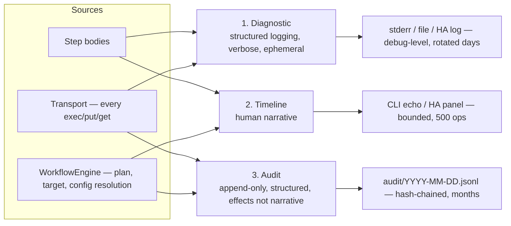
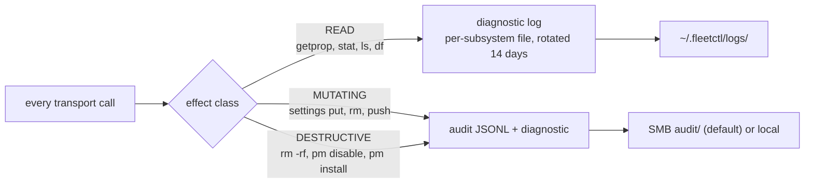
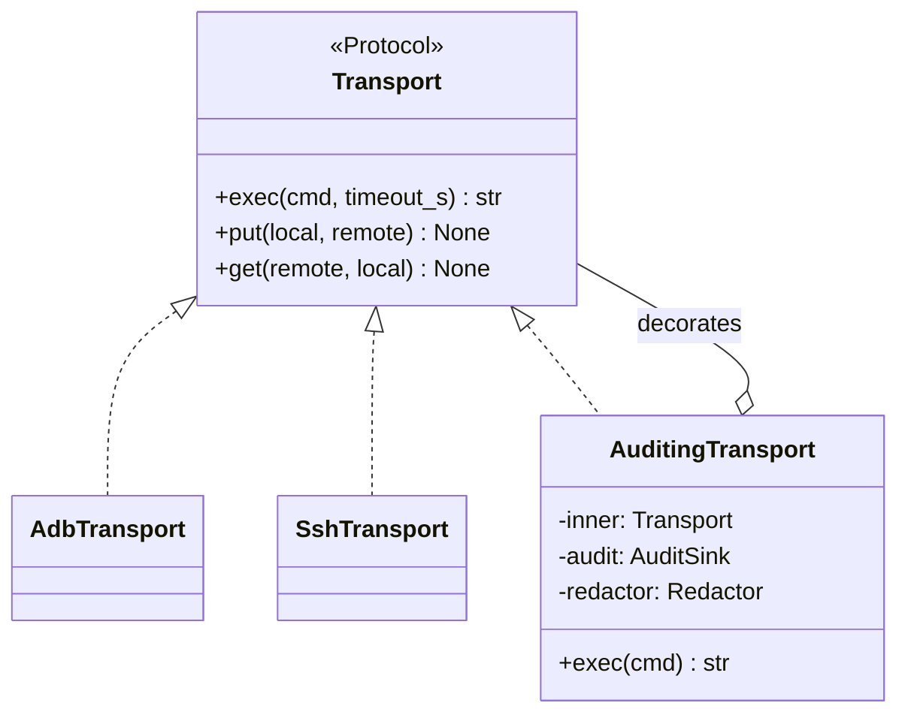
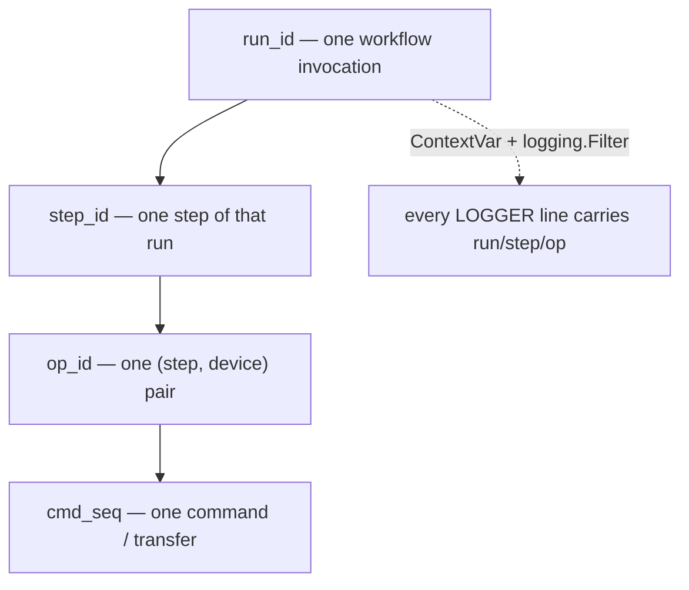

# Observability

> [!IMPORTANT]
> **Status: planned (S1 for the foundations, S4 for hardening).** No `core/observability/` package exists yet — no audit sink, no redactor, no correlation `ContextVar`, no per-subsystem log routing. This documents the settled design from [`architecture.md`](architecture.md) §10 so the shape is clear before it's built. The predecessor project, `firestick_manager`, has neither an audit trail nor working diagnostic logging in CLI runs today — the gaps this design closes are real and currently live.

## Three streams, deliberately separated

`fleetctl` keeps three observability streams that look similar on the surface but serve different consumers, have different retention needs, and carry different security postures. Conflating them — which is exactly what happened in `firestick_manager` — is what produces both an unreadable audit trail and credential leaks in debug logs.

| Stream | What it is | Consumer | Retention |
|---|---|---|---|
| **Diagnostic logging** | Per-subsystem files (`transport/adb.log`, `packs/firetv.log`, ...), verbose, `%s`-formatted `LOGGER` calls | Developer debugging a run | Rotated, days |
| **Operation timeline** | Human-readable progress narrative — "Disabling 90 bloat packages...", one line per major step | CLI echo, HA panel | Bounded count (the predecessor caps at 500 records) |
| **Audit trail** | Append-only, structured, hash-chained JSONL — one record per actual effect | Anyone reviewing what happened, when, and who did it | 90 days by default |



The operation timeline is the one piece that already exists and works: `OperationRegistry` in `firestick_manager` has a single owning lock, debounced flush, bounded retention, and marks `running` records as failed on restart. That behaviour carries forward unchanged (`architecture.md` §9). What's missing entirely is the audit trail — today's `Operation.logs` covers roughly ninety `pm disable-user` calls with one summary line, and the failures those calls swallow by design are simply gone. Diagnostic logging exists as `LOGGER` calls, but nothing calls `logging.basicConfig` in the predecessor's CLI, so every `debug`/`info` line is silently discarded on every CLI run — only Home Assistant, which configures logging itself, ever sees them.

## Routing by effect class

Rather than treat "how much do we log" as a single volume knob, routing is keyed off the same effect classification steps already declare for policy purposes (see [`safety.md`](safety.md)):



A fleet-wide maintenance run produces thousands of `READ` probes — those stay in a rotating diagnostic file that ages out in two weeks. The same run's few hundred `pm disable-user` calls go to the durable, hash-chained audit trail. Nothing is lost either way; the durable stream stays small enough to actually review, which is the point.

```yaml
# config/fleet.yml
observability:
  logs:
    dir: ~/.fleetctl/logs
    level: info                     # per-subsystem overrides supported
    rotate: { when: midnight, keep_days: 14 }
  audit:
    destination: smb                # smb (default) | local
    path: fleetctl/audit
    retention_days: 90
    hash_chain: true
    record_reads: false              # READ stays diagnostic-only
  forensics:
    enabled: true
    keep_failures: 20
```

Audit defaults to the SMB share rather than local disk — a deliberate call, made because every consumer (CLI, Home Assistant, and eventually an agent) already reaches that share, which matters more than the exposure of a household-network-reachable path. Two things carry that decision: redaction happens before every write, and the hash chain makes tampering on a shared path detectable rather than silent. `destination: local` is a one-line config change for anyone who wants the audit trail off the network entirely.

## The key move: audit lives at the transport seam

Every side effect on every device — regardless of which pack or which future third-party plugin issued it — goes through `Transport.exec` / `.put` / `.get`. Wrapping the transport in a decorator captures all of them automatically, for every step ever written, including packs that don't know auditing exists.



`AuditingTransport` is injected once, by the composition root (`cli/bootstrap.py`, the HA integration's setup, `tests/conftest.py`) — a step receives it already wrapped and cannot opt out, because it never constructs its own transport. This is what makes auditing a property of the wiring rather than an obligation every pack author has to remember. It's also what turns a maintenance run's ninety `pm disable-user` calls into ninety audit records with individual outcomes, without a single logging line written by the pack author.

## Correlation: one id hierarchy, propagated automatically



A `ContextVar` set once by the engine, plus a `logging.Filter` that injects it into every log record, means correlation costs a step author nothing and can't be forgotten. This closes a specific gap in `firestick_manager`: `FleetService` there runs up to eight jobs concurrently on a thread pool, and interleaved log output from two simultaneous deploys is currently unattributable after the fact. With `run_id → step_id → op_id → cmd_seq` on every line, grepping one deploy out of eight concurrent ones becomes a single filter.

## Audit event schema

```python
@dataclass(frozen=True, slots=True)
class AuditEvent:
    """One recorded effect. Append-only; never updated after write."""

    ts: str                      # ISO-8601, UTC
    run_id: str
    step_id: str
    op_id: str
    seq: int
    actor: str                   # "cli:alice" | "ha:automation.nightly" | "mcp:claude"
    device_id: str | None
    device_addr: str | None
    kind: AuditKind              # EXEC | PUT | GET | PLAN | CONFIG | DECISION | AUTH
    action: str                  # "pm disable-user" | "artifact.push"
    detail: Mapping[str, Any]    # redacted
    outcome: Outcome             # OK | FAILED | SKIPPED | UNSUPPORTED
    error: str | None
    duration_ms: int
    prev_hash: str               # hash chain over the preceding record
    hash: str
```

Written as JSONL, one file per day, appended never rewritten. `prev_hash` chains each record to the one before it, so `fleetctl audit verify` can detect truncation or a mid-file edit cheaply — the difference between "a log" and "a record you can trust when running an incident down."

Four event kinds beyond raw `exec`/`put`/`get` calls are worth naming, because none of them have any representation in the predecessor project today:

- **`CONFIG`** — the resolved configuration for a `(device, step)` pair, plus which config layer won each key. This answers "why did this stick get that setting?" without reading Python, and only exists because config layering (`architecture.md` §5) is explicit.
- **`DECISION`** — engine choices: which build was resolved as "latest," why a device was skipped, which pack claimed a host during discovery.
- **`AUTH`** — every use of the ADB private key against a device. If the key ever leaks, this is what lets you enumerate exactly which devices it touched and when — see [`safety.md`](safety.md) and [`../SECURITY.md`](../SECURITY.md).
- **`PLAN`** — a dry-run plan, recorded whether or not a run follows, so intent and effect both live in the audit trail (see [`safety.md`](safety.md)'s plan-then-run flow).

## Redaction is applied before write, not optional

The predecessor project has two live credential-leak paths: a config dataclass whose auto-generated `__repr__` would print a plaintext password if anything ever logged it, and `AdbClient.shell` logging full commands at `DEBUG` — including device settings that routinely embed `username=`/`password=` in IPTV URLs. Both are structural gaps, not "someone forgot to be careful" gaps, and they're fixed structurally rather than by convention:

| Finding | Fix |
|---|---|
| Config value would print in a `repr()` | Secret fields are `SecretStr` (pydantic) or `field(repr=False)`. `str(secret)` renders `**********`; a caller must call `.get_secret_value()` deliberately. |
| Commands logged verbatim at DEBUG | A `Redactor` sits at the diagnostic + audit boundary, driven by config-declared sensitive paths (e.g. `vars.kodi.settings.*.m3uPath`) plus regex patterns for URL credentials and bearer tokens. It's applied **inside** `AuditingTransport`, so no step or transport implementation can bypass it. |
| Audit trail on a shared SMB path | Mitigated by mandatory pre-write redaction and the hash chain; `destination: local` is a one-line config change. |
| No record of ADB key use | Every signer use emits an `AUTH` event, per device. |
| Secrets in config-as-code | Config holds `!ref` only, resolved per consumer via `SecretProvider`. The audit trail records the ref, never the resolved value. |

Redaction runs before a record is written, not as a step a caller can skip — that's the difference between "we redact sensitive fields" as policy and as an actual guarantee.

## Forensics: keep the evidence

Two gaps the predecessor has today, both closed the same way — collect the evidence before the thing that would destroy it runs:

- **Failure bundle.** On a non-cancelled failure, before the staging directory is torn down, collect the failing archive's name/size/digest, device free space, installed versions, and the last N lines of the device's own log, and persist it under `artifacts/failures/<op_id>/`. Retention capped; off by default for successful runs.
- **Pre-destruction manifest.** Before a deploy wipes `addons/`/`userdata/`/`media/`, record a cheap manifest — top-level entries and sizes — as an audit `detail`. Not a backup; a record that answers "what did we just replace?" after the fact.

## Where to read next

- The full gap analysis (`G1`–`G9`, `S1`–`S4`) this design closes, and three of them worth backporting to `firestick_manager` now: [`architecture.md`](architecture.md) §10
- How the audit trail feeds the policy layer's approval and denial decisions: [`safety.md`](safety.md)
- Which stage lands the foundations versus the hardening (`S1` vs. `S4`): [`roadmap.md`](roadmap.md)
