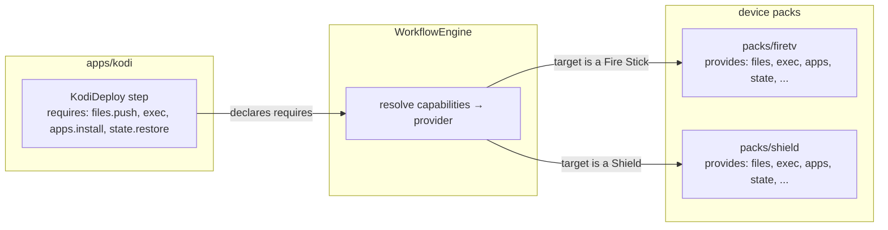
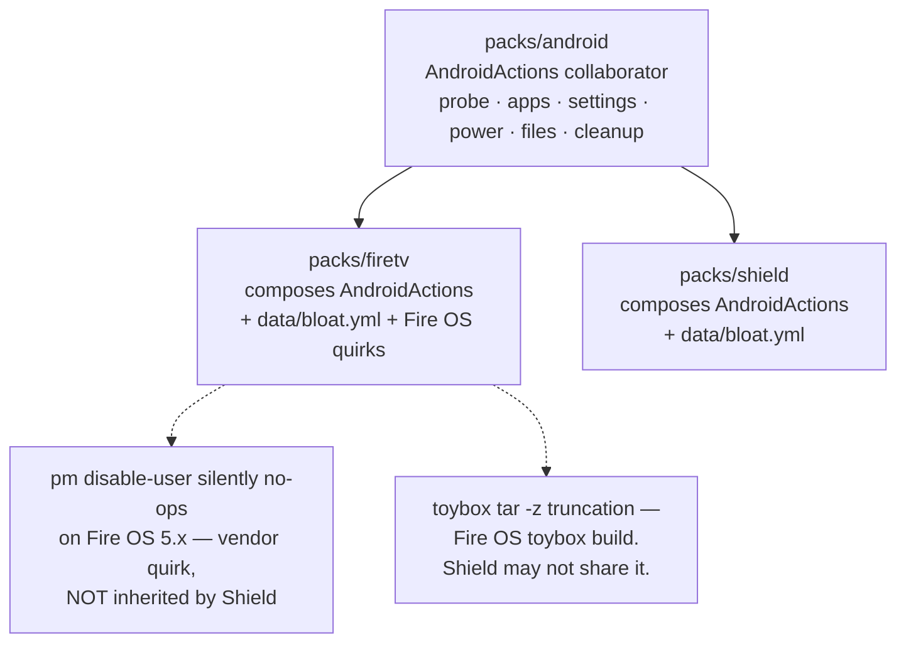

# Pack authoring guide

> [!IMPORTANT]
> **Status: planned (S2+).** No `packs/` or `apps/` package exists in `src/fleetctl/` yet, and there is no `@device_pack`/`@step` decorator, no entry-point registry, and no `Transport` protocol to satisfy. Nothing in this document can be run today. It documents the settled contract from [`architecture.md`](architecture.md) §3, §4, §7, and §8 so the shape is clear before S2 starts, and so a contributor arriving mid-build knows exactly what a pack is required to look like.

This is the most important document for anyone extending `fleetctl` with a new device type or a new piece of software. If you take one thing from it: **a pack should require zero changes inside `core/`.** If adding your pack means editing a `core/` module, the seam is in the wrong place — raise it as an issue rather than working around it (see [`../CONTRIBUTING.md`](../CONTRIBUTING.md)).

## Device pack vs. app pack

|  | Device pack | App pack |
|---|---|---|
| Answers | "What is this device, and what can I do to it?" | "How do I manage this piece of software?" |
| Lives in | `packs/<id>/` | `apps/<id>/` |
| Declares | capabilities it **provides** | capabilities it **requires** |
| Registers via | `fleetctl.packs` entry point | `fleetctl.apps` entry point |
| Knows about the other? | No | No |
| Examples | `firetv`, `shield`, `linux_host`, `generic_net` | `kodi` |

Neither ring imports the other directly. An app pack declares the capabilities its steps need (`files.push`, `exec`, `state.restore`); the workflow engine resolves which device pack on the target actually provides them. That indirection is the entire reason one `apps/kodi` build can deploy to a Fire Stick and an NVIDIA Shield without either knowing the other exists — see [`architecture.md`](architecture.md) §3 for the ring diagram.



## Anatomy of a pack

```text
packs/<id>/
├── __init__.py        # @device_pack registration
├── probe.py            # DeviceProbe — claim a host, or return None
├── actions.py           # steps: each with an effect class + a Pydantic params schema
└── data/
    ├── bloat.yml        # package lists — data, never a Python constant
    └── quirks.yml        # vendor workarounds this device needs, scoped to this pack
```

```text
apps/<id>/
├── __init__.py
├── capture.py / build.py / deploy.py    # the pipeline steps, if the app has one
├── transforms/                          # ProfileTransform implementations, pure functions
└── data/
    └── profiles/*.yml                    # recipes — allow-lists, settings overrides, layout
```

## Registration

Packs and apps register through Python entry points, resolved by `core/registry.py` — third-party packages register exactly the same way, which is what makes the plugin architecture real rather than a closed list of built-ins.

```python
# packs/firetv/__init__.py
from fleetctl.core.registry import device_pack


@device_pack(
    id="firetv",
    transport="adb",
    capabilities={"reach", "facts", "exec", "files", "apps", "settings", "power", "state", "cleanup"},
    probe_priority=10,          # lower runs first; generic_net claims last
    data_dir="data",
)
class FireTvPack:
    """Fire TV Stick device pack. Composes packs/android; does not subclass it."""
```

```toml
# pyproject.toml — a third-party package registers identically
[project.entry-points."fleetctl.packs"]
firetv     = "fleetctl.packs.firetv:FireTvPack"
shield     = "fleetctl.packs.shield:ShieldPack"

[project.entry-points."fleetctl.apps"]
kodi = "fleetctl.apps.kodi:KodiApp"
```

## Probes: claim a host, or get out of the way

A `DeviceProbe` decides whether a discovered host is "mine". Probes run in ascending `probe_priority` order during discovery; the first to claim a host wins, and `generic_net` claims whatever's left (see [`architecture.md`](architecture.md) §7).

```python
def probe(self, host: ProbeContext) -> DeviceIdentity | None:
    manufacturer = host.exec_ok("getprop ro.product.manufacturer")
    if "Amazon" not in manufacturer:
        return None                     # not mine — let the next pack try
    return DeviceIdentity(type="firetv", model=host.exec_ok("getprop ro.product.model"), ...)
```

Three rules, all non-negotiable:

- **Return `None`, never a partial identity**, when the host doesn't match. A probe that half-claims a host corrupts discovery for every pack behind it.
- **Depend on `CommandRunner` only**, not the full `Transport`. A probe never needs to push a file or check disk space to answer "is this a Fire TV?"
- **Never raise.** A subnet sweep hits mostly non-devices — printers, phones, routers. An exception escaping a probe kills the whole scan for one bad host; catch transport errors and return `None` instead.

## Capability declaration

A device pack declares the verbs it supports from the fixed vocabulary — `reach`, `facts`, `exec`, `files`, `apps`, `settings`, `power`, `state`, `cleanup` (full table in [`architecture.md`](architecture.md) §4). An app pack's step declares the subset it needs:

```python
class KodiDeploy(Step):
    requires = {"files.push", "exec", "apps.install", "state.restore"}
```

The engine checks this at **plan time**, before touching a single device — a workflow step targeting a device whose pack doesn't declare a required capability fails during planning, not mid-run.

**Under-declare, never over-declare.** A capability you claim but haven't actually implemented and verified against real hardware is worse than an honest gap — see [`architecture.md`](architecture.md) §13 on hardware honesty: a borrowed bloat list in the predecessor project turned out to contain fabricated package names, precisely because nobody could tell "declared" from "verified."

## Effect classes

Every step declares one of `READ`, `MUTATING`, or `DESTRUCTIVE`. This is the single highest-consequence declaration in the codebase: the policy layer (see [`safety.md`](safety.md)) keys approval and audit routing off the effect class, not off a hand-maintained list of dangerous step names. Mislabel a wipe as `MUTATING` and it silently skips the approval an agent would otherwise need.

```python
@step(
    id="firetv.maintain",
    summary="Disable bloatware, trim caches, and disable telemetry.",
    params=MaintainParams,                 # Pydantic model → CLI/HA/MCP schemas, generated once
    requires={"exec", "apps", "cleanup"},
    effect=Effect.DESTRUCTIVE,
)
def maintain(ctx: StepContext, params: MaintainParams) -> str:
    ...
```

One registration like this yields a Click command, a Home Assistant service schema, an MCP tool, and an HTTP route — all four generated from the `id`, `params`, and `summary`. Never hand-write those surfaces per consumer; see [`architecture.md`](architecture.md) §11.

## Data, not Python

Package lists, prune paths, addon allow-lists, and settings overrides belong in `data/*.yml` inside the pack or app, never as a Python constant. This is what lets a "kids build" Kodi profile be `profiles/kodi/kids.yml` with `extends: gold` and a shorter allow-list — no forking Python (`architecture.md` §5, §6).

## Composition over inheritance — and why

`packs/firetv` and `packs/shield` both **compose** a shared `packs/android` collaborator (`AndroidActions` — probe, app management, settings, power, files, cleanup). Neither subclasses the other, and neither subclasses a shared base pack.



The reason is concrete, not stylistic: `pm disable-user` silently no-ops on Fire OS 5.x, and toybox's `tar -z` produces truncated archives on that build — both documented in `.claude/skills/adb-device-ops/SKILL.md`. These are **Amazon's bugs**, not Android's. If `ShieldPack` inherited `FireTvPack`, it would inherit both workarounds — including a two-step `tar cf` + `gzip` dance that costs real time on a large profile — for bugs it may never actually have. Compose the shared collaborator; declare quirks as data scoped to the pack that needs them.

## Authoring checklist

- [ ] Capabilities declared honestly — under-declare rather than over-declare
- [ ] Every step declares its effect class (`READ` / `MUTATING` / `DESTRUCTIVE`); mislabelling bypasses policy
- [ ] Package lists and prune paths live in `data/*.yml`, not Python constants
- [ ] Vendor quirks are scoped to this pack, not assumed to be shared
- [ ] Probe returns `None` cleanly for foreign hosts, and never raises
- [ ] No import of `core/` internals — only its public protocols
- [ ] No import of another pack, except `packs/android` as a composed collaborator
- [ ] Tests run against `FakeTransport` with canned command output — no real device, no real network
- [ ] Docs state what was actually verified on real hardware versus inferred

## Common mistakes

| Symptom | Cause | Fix |
|---|---|---|
| A step runs against a device that can't actually support it | Capability over-declared | Declare only what's implemented and verified |
| An agent runs a wipe without approval | Effect class defaulted or mislabelled | Mark the step `DESTRUCTIVE` explicitly |
| The Shield inherits a Fire OS workaround it doesn't need | Subclassed a vendor pack instead of composing | Compose `packs/android`; never subclass a vendor pack |
| A second vendor needs a Python change to add its package list | Package list hardcoded in a module | Move it to `data/*.yml` |
| Discovery silently drops a real device | Probe raised an exception instead of returning `None` | Catch transport errors in the probe; return `None` |
| Two packs both claim one host | `probe_priority` unset or tied between packs | Set `probe_priority` explicitly, and keep it unique |

## Where to read next

- The full three-ring design and dependency rules: [`architecture.md`](architecture.md) §3, §7, §8
- The policy consequence of getting an effect class wrong: [`safety.md`](safety.md)
- Which build stage first needs a pack (S2 — first pack + first app): [`roadmap.md`](roadmap.md)
- ADB-specific gotchas any pack composing `packs/android` inherits: `.claude/skills/adb-device-ops/SKILL.md`
