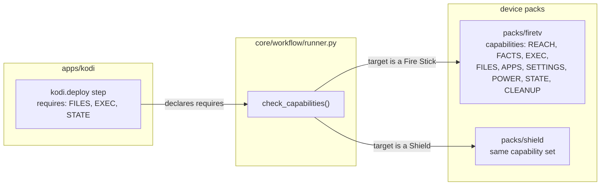
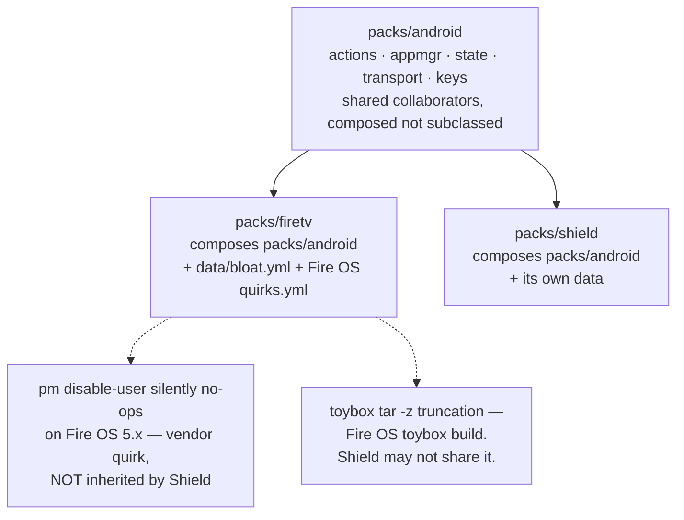

<h1 style="margin: 0 0 8px 0; padding: 0; border: 0; font-size: 2em;">Pack Authoring Guide</h1>
<div style="color: #64748b; font-size: 15px; margin: 0 0 16px 0;">The extension contract for a new device type or a new piece of managed software.</div>

<hr style="border: 0; border-top: 2px solid #005288; margin: 0 0 32px 0;"/>

<sub style="color: #64748b;">Last verified 2026-08-02</sub>

This is the most important document for anyone extending `fleetctl` with a new device type or a new piece of software — every code example here is real and taken from the shipped `firetv` and `kodi` packs. If you take one thing from it: **a pack should require zero changes inside `core/`.** If adding your pack means editing a `core/` module, the seam is in the wrong place — raise it as an issue rather than working around it (see [`../CONTRIBUTING.md`](../CONTRIBUTING.md)).

<h2 style="border-left: 6px solid #005288; padding: 4px 0 10px 16px; margin: 40px 0 16px; border-bottom: 1px solid rgba(0, 82, 136, 0.25); background-image: url(data:image/svg+xml;utf8,%3Csvg%20xmlns%3D%27http%3A%2F%2Fwww.w3.org%2F2000%2Fsvg%27%20width%3D%27100%25%27%20height%3D%27100%25%27%3E%3Cdefs%3E%3Cpattern%20id%3D%27h%27%20width%3D%2720%27%20height%3D%2735%27%20patternUnits%3D%27userSpaceOnUse%27%3E%3Cpath%20d%3D%27M10%2023L0%2018V6L10%200l10%206v12L10%2023zm0%200v12%27%20fill%3D%27none%27%20stroke%3D%27%23005288%27%20stroke-opacity%3D%270.22%27%2F%3E%3C%2Fpattern%3E%3ClinearGradient%20id%3D%27lg%27%20x1%3D%270%25%27%20x2%3D%27100%25%27%3E%3Cstop%20offset%3D%270%25%27%20stop-color%3D%27white%27%20stop-opacity%3D%271%27%2F%3E%3Cstop%20offset%3D%2785%25%27%20stop-color%3D%27white%27%20stop-opacity%3D%270%27%2F%3E%3C%2FlinearGradient%3E%3Cmask%20id%3D%27f%27%3E%3Crect%20width%3D%27100%25%27%20height%3D%27100%25%27%20fill%3D%27url%28%23lg%29%27%2F%3E%3C%2Fmask%3E%3C%2Fdefs%3E%3Crect%20width%3D%27100%25%27%20height%3D%27100%25%27%20fill%3D%27url%28%23h%29%27%20mask%3D%27url%28%23f%29%27%2F%3E%3C%2Fsvg%3E); background-size: 100% 100%; background-repeat: no-repeat; border-radius: 3px;">Device Pack vs. App Pack</h2>

|  | Device pack | App pack |
|---|---|---|
| Answers | "What is this device, and what can I do to it?" | "How do I manage this piece of software?" |
| Lives in | `packs/<id>/` | `apps/<id>/` |
| Declares | `Capability` values it **provides** | `Capability` values its steps **require** |
| Registers via | `fleetctl.packs` entry point | `fleetctl.apps` entry point |
| Knows about the other? | No | No |
| Shipped examples | `firetv`, `shield` (both compose `packs/android`) | `kodi` |

Neither ring imports the other directly. An app pack's `StepSpec.requires` names the capabilities a step needs; `check_capabilities()` (`core/workflow/runner.py`) verifies the target device pack's declared capabilities cover them before a step runs. That indirection is why one `apps/kodi` build deploys to a Fire Stick and an NVIDIA Shield without either knowing the other exists.



<h2 style="border-left: 6px solid #005288; padding: 4px 0 10px 16px; margin: 40px 0 16px; border-bottom: 1px solid rgba(0, 82, 136, 0.25); background-image: url(data:image/svg+xml;utf8,%3Csvg%20xmlns%3D%27http%3A%2F%2Fwww.w3.org%2F2000%2Fsvg%27%20width%3D%27100%25%27%20height%3D%27100%25%27%3E%3Cdefs%3E%3Cpattern%20id%3D%27h%27%20width%3D%2720%27%20height%3D%2735%27%20patternUnits%3D%27userSpaceOnUse%27%3E%3Cpath%20d%3D%27M10%2023L0%2018V6L10%200l10%206v12L10%2023zm0%200v12%27%20fill%3D%27none%27%20stroke%3D%27%23005288%27%20stroke-opacity%3D%270.22%27%2F%3E%3C%2Fpattern%3E%3ClinearGradient%20id%3D%27lg%27%20x1%3D%270%25%27%20x2%3D%27100%25%27%3E%3Cstop%20offset%3D%270%25%27%20stop-color%3D%27white%27%20stop-opacity%3D%271%27%2F%3E%3Cstop%20offset%3D%2785%25%27%20stop-color%3D%27white%27%20stop-opacity%3D%270%27%2F%3E%3C%2FlinearGradient%3E%3Cmask%20id%3D%27f%27%3E%3Crect%20width%3D%27100%25%27%20height%3D%27100%25%27%20fill%3D%27url%28%23lg%29%27%2F%3E%3C%2Fmask%3E%3C%2Fdefs%3E%3Crect%20width%3D%27100%25%27%20height%3D%27100%25%27%20fill%3D%27url%28%23h%29%27%20mask%3D%27url%28%23f%29%27%2F%3E%3C%2Fsvg%3E); background-size: 100% 100%; background-repeat: no-repeat; border-radius: 3px;">Anatomy of a Pack</h2>

```text
packs/firetv/
├── __init__.py
├── pack.py             # FireTvPack: id, platform, capabilities, probe_priority, steps(), probe()
└── data/
    ├── bloat.yml        # package lists — data, never a Python constant
    ├── maintenance.yml   # performance settings applied by the maintain step
    └── quirks.yml         # vendor workarounds, scoped to this pack (via packs/android)
```

```text
apps/kodi/
├── __init__.py
├── pack.py             # KodiApp: recipe, transforms, workflows(), steps()
├── steps.py             # capture / build / deploy step bodies
├── base_image.py        # fetch/check/install the shared Kodi APK
├── device_config.py     # apply per-device display + settings overrides
├── transforms/          # ProfileTransform implementations — pure, one concern each
└── data/
    ├── profiles/*.yml    # recipes — addon allow-lists, settings overrides
    ├── hubs/*.yml         # home-screen layout definitions
    └── workflows/*.yml    # shipped workflows this app provides
```

Real pack, unabridged except for the docstrings — `packs/firetv/pack.py`:

<div align="left" style="margin-bottom: -16px;"></div>

```python
CAPABILITIES: frozenset[Capability] = frozenset({
    Capability.REACH, Capability.FACTS, Capability.EXEC, Capability.FILES,
    Capability.APPS, Capability.SETTINGS, Capability.POWER, Capability.STATE, Capability.CLEANUP,
})

MAINTAIN = StepSpec(
    id="firetv.maintain",
    summary="Disable Amazon bloatware, apply performance settings, and trim caches.",
    effect=Effect.DESTRUCTIVE,
    requires=frozenset({Capability.EXEC, Capability.APPS, Capability.SETTINGS, Capability.CLEANUP}),
    scope="device",
)

class FireTvPack:
    id = "firetv"
    platform = "android"
    capabilities = CAPABILITIES
    probe_priority = 10

    def steps(self) -> list[RegisteredStep]:
        return [RegisteredStep(spec=MAINTAIN, run=self.maintain, provider=self.id), ...]

    def probe(self, runner: CommandRunner) -> dict[str, str] | None:
        facts = actions.read_facts(runner)
        if not facts.get("model") or "amazon" not in facts.get("manufacturer", "").lower():
            return None
        return {**facts, "type": self.id}
```

<h2 style="border-left: 6px solid #005288; padding: 4px 0 10px 16px; margin: 40px 0 16px; border-bottom: 1px solid rgba(0, 82, 136, 0.25); background-image: url(data:image/svg+xml;utf8,%3Csvg%20xmlns%3D%27http%3A%2F%2Fwww.w3.org%2F2000%2Fsvg%27%20width%3D%27100%25%27%20height%3D%27100%25%27%3E%3Cdefs%3E%3Cpattern%20id%3D%27h%27%20width%3D%2720%27%20height%3D%2735%27%20patternUnits%3D%27userSpaceOnUse%27%3E%3Cpath%20d%3D%27M10%2023L0%2018V6L10%200l10%206v12L10%2023zm0%200v12%27%20fill%3D%27none%27%20stroke%3D%27%23005288%27%20stroke-opacity%3D%270.22%27%2F%3E%3C%2Fpattern%3E%3ClinearGradient%20id%3D%27lg%27%20x1%3D%270%25%27%20x2%3D%27100%25%27%3E%3Cstop%20offset%3D%270%25%27%20stop-color%3D%27white%27%20stop-opacity%3D%271%27%2F%3E%3Cstop%20offset%3D%2785%25%27%20stop-color%3D%27white%27%20stop-opacity%3D%270%27%2F%3E%3C%2FlinearGradient%3E%3Cmask%20id%3D%27f%27%3E%3Crect%20width%3D%27100%25%27%20height%3D%27100%25%27%20fill%3D%27url%28%23lg%29%27%2F%3E%3C%2Fmask%3E%3C%2Fdefs%3E%3Crect%20width%3D%27100%25%27%20height%3D%27100%25%27%20fill%3D%27url%28%23h%29%27%20mask%3D%27url%28%23f%29%27%2F%3E%3C%2Fsvg%3E); background-size: 100% 100%; background-repeat: no-repeat; border-radius: 3px;">Registration</h2>

Packs and apps register through Python entry points, resolved by `core/registry.py::discover()` — a third-party package registers exactly the same way, which is what makes the plugin architecture real rather than a closed list of built-ins. `discover()` never raises on a broken third-party pack; it logs a warning and skips it, so one bad plugin doesn't take down the whole fleet.

<div align="left" style="margin-bottom: -16px;"></div>

```toml
# pyproject.toml
[project.entry-points."fleetctl.packs"]
firetv = "fleetctl.packs.firetv.pack:FireTvPack"
shield = "fleetctl.packs.shield.pack:ShieldPack"

[project.entry-points."fleetctl.apps"]
kodi = "fleetctl.apps.kodi.pack:KodiApp"
```

No decorator, no metaclass — the entry point names a class, `discover()` instantiates it with no arguments and calls `registry.register_device_pack(instance)` or `register_app_pack(instance)`. `Registry` refuses a duplicate pack id or a step id already claimed by another provider.

<h2 style="border-left: 6px solid #005288; padding: 4px 0 10px 16px; margin: 40px 0 16px; border-bottom: 1px solid rgba(0, 82, 136, 0.25); background-image: url(data:image/svg+xml;utf8,%3Csvg%20xmlns%3D%27http%3A%2F%2Fwww.w3.org%2F2000%2Fsvg%27%20width%3D%27100%25%27%20height%3D%27100%25%27%3E%3Cdefs%3E%3Cpattern%20id%3D%27h%27%20width%3D%2720%27%20height%3D%2735%27%20patternUnits%3D%27userSpaceOnUse%27%3E%3Cpath%20d%3D%27M10%2023L0%2018V6L10%200l10%206v12L10%2023zm0%200v12%27%20fill%3D%27none%27%20stroke%3D%27%23005288%27%20stroke-opacity%3D%270.22%27%2F%3E%3C%2Fpattern%3E%3ClinearGradient%20id%3D%27lg%27%20x1%3D%270%25%27%20x2%3D%27100%25%27%3E%3Cstop%20offset%3D%270%25%27%20stop-color%3D%27white%27%20stop-opacity%3D%271%27%2F%3E%3Cstop%20offset%3D%2785%25%27%20stop-color%3D%27white%27%20stop-opacity%3D%270%27%2F%3E%3C%2FlinearGradient%3E%3Cmask%20id%3D%27f%27%3E%3Crect%20width%3D%27100%25%27%20height%3D%27100%25%27%20fill%3D%27url%28%23lg%29%27%2F%3E%3C%2Fmask%3E%3C%2Fdefs%3E%3Crect%20width%3D%27100%25%27%20height%3D%27100%25%27%20fill%3D%27url%28%23h%29%27%20mask%3D%27url%28%23f%29%27%2F%3E%3C%2Fsvg%3E); background-size: 100% 100%; background-repeat: no-repeat; border-radius: 3px;">Probes: Claim a Host, or Get Out of the Way</h2>

A pack's `probe(runner: CommandRunner) -> dict[str, str] | None` decides whether a discovered host is "mine." Probes run in ascending `probe_priority` order during discovery (lower runs first); the first to claim a host wins. Three rules, all non-negotiable:

- **Return `None`, never a partial result**, when the host doesn't match. `discovery/claim.py` treats a probe that raises as "not mine" too — an exception escaping a probe must not kill the whole scan for one bad host, so `_probe()` catches broadly and logs a warning.
- **Depend on `CommandRunner` only**, not the full `Transport`. A probe never needs to push a file to answer "is this a Fire TV?"
- **A subnet sweep hits mostly non-devices** — printers, phones, routers. Returning `None` for those is the normal case, not an error path.

<h2 style="border-left: 6px solid #005288; padding: 4px 0 10px 16px; margin: 40px 0 16px; border-bottom: 1px solid rgba(0, 82, 136, 0.25); background-image: url(data:image/svg+xml;utf8,%3Csvg%20xmlns%3D%27http%3A%2F%2Fwww.w3.org%2F2000%2Fsvg%27%20width%3D%27100%25%27%20height%3D%27100%25%27%3E%3Cdefs%3E%3Cpattern%20id%3D%27h%27%20width%3D%2720%27%20height%3D%2735%27%20patternUnits%3D%27userSpaceOnUse%27%3E%3Cpath%20d%3D%27M10%2023L0%2018V6L10%200l10%206v12L10%2023zm0%200v12%27%20fill%3D%27none%27%20stroke%3D%27%23005288%27%20stroke-opacity%3D%270.22%27%2F%3E%3C%2Fpattern%3E%3ClinearGradient%20id%3D%27lg%27%20x1%3D%270%25%27%20x2%3D%27100%25%27%3E%3Cstop%20offset%3D%270%25%27%20stop-color%3D%27white%27%20stop-opacity%3D%271%27%2F%3E%3Cstop%20offset%3D%2785%25%27%20stop-color%3D%27white%27%20stop-opacity%3D%270%27%2F%3E%3C%2FlinearGradient%3E%3Cmask%20id%3D%27f%27%3E%3Crect%20width%3D%27100%25%27%20height%3D%27100%25%27%20fill%3D%27url%28%23lg%29%27%2F%3E%3C%2Fmask%3E%3C%2Fdefs%3E%3Crect%20width%3D%27100%25%27%20height%3D%27100%25%27%20fill%3D%27url%28%23h%29%27%20mask%3D%27url%28%23f%29%27%2F%3E%3C%2Fsvg%3E); background-size: 100% 100%; background-repeat: no-repeat; border-radius: 3px;">Capability Declaration</h2>

A device pack declares the `Capability` values it supports as a `frozenset` class attribute — `REACH`, `FACTS`, `EXEC`, `FILES`, `APPS`, `SETTINGS`, `POWER`, `STATE`, `CLEANUP` (the full enum, `core/effects.py`). A `StepSpec.requires` names the subset a step needs, checked by `check_capabilities()` before a step runs against a device — a step targeting a device whose pack doesn't declare a required capability is refused before anything is touched, not mid-run.

**Under-declare, never over-declare.** A capability you claim but haven't verified against real hardware is worse than an honest gap — the predecessor's own bloat package list was found to mix fabricated entries with real ones, precisely because nobody could tell "declared" from "verified."

<h2 style="border-left: 6px solid #005288; padding: 4px 0 10px 16px; margin: 40px 0 16px; border-bottom: 1px solid rgba(0, 82, 136, 0.25); background-image: url(data:image/svg+xml;utf8,%3Csvg%20xmlns%3D%27http%3A%2F%2Fwww.w3.org%2F2000%2Fsvg%27%20width%3D%27100%25%27%20height%3D%27100%25%27%3E%3Cdefs%3E%3Cpattern%20id%3D%27h%27%20width%3D%2720%27%20height%3D%2735%27%20patternUnits%3D%27userSpaceOnUse%27%3E%3Cpath%20d%3D%27M10%2023L0%2018V6L10%200l10%206v12L10%2023zm0%200v12%27%20fill%3D%27none%27%20stroke%3D%27%23005288%27%20stroke-opacity%3D%270.22%27%2F%3E%3C%2Fpattern%3E%3ClinearGradient%20id%3D%27lg%27%20x1%3D%270%25%27%20x2%3D%27100%25%27%3E%3Cstop%20offset%3D%270%25%27%20stop-color%3D%27white%27%20stop-opacity%3D%271%27%2F%3E%3Cstop%20offset%3D%2785%25%27%20stop-color%3D%27white%27%20stop-opacity%3D%270%27%2F%3E%3C%2FlinearGradient%3E%3Cmask%20id%3D%27f%27%3E%3Crect%20width%3D%27100%25%27%20height%3D%27100%25%27%20fill%3D%27url%28%23lg%29%27%2F%3E%3C%2Fmask%3E%3C%2Fdefs%3E%3Crect%20width%3D%27100%25%27%20height%3D%27100%25%27%20fill%3D%27url%28%23h%29%27%20mask%3D%27url%28%23f%29%27%2F%3E%3C%2Fsvg%3E); background-size: 100% 100%; background-repeat: no-repeat; border-radius: 3px;">Effect Classes</h2>

Every `StepSpec` declares `effect=Effect.READ | MUTATING | DESTRUCTIVE`. This is the single highest-consequence declaration in the codebase — the policy layer (see [`safety.md`](safety.md)) keys approval off the effect class, not off a hand-maintained list of dangerous step names. Mislabel a wipe as `MUTATING` and it silently needs less approval than it should.

<div align="left" style="margin-bottom: -16px;"></div>

```python
MAINTAIN = StepSpec(
    id="firetv.maintain",
    summary="Disable Amazon bloatware, apply performance settings, and trim caches.",
    effect=Effect.DESTRUCTIVE,
    requires=frozenset({Capability.EXEC, Capability.APPS, Capability.SETTINGS, Capability.CLEANUP}),
    scope="device",
)
```

The same `spec.id`, `spec.summary`, and `spec.effect` are what `fleetctl steps` prints, what the MCP `list_steps` resource returns, and what a workflow's `use:` field references — one declaration, every consumer.

<h2 style="border-left: 6px solid #005288; padding: 4px 0 10px 16px; margin: 40px 0 16px; border-bottom: 1px solid rgba(0, 82, 136, 0.25); background-image: url(data:image/svg+xml;utf8,%3Csvg%20xmlns%3D%27http%3A%2F%2Fwww.w3.org%2F2000%2Fsvg%27%20width%3D%27100%25%27%20height%3D%27100%25%27%3E%3Cdefs%3E%3Cpattern%20id%3D%27h%27%20width%3D%2720%27%20height%3D%2735%27%20patternUnits%3D%27userSpaceOnUse%27%3E%3Cpath%20d%3D%27M10%2023L0%2018V6L10%200l10%206v12L10%2023zm0%200v12%27%20fill%3D%27none%27%20stroke%3D%27%23005288%27%20stroke-opacity%3D%270.22%27%2F%3E%3C%2Fpattern%3E%3ClinearGradient%20id%3D%27lg%27%20x1%3D%270%25%27%20x2%3D%27100%25%27%3E%3Cstop%20offset%3D%270%25%27%20stop-color%3D%27white%27%20stop-opacity%3D%271%27%2F%3E%3Cstop%20offset%3D%2785%25%27%20stop-color%3D%27white%27%20stop-opacity%3D%270%27%2F%3E%3C%2FlinearGradient%3E%3Cmask%20id%3D%27f%27%3E%3Crect%20width%3D%27100%25%27%20height%3D%27100%25%27%20fill%3D%27url%28%23lg%29%27%2F%3E%3C%2Fmask%3E%3C%2Fdefs%3E%3Crect%20width%3D%27100%25%27%20height%3D%27100%25%27%20fill%3D%27url%28%23h%29%27%20mask%3D%27url%28%23f%29%27%2F%3E%3C%2Fsvg%3E); background-size: 100% 100%; background-repeat: no-repeat; border-radius: 3px;">Data, Not Python</h2>

Package lists, prune paths, addon allow-lists, and settings overrides belong in `data/*.yml` inside the pack or app, never as a Python constant — see `packs/firetv/data/bloat.yml` and `apps/kodi/data/profiles/gold.yml` for the shipped examples. This is what lets a second Kodi profile exist as `profiles/another.yml` with its own allow-list, no forking Python.

<h2 style="border-left: 6px solid #005288; padding: 4px 0 10px 16px; margin: 40px 0 16px; border-bottom: 1px solid rgba(0, 82, 136, 0.25); background-image: url(data:image/svg+xml;utf8,%3Csvg%20xmlns%3D%27http%3A%2F%2Fwww.w3.org%2F2000%2Fsvg%27%20width%3D%27100%25%27%20height%3D%27100%25%27%3E%3Cdefs%3E%3Cpattern%20id%3D%27h%27%20width%3D%2720%27%20height%3D%2735%27%20patternUnits%3D%27userSpaceOnUse%27%3E%3Cpath%20d%3D%27M10%2023L0%2018V6L10%200l10%206v12L10%2023zm0%200v12%27%20fill%3D%27none%27%20stroke%3D%27%23005288%27%20stroke-opacity%3D%270.22%27%2F%3E%3C%2Fpattern%3E%3ClinearGradient%20id%3D%27lg%27%20x1%3D%270%25%27%20x2%3D%27100%25%27%3E%3Cstop%20offset%3D%270%25%27%20stop-color%3D%27white%27%20stop-opacity%3D%271%27%2F%3E%3Cstop%20offset%3D%2785%25%27%20stop-color%3D%27white%27%20stop-opacity%3D%270%27%2F%3E%3C%2FlinearGradient%3E%3Cmask%20id%3D%27f%27%3E%3Crect%20width%3D%27100%25%27%20height%3D%27100%25%27%20fill%3D%27url%28%23lg%29%27%2F%3E%3C%2Fmask%3E%3C%2Fdefs%3E%3Crect%20width%3D%27100%25%27%20height%3D%27100%25%27%20fill%3D%27url%28%23h%29%27%20mask%3D%27url%28%23f%29%27%2F%3E%3C%2Fsvg%3E); background-size: 100% 100%; background-repeat: no-repeat; border-radius: 3px;">Composition Over Inheritance — and Why</h2>

`packs/firetv` and `packs/shield` both **compose** shared `packs/android` collaborators (`actions.py`, `AndroidAppManager`, `AndroidStateManager`, `AdbTransport`). Neither subclasses the other, and neither subclasses a shared base pack class.



The reason is concrete, not stylistic: `pm disable-user` silently no-ops on Fire OS 5.x, and toybox's `tar -z` produces truncated archives on that build. These are **Amazon's bugs**, not Android's. If `ShieldPack` inherited `FireTvPack`, it would inherit both workarounds — including a two-step `tar cf` + `gzip` dance that costs real time on a large profile — for bugs it may never have. Compose the shared collaborator; declare quirks as data scoped to the pack that needs them (`AndroidQuirks.from_mapping`, per-pack `data/quirks.yml`).

<h2 style="border-left: 6px solid #005288; padding: 4px 0 10px 16px; margin: 40px 0 16px; border-bottom: 1px solid rgba(0, 82, 136, 0.25); background-image: url(data:image/svg+xml;utf8,%3Csvg%20xmlns%3D%27http%3A%2F%2Fwww.w3.org%2F2000%2Fsvg%27%20width%3D%27100%25%27%20height%3D%27100%25%27%3E%3Cdefs%3E%3Cpattern%20id%3D%27h%27%20width%3D%2720%27%20height%3D%2735%27%20patternUnits%3D%27userSpaceOnUse%27%3E%3Cpath%20d%3D%27M10%2023L0%2018V6L10%200l10%206v12L10%2023zm0%200v12%27%20fill%3D%27none%27%20stroke%3D%27%23005288%27%20stroke-opacity%3D%270.22%27%2F%3E%3C%2Fpattern%3E%3ClinearGradient%20id%3D%27lg%27%20x1%3D%270%25%27%20x2%3D%27100%25%27%3E%3Cstop%20offset%3D%270%25%27%20stop-color%3D%27white%27%20stop-opacity%3D%271%27%2F%3E%3Cstop%20offset%3D%2785%25%27%20stop-color%3D%27white%27%20stop-opacity%3D%270%27%2F%3E%3C%2FlinearGradient%3E%3Cmask%20id%3D%27f%27%3E%3Crect%20width%3D%27100%25%27%20height%3D%27100%25%27%20fill%3D%27url%28%23lg%29%27%2F%3E%3C%2Fmask%3E%3C%2Fdefs%3E%3Crect%20width%3D%27100%25%27%20height%3D%27100%25%27%20fill%3D%27url%28%23h%29%27%20mask%3D%27url%28%23f%29%27%2F%3E%3C%2Fsvg%3E); background-size: 100% 100%; background-repeat: no-repeat; border-radius: 3px;">Authoring Checklist</h2>

- [ ] Capabilities declared honestly — under-declare rather than over-declare
- [ ] Every `StepSpec` declares its effect class (`READ` / `MUTATING` / `DESTRUCTIVE`); mislabelling weakens policy
- [ ] Package lists and prune paths live in `data/*.yml`, not Python constants
- [ ] Vendor quirks are scoped to this pack, not assumed to be shared
- [ ] `probe()` returns `None` cleanly for foreign hosts
- [ ] No import of `core/` internals — only its public protocols
- [ ] No import of another pack, except a shared collaborator pack (like `packs/android`) composed deliberately
- [ ] Tests run against `FakeTransport` with canned command output — no real device required
- [ ] Anything claimed as verified was actually run against real hardware, not inferred

<h2 style="border-left: 6px solid #005288; padding: 4px 0 10px 16px; margin: 40px 0 16px; border-bottom: 1px solid rgba(0, 82, 136, 0.25); background-image: url(data:image/svg+xml;utf8,%3Csvg%20xmlns%3D%27http%3A%2F%2Fwww.w3.org%2F2000%2Fsvg%27%20width%3D%27100%25%27%20height%3D%27100%25%27%3E%3Cdefs%3E%3Cpattern%20id%3D%27h%27%20width%3D%2720%27%20height%3D%2735%27%20patternUnits%3D%27userSpaceOnUse%27%3E%3Cpath%20d%3D%27M10%2023L0%2018V6L10%200l10%206v12L10%2023zm0%200v12%27%20fill%3D%27none%27%20stroke%3D%27%23005288%27%20stroke-opacity%3D%270.22%27%2F%3E%3C%2Fpattern%3E%3ClinearGradient%20id%3D%27lg%27%20x1%3D%270%25%27%20x2%3D%27100%25%27%3E%3Cstop%20offset%3D%270%25%27%20stop-color%3D%27white%27%20stop-opacity%3D%271%27%2F%3E%3Cstop%20offset%3D%2785%25%27%20stop-color%3D%27white%27%20stop-opacity%3D%270%27%2F%3E%3C%2FlinearGradient%3E%3Cmask%20id%3D%27f%27%3E%3Crect%20width%3D%27100%25%27%20height%3D%27100%25%27%20fill%3D%27url%28%23lg%29%27%2F%3E%3C%2Fmask%3E%3C%2Fdefs%3E%3Crect%20width%3D%27100%25%27%20height%3D%27100%25%27%20fill%3D%27url%28%23h%29%27%20mask%3D%27url%28%23f%29%27%2F%3E%3C%2Fsvg%3E); background-size: 100% 100%; background-repeat: no-repeat; border-radius: 3px;">Common Mistakes</h2>

| Symptom | Cause | Fix |
|---|---|---|
| A step runs against a device that can't actually support it | Capability over-declared | Declare only what's implemented and verified |
| A destructive step needs less approval than expected | Effect class understated | Mark the step `DESTRUCTIVE` explicitly |
| The Shield inherits a Fire OS workaround it doesn't need | Subclassed a vendor pack instead of composing | Compose `packs/android`; never subclass a vendor pack |
| A second vendor needs a Python change to add its package list | Package list hardcoded in a module | Move it to `data/*.yml` |
| Discovery silently drops a real device | Probe raised an exception instead of returning `None` | Catch transport errors in the probe; return `None` |
| Two packs both claim one host | `probe_priority` unset or tied between packs | Set `probe_priority` explicitly, and keep it unique |

<h2 style="border-left: 6px solid #005288; padding: 4px 0 10px 16px; margin: 40px 0 16px; border-bottom: 1px solid rgba(0, 82, 136, 0.25); background-image: url(data:image/svg+xml;utf8,%3Csvg%20xmlns%3D%27http%3A%2F%2Fwww.w3.org%2F2000%2Fsvg%27%20width%3D%27100%25%27%20height%3D%27100%25%27%3E%3Cdefs%3E%3Cpattern%20id%3D%27h%27%20width%3D%2720%27%20height%3D%2735%27%20patternUnits%3D%27userSpaceOnUse%27%3E%3Cpath%20d%3D%27M10%2023L0%2018V6L10%200l10%206v12L10%2023zm0%200v12%27%20fill%3D%27none%27%20stroke%3D%27%23005288%27%20stroke-opacity%3D%270.22%27%2F%3E%3C%2Fpattern%3E%3ClinearGradient%20id%3D%27lg%27%20x1%3D%270%25%27%20x2%3D%27100%25%27%3E%3Cstop%20offset%3D%270%25%27%20stop-color%3D%27white%27%20stop-opacity%3D%271%27%2F%3E%3Cstop%20offset%3D%2785%25%27%20stop-color%3D%27white%27%20stop-opacity%3D%270%27%2F%3E%3C%2FlinearGradient%3E%3Cmask%20id%3D%27f%27%3E%3Crect%20width%3D%27100%25%27%20height%3D%27100%25%27%20fill%3D%27url%28%23lg%29%27%2F%3E%3C%2Fmask%3E%3C%2Fdefs%3E%3Crect%20width%3D%27100%25%27%20height%3D%27100%25%27%20fill%3D%27url%28%23h%29%27%20mask%3D%27url%28%23f%29%27%2F%3E%3C%2Fsvg%3E); background-size: 100% 100%; background-repeat: no-repeat; border-radius: 3px;">Where to Read Next</h2>

- The full three-ring design and dependency rules: [`architecture.md`](architecture.md) §3, §7, §8
- The policy consequence of getting an effect class wrong: [`safety.md`](safety.md)
- ADB-specific gotchas any pack composing `packs/android` inherits — broken `adb shell push`, toybox `tar -z` truncation, and `pm disable-user` no-oping by Fire OS version: [`.claude/skills/adb-device-ops/SKILL.md`](../.claude/skills/adb-device-ops/SKILL.md)

<br/><br/>

<hr style="border: 0; border-top: 1px solid rgba(100, 116, 139, 0.35); margin: 24px 0;"/>

<br/>

<table>
<tr>
<td width="22%" valign="top" align="center">

<br/>
<strong>fleetctl</strong>
<br/><br/>
<sub>Pack Authoring Guide</sub>

</td>
<td width="26%" valign="top">

<h4><ins style="color: #2a8b93; text-decoration: none;">Documentation</ins></h4>

- [Getting Started](getting-started.md)
- [CLI Reference](cli-reference.md)
- [Configuration](configuration.md)
- [Architecture](architecture.md)
- [Safety & Policy](safety.md)

</td>
<td width="26%" valign="top">

<h4><ins style="color: #2a8b93; text-decoration: none;">Repositories</ins></h4>

- [fleetctl](https://github.com/salvuswarez/fleetctl)
- [firestick_manager](https://github.com/salvuswarez/firestick_manager) &mdash; predecessor
- [ha-cyberpunk](https://github.com/salvuswarez/ha-cyberpunk) &mdash; S7 consumer

<h4><ins style="color: #2a8b93; text-decoration: none;">References</ins></h4>

- [Roadmap](roadmap.md) &mdash; S0&ndash;S8 stages
- [Documentation Index](README.md)

</td>
<td width="26%" valign="top">

<h4><ins style="color: #2a8b93; text-decoration: none;">About</ins></h4>

- Plugin-based home device fleet manager
- MIT licensed

<h4><ins style="color: #2a8b93; text-decoration: none;">Status</ins></h4>

- S0&ndash;S6 done &middot; S7 (HA cutover) not started

</td>
</tr>
</table>

<br/>

<hr style="border: 0; border-top: 1px solid rgba(100, 116, 139, 0.35); margin: 24px 0;"/>

<div align="center">
  <sub>fleetctl</sub>
</div>
