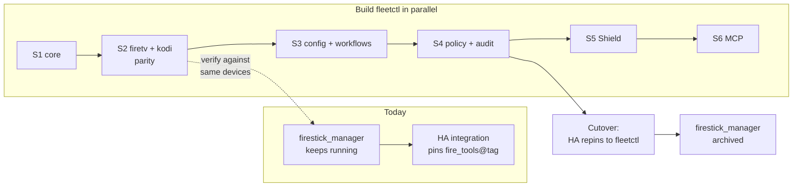

# Roadmap

`fleetctl` is built in numbered stages, each with a concrete exit criterion — not a percentage-complete estimate. This page tracks the same table as `.claude/skills/build-stages/SKILL.md` and `architecture.md` §14; if this page and that skill ever disagree, the skill is more likely to be current since it's consulted every session — check there and update this page to match.

> [!IMPORTANT]
> **Status: only S0 is done.** Everything from S1 onward is planned, not started. Nothing in `src/fleetctl/` today implements any part of S1–S8.

## `firestick_manager` keeps running throughout

`fleetctl` is a new repository, not an in-place refactor of `firestick_manager`. The predecessor keeps serving the Home Assistant integration untouched for the entire build, and is retired only at the S7 cutover — there's no point where both the old and new packages are half-working simultaneously.

## Stages

| # | Stage | Contents | Exit criterion | Status |
|---|---|---|---|---|
| **S0** | Repo bootstrap | uv + hatchling, `src/fleetctl/`, licence, CI (black/isort/mypy --strict/pytest), `.gitignore` incl. `config/` real data, `.example` files | CI green on an empty package | **Done** |
| **S1** | Core kernel | `Transport` protocol + `AdbTransport`; `ArtifactStore` + SMB **and** local adapters; inventory; operations; `SecretProvider` (env + keyring); observability (audit sink, redactor, correlation, log setup) | `FakeTransport` + `LocalArtifactStore` let a trivial step run end-to-end in tests, with audit records asserted | Not started |
| **S2** | First pack + first app | `packs/android` (deep base) → `packs/firetv`; `apps/kodi` with all four transforms; capture/build/deploy steps | Feature parity: capture → build → deploy a real device, verified against what `firestick_manager` produces | Not started |
| **S3** | Config-as-code + workflows | bloat/prune/allow/settings/hub-layout → YAML; layered resolution; `Workflow` + engine + plan/dry-run; registry-driven CLI | `fleetctl run kodi-refresh --dry-run` prints a correct plan; `config show <device>` explains every resolved key | Not started |
| **S4** | Policy + audit hardening | `PolicyEngine`, effect classification on every step, protected-device rules, blast-radius cap, hash chain + `audit verify` | Gold device is structurally undeployable-to without a config edit | Not started |
| **S5** | Shield Pro | `packs/shield`; whatever quirks turn out to be Fire-OS-only get pushed down into `packs/firetv` | Same Kodi build deploys to a Stick and a Shield from one workflow | Not started |
| **S6** | MCP adapter | stdio server; tools from the step/workflow registry; resources for inventory/builds/audit; approval flow | Agent completes a full `kodi-refresh` with per-step approval, fully audited | Not started |
| **S7** | HA cutover | HA integration repinned to `fleetctl`; becomes actor `ha:*`; services regenerated from the registry; panel + automations updated | Live panel runs on `fleetctl`; `firestick_manager` archived | Not started |
| **S8** | Later | `packs/linux_host` + SSH transport; HTTP API if a consumer appears; `fleet.lock` | — | Not started |

## Ordering constraints

These aren't arbitrary sequencing preferences — each one exists because building out of order either produces untestable code or a design mistake that's expensive to unwind later.

1. **S1 before everything.** Both `ArtifactStore` adapters (SMB and local) land in S1. One adapter alone is a hypothetical seam; the local one specifically is what makes S2 testable without touching a real SMB share.
2. **S4 before S6 — the hardest one to walk back.** Policy and audit precede the MCP adapter. Shipping agent-facing tools over a fleet with no policy layer and no audit record is the one sequencing mistake in this plan that can't be cleanly undone: once an agent has run unaudited destructive operations against real devices, there's no retroactive fix. See [`safety.md`](safety.md) for what S4 actually builds.
3. **S2 is the hardware-parity honesty gate.** Capture → build → deploy has to reproduce what `firestick_manager` already does on a real device before anything past S2 is worth building. If `fleetctl` can't match the predecessor here, nothing after it matters — this is where "the architecture is elegant" gets checked against "does it actually work."
4. **S5 validates the seams.** Adding the Shield Pro pack is the test of whether the three-ring design (`architecture.md` §3) actually holds. If supporting a second Android device requires touching `core/` or `apps/kodi/`, the ring boundaries are in the wrong place — that's the signal to stop and fix the seam, not to work around it inside the Shield pack.
5. **S7 is a coordinated two-repo release.** The HA side has its own deploy quirks (manual manifest bump, restart, a feature branch rather than `main`) and needs its own budget as a distinct piece of work, not a side effect of S6 finishing.

## What carries forward from `firestick_manager` unchanged

These are hard-won operational details, not architecture — they move into the new structure verbatim rather than being redesigned:

| Behaviour | Lands in |
|---|---|
| Netcat upload; listener can't be backgrounded; md5 tail check | `AdbTransport.put()` (S1/S2) |
| `tar cf` + separate `gzip`, never `tar czf` (toybox truncation) | `packs/firetv` quirk data (S2), not a global assumption |
| Flat build archives (`addons/`/`userdata/`/`media/` at the tar root, no `.kodi/` wrapper) | `apps/kodi` build step (S2) |
| Single-archive transfer, never per-file sync | `apps/kodi` deploy step (S2) |
| Size-scaled timeouts for transfer and on-device unpack | `AdbTransport` (S1/S2) |
| `OperationRegistry`'s working cancellation, debounced flush, restart handling | `core/operations` (S1), ported as-is |
| MAC → serial → IP reconciliation; only overwrite a field when the probe returned something | `core/inventory` (S1) |
| The gold-device rule | `core/policy` (S4) — as enforced config, not a memory file |

Full detail and citations for each of these: `.claude/skills/adb-device-ops/SKILL.md` and `architecture.md` §14.

## Where to read next

- What the S1 core kernel and S4 policy layer actually look like once built: [`safety.md`](safety.md), [`observability.md`](observability.md)
- How to add a pack once S2 lands: [`pack-authoring.md`](pack-authoring.md)
- The full rationale behind every decision this roadmap encodes: [`architecture.md`](architecture.md) §14–§15
