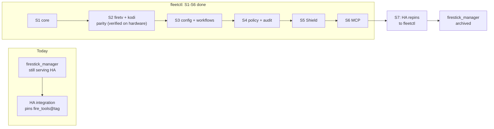

<h1 style="margin: 0 0 8px 0; padding: 0; border: 0; font-size: 2em;">Roadmap</h1>

Numbered stages, each with a concrete exit criterion — not a percentage estimate.

Last verified 2026-08-02

This page tracks the same table as `.claude/skills/build-stages/SKILL.md` and `architecture.md` §14; if this page and that skill ever disagree, the skill is more likely to be current since it's consulted every session — check there and update this page to match.

<blockquote style="border-left: 4px solid #7ab9d5; background-color: rgba(122, 185, 213, 0.08); padding: 14px 18px; margin: 16px 0; border-radius: 10px;">

**Status:** S0–S6 are done. S7 (Home Assistant cutover) and S8 have not started — both are covered below.

</blockquote>

<h2 style="border-left: 6px solid #005288; padding: 4px 0 10px 16px; margin: 40px 0 16px; border-bottom: 1px solid rgba(0, 82, 136, 0.25); background-image: url(data:image/svg+xml;utf8,%3Csvg%20xmlns%3D%27http%3A%2F%2Fwww.w3.org%2F2000%2Fsvg%27%20width%3D%27100%25%27%20height%3D%27100%25%27%3E%3Cdefs%3E%3Cpattern%20id%3D%27h%27%20width%3D%2720%27%20height%3D%2735%27%20patternUnits%3D%27userSpaceOnUse%27%3E%3Cpath%20d%3D%27M10%2023L0%2018V6L10%200l10%206v12L10%2023zm0%200v12%27%20fill%3D%27none%27%20stroke%3D%27%23005288%27%20stroke-opacity%3D%270.22%27%2F%3E%3C%2Fpattern%3E%3ClinearGradient%20id%3D%27lg%27%20x1%3D%270%25%27%20x2%3D%27100%25%27%3E%3Cstop%20offset%3D%270%25%27%20stop-color%3D%27white%27%20stop-opacity%3D%271%27%2F%3E%3Cstop%20offset%3D%2785%25%27%20stop-color%3D%27white%27%20stop-opacity%3D%270%27%2F%3E%3C%2FlinearGradient%3E%3Cmask%20id%3D%27f%27%3E%3Crect%20width%3D%27100%25%27%20height%3D%27100%25%27%20fill%3D%27url%28%23lg%29%27%2F%3E%3C%2Fmask%3E%3C%2Fdefs%3E%3Crect%20width%3D%27100%25%27%20height%3D%27100%25%27%20fill%3D%27url%28%23h%29%27%20mask%3D%27url%28%23f%29%27%2F%3E%3C%2Fsvg%3E); background-size: 100% 100%; background-repeat: no-repeat; border-radius: 3px;">firestick_manager Keeps Running Throughout</h2>

`fleetctl` is a new repository, not an in-place refactor of `firestick_manager`. The predecessor keeps serving the Home Assistant integration untouched through S6, and is retired only at the S7 cutover — there's no point where both the old and new packages are half-working simultaneously.

<h2 style="border-left: 6px solid #005288; padding: 4px 0 10px 16px; margin: 40px 0 16px; border-bottom: 1px solid rgba(0, 82, 136, 0.25); background-image: url(data:image/svg+xml;utf8,%3Csvg%20xmlns%3D%27http%3A%2F%2Fwww.w3.org%2F2000%2Fsvg%27%20width%3D%27100%25%27%20height%3D%27100%25%27%3E%3Cdefs%3E%3Cpattern%20id%3D%27h%27%20width%3D%2720%27%20height%3D%2735%27%20patternUnits%3D%27userSpaceOnUse%27%3E%3Cpath%20d%3D%27M10%2023L0%2018V6L10%200l10%206v12L10%2023zm0%200v12%27%20fill%3D%27none%27%20stroke%3D%27%23005288%27%20stroke-opacity%3D%270.22%27%2F%3E%3C%2Fpattern%3E%3ClinearGradient%20id%3D%27lg%27%20x1%3D%270%25%27%20x2%3D%27100%25%27%3E%3Cstop%20offset%3D%270%25%27%20stop-color%3D%27white%27%20stop-opacity%3D%271%27%2F%3E%3Cstop%20offset%3D%2785%25%27%20stop-color%3D%27white%27%20stop-opacity%3D%270%27%2F%3E%3C%2FlinearGradient%3E%3Cmask%20id%3D%27f%27%3E%3Crect%20width%3D%27100%25%27%20height%3D%27100%25%27%20fill%3D%27url%28%23lg%29%27%2F%3E%3C%2Fmask%3E%3C%2Fdefs%3E%3Crect%20width%3D%27100%25%27%20height%3D%27100%25%27%20fill%3D%27url%28%23h%29%27%20mask%3D%27url%28%23f%29%27%2F%3E%3C%2Fsvg%3E); background-size: 100% 100%; background-repeat: no-repeat; border-radius: 3px;">Stages</h2>

| # | Stage | Contents | Exit criterion | Status |
|---|---|---|---|---|
| **S0** | Repo bootstrap | uv + hatchling, `src/fleetctl/`, licence, CI (black/isort/mypy --strict/pytest), `.gitignore` incl. `config/` real data, `.example` files | CI green on an empty package | **Done** |
| **S1** | Core kernel | `Transport` protocol + `AdbTransport`; `ArtifactStore` + SMB **and** local adapters; inventory; operations; `SecretProvider` (env + `.env`); observability (audit sink, redactor, correlation, log setup) | `FakeTransport` + `LocalArtifactStore` let a trivial step run end-to-end in tests, with audit records asserted | **Done** |
| **S2** | First pack + first app | `packs/android` (deep base) → `packs/firetv`; `apps/kodi` with all five transforms incl. hub layout; capture/build/deploy steps | Feature parity: capture → build → deploy a real device, verified against what `firestick_manager` produces | **Done** — capture/build verified against real hardware; on-device deploy verification pending a device reachability issue, see [`ha-parity.md`](ha-parity.md) |
| **S3** | Config-as-code + workflows | bloat/prune/allow/settings/hub-layout → YAML; layered resolution; `Workflow` + engine + plan/dry-run; registry-driven CLI | `fleetctl workflow plan kodi-refresh` prints a correct plan; `fleetctl config <device>` explains every resolved key | **Done** |
| **S4** | Policy + audit hardening | `Policy`, effect classification on every step, protected-device rules, blast-radius cap, hash chain + `audit verify` | A device can be made structurally undeployable-to via a `protected:` config rule, with no code change | **Done** |
| **S5** | Shield Pro | `packs/shield`; whatever quirks turn out to be Fire-OS-only get pushed down into `packs/firetv` | Same Kodi build deploys to a Stick and a Shield from one workflow | **Done** |
| **S6** | MCP adapter | stdio server; tools from the step/workflow registry; resources for inventory/builds/audit; approval flow | Agent completes a full `kodi-refresh` with per-step approval, fully audited | **Done** |
| **S7** | HA cutover | HA integration repinned to `fleetctl`; becomes actor `ha:*`; services regenerated from the registry; panel + automations updated | Live panel runs on `fleetctl`; `firestick_manager` archived | Not started |
| **S8** | Later | `packs/linux_host` + SSH transport; HTTP API if a consumer appears; `fleet.lock` | — | Not started |

<h2 style="border-left: 6px solid #005288; padding: 4px 0 10px 16px; margin: 40px 0 16px; border-bottom: 1px solid rgba(0, 82, 136, 0.25); background-image: url(data:image/svg+xml;utf8,%3Csvg%20xmlns%3D%27http%3A%2F%2Fwww.w3.org%2F2000%2Fsvg%27%20width%3D%27100%25%27%20height%3D%27100%25%27%3E%3Cdefs%3E%3Cpattern%20id%3D%27h%27%20width%3D%2720%27%20height%3D%2735%27%20patternUnits%3D%27userSpaceOnUse%27%3E%3Cpath%20d%3D%27M10%2023L0%2018V6L10%200l10%206v12L10%2023zm0%200v12%27%20fill%3D%27none%27%20stroke%3D%27%23005288%27%20stroke-opacity%3D%270.22%27%2F%3E%3C%2Fpattern%3E%3ClinearGradient%20id%3D%27lg%27%20x1%3D%270%25%27%20x2%3D%27100%25%27%3E%3Cstop%20offset%3D%270%25%27%20stop-color%3D%27white%27%20stop-opacity%3D%271%27%2F%3E%3Cstop%20offset%3D%2785%25%27%20stop-color%3D%27white%27%20stop-opacity%3D%270%27%2F%3E%3C%2FlinearGradient%3E%3Cmask%20id%3D%27f%27%3E%3Crect%20width%3D%27100%25%27%20height%3D%27100%25%27%20fill%3D%27url%28%23lg%29%27%2F%3E%3C%2Fmask%3E%3C%2Fdefs%3E%3Crect%20width%3D%27100%25%27%20height%3D%27100%25%27%20fill%3D%27url%28%23h%29%27%20mask%3D%27url%28%23f%29%27%2F%3E%3C%2Fsvg%3E); background-size: 100% 100%; background-repeat: no-repeat; border-radius: 3px;">Ordering Constraints</h2>

These aren't arbitrary sequencing preferences — each one exists because building out of order either produces untestable code or a design mistake that's expensive to unwind later.

1. **S1 before everything.** Both `ArtifactStore` adapters (SMB and local) landed in S1. One adapter alone is a hypothetical seam; the local one specifically is what made S2 testable without touching a real SMB share.
2. **S4 before S6 — the hardest one to walk back.** Policy and audit preceded the MCP adapter. Shipping agent-facing tools over a fleet with no policy layer and no audit record is the one sequencing mistake in this plan that couldn't have been cleanly undone: once an agent has run unaudited destructive operations against real devices, there's no retroactive fix. See [`safety.md`](safety.md) for what S4 built.
3. **S2 is the hardware-parity honesty gate.** Capture → build → deploy had to reproduce what `firestick_manager` already does on a real device before anything past S2 was worth building. Capture and build are verified against real hardware; on-device deploy verification is the one piece still outstanding.
4. **S5 validates the seams.** Adding the Shield Pro pack tested whether the three-ring design (`architecture.md` §3) actually holds — it did; the Shield pack composes `packs/android` without touching `core/` or `apps/kodi`.
5. **S7 is a coordinated two-repo release.** The HA side has its own deploy quirks (manual manifest bump, restart, a feature branch rather than `main`) and needs its own budget as a distinct piece of work, not a side effect of S6 finishing.

<h2 style="border-left: 6px solid #005288; padding: 4px 0 10px 16px; margin: 40px 0 16px; border-bottom: 1px solid rgba(0, 82, 136, 0.25); background-image: url(data:image/svg+xml;utf8,%3Csvg%20xmlns%3D%27http%3A%2F%2Fwww.w3.org%2F2000%2Fsvg%27%20width%3D%27100%25%27%20height%3D%27100%25%27%3E%3Cdefs%3E%3Cpattern%20id%3D%27h%27%20width%3D%2720%27%20height%3D%2735%27%20patternUnits%3D%27userSpaceOnUse%27%3E%3Cpath%20d%3D%27M10%2023L0%2018V6L10%200l10%206v12L10%2023zm0%200v12%27%20fill%3D%27none%27%20stroke%3D%27%23005288%27%20stroke-opacity%3D%270.22%27%2F%3E%3C%2Fpattern%3E%3ClinearGradient%20id%3D%27lg%27%20x1%3D%270%25%27%20x2%3D%27100%25%27%3E%3Cstop%20offset%3D%270%25%27%20stop-color%3D%27white%27%20stop-opacity%3D%271%27%2F%3E%3Cstop%20offset%3D%2785%25%27%20stop-color%3D%27white%27%20stop-opacity%3D%270%27%2F%3E%3C%2FlinearGradient%3E%3Cmask%20id%3D%27f%27%3E%3Crect%20width%3D%27100%25%27%20height%3D%27100%25%27%20fill%3D%27url%28%23lg%29%27%2F%3E%3C%2Fmask%3E%3C%2Fdefs%3E%3Crect%20width%3D%27100%25%27%20height%3D%27100%25%27%20fill%3D%27url%28%23h%29%27%20mask%3D%27url%28%23f%29%27%2F%3E%3C%2Fsvg%3E); background-size: 100% 100%; background-repeat: no-repeat; border-radius: 3px;">What Carried Forward from firestick_manager Unchanged</h2>

These are hard-won operational details, not architecture — they moved into the new structure verbatim rather than being redesigned:

| Behaviour | Landed in |
|---|---|
| Netcat upload; listener can't be backgrounded; md5 tail check | `AdbTransport.put()` (S1/S2) |
| `tar cf` + separate `gzip`, never `tar czf` (toybox truncation) | `packs/firetv` quirk data (S2), not a global assumption |
| Flat build archives (`addons/`/`userdata/`/`media/` at the tar root, no `.kodi/` wrapper) | `apps/kodi` build step (S2) |
| Single-archive transfer, never per-file sync | `apps/kodi` deploy step (S2) |
| Size-scaled timeouts for transfer and on-device unpack | `AdbTransport` (S1/S2) |
| `OperationRegistry`'s working cancellation, one-per-device guard, restart handling | `core/operations` (S1), ported and extended |
| MAC → serial → IP reconciliation; only overwrite a field when the probe returned something | `core/inventory`, `core/discovery` (S1) |
| The gold-device rule | `core/policy` (S4) — as enforced config, not a memory file |

Full detail and citations for each of these: `.claude/skills/adb-device-ops/SKILL.md` and `architecture.md` §14.

<h2 style="border-left: 6px solid #005288; padding: 4px 0 10px 16px; margin: 40px 0 16px; border-bottom: 1px solid rgba(0, 82, 136, 0.25); background-image: url(data:image/svg+xml;utf8,%3Csvg%20xmlns%3D%27http%3A%2F%2Fwww.w3.org%2F2000%2Fsvg%27%20width%3D%27100%25%27%20height%3D%27100%25%27%3E%3Cdefs%3E%3Cpattern%20id%3D%27h%27%20width%3D%2720%27%20height%3D%2735%27%20patternUnits%3D%27userSpaceOnUse%27%3E%3Cpath%20d%3D%27M10%2023L0%2018V6L10%200l10%206v12L10%2023zm0%200v12%27%20fill%3D%27none%27%20stroke%3D%27%23005288%27%20stroke-opacity%3D%270.22%27%2F%3E%3C%2Fpattern%3E%3ClinearGradient%20id%3D%27lg%27%20x1%3D%270%25%27%20x2%3D%27100%25%27%3E%3Cstop%20offset%3D%270%25%27%20stop-color%3D%27white%27%20stop-opacity%3D%271%27%2F%3E%3Cstop%20offset%3D%2785%25%27%20stop-color%3D%27white%27%20stop-opacity%3D%270%27%2F%3E%3C%2FlinearGradient%3E%3Cmask%20id%3D%27f%27%3E%3Crect%20width%3D%27100%25%27%20height%3D%27100%25%27%20fill%3D%27url%28%23lg%29%27%2F%3E%3C%2Fmask%3E%3C%2Fdefs%3E%3Crect%20width%3D%27100%25%27%20height%3D%27100%25%27%20fill%3D%27url%28%23h%29%27%20mask%3D%27url%28%23f%29%27%2F%3E%3C%2Fsvg%3E); background-size: 100% 100%; background-repeat: no-repeat; border-radius: 3px;">Where to Read Next</h2>

- What S1's core kernel and S4's policy layer actually look like: [`safety.md`](safety.md), [`observability.md`](observability.md)
- How to add a pack: [`pack-authoring.md`](pack-authoring.md)
- Every command that exists today: [`cli-reference.md`](cli-reference.md)
- What's left before S7 can start: [`ha-parity.md`](ha-parity.md)
- The full rationale behind every decision this roadmap encodes: [`architecture.md`](architecture.md) §14–§15

  

 

<table>
<tr>
<td width="22%" valign="top" align="center">

 
<strong>fleetctl</strong>
  
Roadmap

</td>
<td width="26%" valign="top">

<h4><ins style="color: #2a8b93; text-decoration: none;">Documentation</ins></h4>

- [Getting Started](getting-started.md)
- [CLI Reference](cli-reference.md)
- [Configuration](configuration.md)
- [Architecture](architecture.md)
- [Safety & Policy](safety.md)

</td>
<td width="26%" valign="top">

<h4><ins style="color: #2a8b93; text-decoration: none;">Repositories</ins></h4>

- [fleetctl](https://github.com/salvuswarez/fleetctl)
- [firestick_manager](https://github.com/salvuswarez/firestick_manager) &mdash; predecessor
- [ha-cyberpunk](https://github.com/salvuswarez/ha-cyberpunk) &mdash; S7 consumer

<h4><ins style="color: #2a8b93; text-decoration: none;">References</ins></h4>

- [Observability](observability.md) &mdash; diagnostics, timeline, audit
- [Documentation Index](README.md)
- [HA Parity](ha-parity.md) &mdash; panel command mapping

</td>
<td width="26%" valign="top">

<h4><ins style="color: #2a8b93; text-decoration: none;">About</ins></h4>

- Plugin-based home device fleet manager
- MIT licensed

<h4><ins style="color: #2a8b93; text-decoration: none;">Status</ins></h4>

- S0&ndash;S6 done &middot; S7 (HA cutover) not started

</td>
</tr>
</table>

 

  fleetctl

