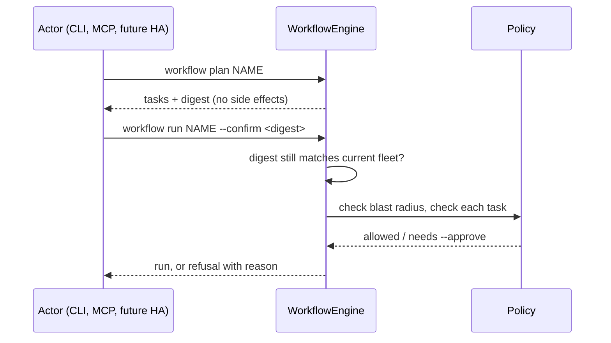

<h1 style="margin: 0 0 8px 0; padding: 0; border: 0; font-size: 2em;">Safety</h1>
<div style="color: #64748b; font-size: 15px; margin: 0 0 16px 0;">Effect classes, protected devices, per-actor policy, and how a confirm verdict is satisfied.</div>

<hr style="border: 0; border-top: 2px solid #005288; margin: 0 0 32px 0;"/>

<sub style="color: #64748b;">Last verified 2026-08-02</sub>

This document is for anyone who will point `fleetctl` at real hardware — your own Fire Sticks, Shield, or PCs — or anyone building a consumer (Home Assistant, an MCP-based agent) on top of it. `fleetctl` can wipe an app's entire profile, disable system packages, install APKs, and deploy to every tagged device in the house. Every one of those is gated deliberately, because the alternative — an agent or automation running unattended with no gate — is not something this project ships.

For the threat model and reporting process, see [`../SECURITY.md`](../SECURITY.md) — this document doesn't repeat it.

<h2 style="border-left: 6px solid #005288; padding: 4px 0 10px 16px; margin: 40px 0 16px; border-bottom: 1px solid rgba(0, 82, 136, 0.25); background-image: url(data:image/svg+xml;utf8,%3Csvg%20xmlns%3D%27http%3A%2F%2Fwww.w3.org%2F2000%2Fsvg%27%20width%3D%27100%25%27%20height%3D%27100%25%27%3E%3Cdefs%3E%3Cpattern%20id%3D%27h%27%20width%3D%2720%27%20height%3D%2735%27%20patternUnits%3D%27userSpaceOnUse%27%3E%3Cpath%20d%3D%27M10%2023L0%2018V6L10%200l10%206v12L10%2023zm0%200v12%27%20fill%3D%27none%27%20stroke%3D%27%23005288%27%20stroke-opacity%3D%270.22%27%2F%3E%3C%2Fpattern%3E%3ClinearGradient%20id%3D%27lg%27%20x1%3D%270%25%27%20x2%3D%27100%25%27%3E%3Cstop%20offset%3D%270%25%27%20stop-color%3D%27white%27%20stop-opacity%3D%271%27%2F%3E%3Cstop%20offset%3D%2785%25%27%20stop-color%3D%27white%27%20stop-opacity%3D%270%27%2F%3E%3C%2FlinearGradient%3E%3Cmask%20id%3D%27f%27%3E%3Crect%20width%3D%27100%25%27%20height%3D%27100%25%27%20fill%3D%27url%28%23lg%29%27%2F%3E%3C%2Fmask%3E%3C%2Fdefs%3E%3Crect%20width%3D%27100%25%27%20height%3D%27100%25%27%20fill%3D%27url%28%23h%29%27%20mask%3D%27url%28%23f%29%27%2F%3E%3C%2Fsvg%3E); background-size: 100% 100%; background-repeat: no-repeat; border-radius: 3px;">Effect Classes</h2>

Every step a pack registers declares one of three effect classes on its `StepSpec`:

| Class | Examples | Policy consequence |
|---|---|---|
| `read` | `firetv.check`, `kodi.check_update` | No approval needed |
| `mutating` | `kodi.capture`, `kodi.build`, `fleet.scan` | May need approval, per actor's `confirm:` list |
| `destructive` | `kodi.deploy`, `firetv.maintain`, `kodi.install_base` | Same as `mutating` — nothing is automatically harder to satisfy, but every default policy in this project's own `fleet.yml.example` puts `destructive` in `confirm:` |

A pack author declares this once, on the step (see [`pack-authoring.md`](pack-authoring.md)). The policy layer keys every approval decision off this declaration — **not** off a hand-maintained list of "dangerous" step names. A new pack that adds a destructive step is gated automatically the moment it's registered, with zero changes anywhere else. `fleetctl steps` shows every registered step's declared effect.

<blockquote style="border-left: 4px solid #c41230; background-color: rgba(196, 18, 48, 0.08); padding: 14px 18px; margin: 16px 0; border-radius: 10px;">

**Warning:** Mislabelling a destructive step as `mutating` (or `read`) silently weakens the approval gate for it. There is no secondary check — the policy trusts the declaration.

</blockquote>

<h2 style="border-left: 6px solid #005288; padding: 4px 0 10px 16px; margin: 40px 0 16px; border-bottom: 1px solid rgba(0, 82, 136, 0.25); background-image: url(data:image/svg+xml;utf8,%3Csvg%20xmlns%3D%27http%3A%2F%2Fwww.w3.org%2F2000%2Fsvg%27%20width%3D%27100%25%27%20height%3D%27100%25%27%3E%3Cdefs%3E%3Cpattern%20id%3D%27h%27%20width%3D%2720%27%20height%3D%2735%27%20patternUnits%3D%27userSpaceOnUse%27%3E%3Cpath%20d%3D%27M10%2023L0%2018V6L10%200l10%206v12L10%2023zm0%200v12%27%20fill%3D%27none%27%20stroke%3D%27%23005288%27%20stroke-opacity%3D%270.22%27%2F%3E%3C%2Fpattern%3E%3ClinearGradient%20id%3D%27lg%27%20x1%3D%270%25%27%20x2%3D%27100%25%27%3E%3Cstop%20offset%3D%270%25%27%20stop-color%3D%27white%27%20stop-opacity%3D%271%27%2F%3E%3Cstop%20offset%3D%2785%25%27%20stop-color%3D%27white%27%20stop-opacity%3D%270%27%2F%3E%3C%2FlinearGradient%3E%3Cmask%20id%3D%27f%27%3E%3Crect%20width%3D%27100%25%27%20height%3D%27100%25%27%20fill%3D%27url%28%23lg%29%27%2F%3E%3C%2Fmask%3E%3C%2Fdefs%3E%3Crect%20width%3D%27100%25%27%20height%3D%27100%25%27%20fill%3D%27url%28%23h%29%27%20mask%3D%27url%28%23f%29%27%2F%3E%3C%2Fsvg%3E); background-size: 100% 100%; background-repeat: no-repeat; border-radius: 3px;">Protected Devices</h2>

A device can be marked protected in config, denying specific steps regardless of who's asking — checked before any actor rule:

<div align="left" style="position: relative; z-index: 1; margin-left: 10px; margin-bottom: -10px;"></div>

```yaml
# config/fleet.yml
policy:
  protected:
    - tags: [gold]
      deny: [kodi.deploy]
      reason: Prove a change on a spare device first.
```

`tags` (every tag a device must carry) or `ids` (explicit device ids) selects what a rule covers; `deny` is step id patterns (`*` denies everything). This project's own `fleet.yml` deliberately leaves `protected:` unset — see [`configuration.md`](configuration.md#policy) for why: a gold device that's also an everyday stick shouldn't be structurally undeployable-to, and `confirm: [destructive]` already means nothing lands unasked.

<h2 style="border-left: 6px solid #005288; padding: 4px 0 10px 16px; margin: 40px 0 16px; border-bottom: 1px solid rgba(0, 82, 136, 0.25); background-image: url(data:image/svg+xml;utf8,%3Csvg%20xmlns%3D%27http%3A%2F%2Fwww.w3.org%2F2000%2Fsvg%27%20width%3D%27100%25%27%20height%3D%27100%25%27%3E%3Cdefs%3E%3Cpattern%20id%3D%27h%27%20width%3D%2720%27%20height%3D%2735%27%20patternUnits%3D%27userSpaceOnUse%27%3E%3Cpath%20d%3D%27M10%2023L0%2018V6L10%200l10%206v12L10%2023zm0%200v12%27%20fill%3D%27none%27%20stroke%3D%27%23005288%27%20stroke-opacity%3D%270.22%27%2F%3E%3C%2Fpattern%3E%3ClinearGradient%20id%3D%27lg%27%20x1%3D%270%25%27%20x2%3D%27100%25%27%3E%3Cstop%20offset%3D%270%25%27%20stop-color%3D%27white%27%20stop-opacity%3D%271%27%2F%3E%3Cstop%20offset%3D%2785%25%27%20stop-color%3D%27white%27%20stop-opacity%3D%270%27%2F%3E%3C%2FlinearGradient%3E%3Cmask%20id%3D%27f%27%3E%3Crect%20width%3D%27100%25%27%20height%3D%27100%25%27%20fill%3D%27url%28%23lg%29%27%2F%3E%3C%2Fmask%3E%3C%2Fdefs%3E%3Crect%20width%3D%27100%25%27%20height%3D%27100%25%27%20fill%3D%27url%28%23h%29%27%20mask%3D%27url%28%23f%29%27%2F%3E%3C%2Fsvg%3E); background-size: 100% 100%; background-repeat: no-repeat; border-radius: 3px;">Per-Actor Policy, Gated on Effect Class</h2>

Every request to run a step or workflow carries an actor identity — `cli:*`, `mcp:*`, and `ha:*` — and policy is expressed per actor, keyed on effect class rather than a per-step allow-list:

<div align="left" style="position: relative; z-index: 1; margin-left: 10px; margin-bottom: -10px;"></div>

```yaml
policy:
  actors:
    "cli:*":
      allow: ["*"]
      confirm: [destructive]
    "mcp:*":
      allow: ["*"]
      confirm: [mutating, destructive]
      max_devices: 3
```

First actor pattern to match wins. `allow`/`deny` are step id glob patterns; `confirm` is a list of effect classes needing explicit approval before that actor's request proceeds; `max_devices` caps how many devices one workflow run can touch. Absent `policy:` entirely → permissive: every actor may run every step, nothing needs approval.

<h2 style="border-left: 6px solid #005288; padding: 4px 0 10px 16px; margin: 40px 0 16px; border-bottom: 1px solid rgba(0, 82, 136, 0.25); background-image: url(data:image/svg+xml;utf8,%3Csvg%20xmlns%3D%27http%3A%2F%2Fwww.w3.org%2F2000%2Fsvg%27%20width%3D%27100%25%27%20height%3D%27100%25%27%3E%3Cdefs%3E%3Cpattern%20id%3D%27h%27%20width%3D%2720%27%20height%3D%2735%27%20patternUnits%3D%27userSpaceOnUse%27%3E%3Cpath%20d%3D%27M10%2023L0%2018V6L10%200l10%206v12L10%2023zm0%200v12%27%20fill%3D%27none%27%20stroke%3D%27%23005288%27%20stroke-opacity%3D%270.22%27%2F%3E%3C%2Fpattern%3E%3ClinearGradient%20id%3D%27lg%27%20x1%3D%270%25%27%20x2%3D%27100%25%27%3E%3Cstop%20offset%3D%270%25%27%20stop-color%3D%27white%27%20stop-opacity%3D%271%27%2F%3E%3Cstop%20offset%3D%2785%25%27%20stop-color%3D%27white%27%20stop-opacity%3D%270%27%2F%3E%3C%2FlinearGradient%3E%3Cmask%20id%3D%27f%27%3E%3Crect%20width%3D%27100%25%27%20height%3D%27100%25%27%20fill%3D%27url%28%23lg%29%27%2F%3E%3C%2Fmask%3E%3C%2Fdefs%3E%3Crect%20width%3D%27100%25%27%20height%3D%27100%25%27%20fill%3D%27url%28%23h%29%27%20mask%3D%27url%28%23f%29%27%2F%3E%3C%2Fsvg%3E); background-size: 100% 100%; background-repeat: no-repeat; border-radius: 3px;">Satisfying a Confirm Verdict</h2>

How a policy `confirm` verdict gets satisfied depends on the surface:

<div style="margin-top: 52px; margin-left: 10px; color: #7986cb; font-size: 10.5px; font-weight: 700; letter-spacing: 2px; line-height: 1;">&#9642; REFERENCE &middot; CLI</div>
<h3 style="margin-top: 4px; margin-left: 10px;">A Human at the CLI</h3>

`fleetctl run` and `fleetctl workflow run` both refuse a `confirm`-flagged step with the policy's reason and tell you to re-run with `--approve`. Nothing runs partially — the refusal happens before anything is touched. See [`cli-reference.md`](cli-reference.md#run) for both commands.

<div style="margin-top: 52px; margin-left: 10px; color: #7986cb; font-size: 10.5px; font-weight: 700; letter-spacing: 2px; line-height: 1;">&#9642; REFERENCE &middot; Agent Toolkit</div>
<h3 style="margin-top: 4px; margin-left: 10px;">An Agent (MCP, or a Future HA Integration)</h3>

`Toolkit.run_step` / `start_step` raise `ApprovalRequired` — with the reason and a description of what would run — rather than returning a status the caller could mistake for success. The caller is expected to show the user what would change and call again with `approve=True`. A denial (`PolicyDenied`) is not answerable by approving; the caller must not retry it.

<h2 style="border-left: 6px solid #005288; padding: 4px 0 10px 16px; margin: 40px 0 16px; border-bottom: 1px solid rgba(0, 82, 136, 0.25); background-image: url(data:image/svg+xml;utf8,%3Csvg%20xmlns%3D%27http%3A%2F%2Fwww.w3.org%2F2000%2Fsvg%27%20width%3D%27100%25%27%20height%3D%27100%25%27%3E%3Cdefs%3E%3Cpattern%20id%3D%27h%27%20width%3D%2720%27%20height%3D%2735%27%20patternUnits%3D%27userSpaceOnUse%27%3E%3Cpath%20d%3D%27M10%2023L0%2018V6L10%200l10%206v12L10%2023zm0%200v12%27%20fill%3D%27none%27%20stroke%3D%27%23005288%27%20stroke-opacity%3D%270.22%27%2F%3E%3C%2Fpattern%3E%3ClinearGradient%20id%3D%27lg%27%20x1%3D%270%25%27%20x2%3D%27100%25%27%3E%3Cstop%20offset%3D%270%25%27%20stop-color%3D%27white%27%20stop-opacity%3D%271%27%2F%3E%3Cstop%20offset%3D%2785%25%27%20stop-color%3D%27white%27%20stop-opacity%3D%270%27%2F%3E%3C%2FlinearGradient%3E%3Cmask%20id%3D%27f%27%3E%3Crect%20width%3D%27100%25%27%20height%3D%27100%25%27%20fill%3D%27url%28%23lg%29%27%2F%3E%3C%2Fmask%3E%3C%2Fdefs%3E%3Crect%20width%3D%27100%25%27%20height%3D%27100%25%27%20fill%3D%27url%28%23h%29%27%20mask%3D%27url%28%23f%29%27%2F%3E%3C%2Fsvg%3E); background-size: 100% 100%; background-repeat: no-repeat; border-radius: 3px;">Plan-Then-Run for Workflows</h2>

A workflow can never run against a plan nobody looked at. `workflow plan` returns every task it would run plus a digest; `workflow run` requires `--confirm <digest>` and refuses if the fleet changed since — a device added, a tag edited — because the digest won't match:



A single step run via `fleetctl run` or `Toolkit.run_step` has no plan/digest step — it's one step against one device (or the fleet), gated by `--approve` alone.

<h2 style="border-left: 6px solid #005288; padding: 4px 0 10px 16px; margin: 40px 0 16px; border-bottom: 1px solid rgba(0, 82, 136, 0.25); background-image: url(data:image/svg+xml;utf8,%3Csvg%20xmlns%3D%27http%3A%2F%2Fwww.w3.org%2F2000%2Fsvg%27%20width%3D%27100%25%27%20height%3D%27100%25%27%3E%3Cdefs%3E%3Cpattern%20id%3D%27h%27%20width%3D%2720%27%20height%3D%2735%27%20patternUnits%3D%27userSpaceOnUse%27%3E%3Cpath%20d%3D%27M10%2023L0%2018V6L10%200l10%206v12L10%2023zm0%200v12%27%20fill%3D%27none%27%20stroke%3D%27%23005288%27%20stroke-opacity%3D%270.22%27%2F%3E%3C%2Fpattern%3E%3ClinearGradient%20id%3D%27lg%27%20x1%3D%270%25%27%20x2%3D%27100%25%27%3E%3Cstop%20offset%3D%270%25%27%20stop-color%3D%27white%27%20stop-opacity%3D%271%27%2F%3E%3Cstop%20offset%3D%2785%25%27%20stop-color%3D%27white%27%20stop-opacity%3D%270%27%2F%3E%3C%2FlinearGradient%3E%3Cmask%20id%3D%27f%27%3E%3Crect%20width%3D%27100%25%27%20height%3D%27100%25%27%20fill%3D%27url%28%23lg%29%27%2F%3E%3C%2Fmask%3E%3C%2Fdefs%3E%3Crect%20width%3D%27100%25%27%20height%3D%27100%25%27%20fill%3D%27url%28%23h%29%27%20mask%3D%27url%28%23f%29%27%2F%3E%3C%2Fsvg%3E); background-size: 100% 100%; background-repeat: no-repeat; border-radius: 3px;">Blast-Radius Caps</h2>

`max_devices` on an actor rule (or `default_max_devices` on the policy as a whole) bounds how many devices a single workflow run can fan out to, independent of how a tag-based target resolves. This is the backstop for the case a plan digest doesn't catch: a correctly-planned run against a target set that's simply larger than it should be for one operation. Checked via `Policy.check_blast_radius()` before a workflow executes.

<h2 style="border-left: 6px solid #005288; padding: 4px 0 10px 16px; margin: 40px 0 16px; border-bottom: 1px solid rgba(0, 82, 136, 0.25); background-image: url(data:image/svg+xml;utf8,%3Csvg%20xmlns%3D%27http%3A%2F%2Fwww.w3.org%2F2000%2Fsvg%27%20width%3D%27100%25%27%20height%3D%27100%25%27%3E%3Cdefs%3E%3Cpattern%20id%3D%27h%27%20width%3D%2720%27%20height%3D%2735%27%20patternUnits%3D%27userSpaceOnUse%27%3E%3Cpath%20d%3D%27M10%2023L0%2018V6L10%200l10%206v12L10%2023zm0%200v12%27%20fill%3D%27none%27%20stroke%3D%27%23005288%27%20stroke-opacity%3D%270.22%27%2F%3E%3C%2Fpattern%3E%3ClinearGradient%20id%3D%27lg%27%20x1%3D%270%25%27%20x2%3D%27100%25%27%3E%3Cstop%20offset%3D%270%25%27%20stop-color%3D%27white%27%20stop-opacity%3D%271%27%2F%3E%3Cstop%20offset%3D%2785%25%27%20stop-color%3D%27white%27%20stop-opacity%3D%270%27%2F%3E%3C%2FlinearGradient%3E%3Cmask%20id%3D%27f%27%3E%3Crect%20width%3D%27100%25%27%20height%3D%27100%25%27%20fill%3D%27url%28%23lg%29%27%2F%3E%3C%2Fmask%3E%3C%2Fdefs%3E%3Crect%20width%3D%27100%25%27%20height%3D%27100%25%27%20fill%3D%27url%28%23h%29%27%20mask%3D%27url%28%23f%29%27%2F%3E%3C%2Fsvg%3E); background-size: 100% 100%; background-repeat: no-repeat; border-radius: 3px;">Every Denial Is Audited</h2>

A protected-device denial, a policy denial, and a blast-radius cap hit are each recorded as an audit event before the exception reaches the caller. A policy that silently refuses without a record is undebuggable — exactly the failure mode this design avoids. See [`observability.md`](observability.md) for the audit chain itself.

<h2 style="border-left: 6px solid #005288; padding: 4px 0 10px 16px; margin: 40px 0 16px; border-bottom: 1px solid rgba(0, 82, 136, 0.25); background-image: url(data:image/svg+xml;utf8,%3Csvg%20xmlns%3D%27http%3A%2F%2Fwww.w3.org%2F2000%2Fsvg%27%20width%3D%27100%25%27%20height%3D%27100%25%27%3E%3Cdefs%3E%3Cpattern%20id%3D%27h%27%20width%3D%2720%27%20height%3D%2735%27%20patternUnits%3D%27userSpaceOnUse%27%3E%3Cpath%20d%3D%27M10%2023L0%2018V6L10%200l10%206v12L10%2023zm0%200v12%27%20fill%3D%27none%27%20stroke%3D%27%23005288%27%20stroke-opacity%3D%270.22%27%2F%3E%3C%2Fpattern%3E%3ClinearGradient%20id%3D%27lg%27%20x1%3D%270%25%27%20x2%3D%27100%25%27%3E%3Cstop%20offset%3D%270%25%27%20stop-color%3D%27white%27%20stop-opacity%3D%271%27%2F%3E%3Cstop%20offset%3D%2785%25%27%20stop-color%3D%27white%27%20stop-opacity%3D%270%27%2F%3E%3C%2FlinearGradient%3E%3Cmask%20id%3D%27f%27%3E%3Crect%20width%3D%27100%25%27%20height%3D%27100%25%27%20fill%3D%27url%28%23lg%29%27%2F%3E%3C%2Fmask%3E%3C%2Fdefs%3E%3Crect%20width%3D%27100%25%27%20height%3D%27100%25%27%20fill%3D%27url%28%23h%29%27%20mask%3D%27url%28%23f%29%27%2F%3E%3C%2Fsvg%3E); background-size: 100% 100%; background-repeat: no-repeat; border-radius: 3px;">What This Document Doesn't Cover</h2>

The threat model — what's in scope for a security report, standing risks like the ADB private key having no expiry, and the practices the project holds itself to around secrets and redaction — lives in [`../SECURITY.md`](../SECURITY.md). Read that alongside this document rather than looking for it here.

<br/><br/>

<hr style="border: 0; border-top: 1px solid rgba(100, 116, 139, 0.35); margin: 24px 0;"/>

<br/>

<table>
<tr>
<td width="22%" valign="top" align="center">

<br/>
<strong>fleetctl</strong>
<br/><br/>
<sub>Safety</sub>

</td>
<td width="26%" valign="top">

<h4><ins style="color: #2a8b93; text-decoration: none;">Documentation</ins></h4>

- [Getting Started](getting-started.md)
- [CLI Reference](cli-reference.md)
- [Configuration](configuration.md)
- [Architecture](architecture.md)
- [Documentation Index](README.md)

</td>
<td width="26%" valign="top">

<h4><ins style="color: #2a8b93; text-decoration: none;">Repositories</ins></h4>

- [fleetctl](https://github.com/salvuswarez/fleetctl)
- [firestick_manager](https://github.com/salvuswarez/firestick_manager) &mdash; predecessor
- [ha-cyberpunk](https://github.com/salvuswarez/ha-cyberpunk) &mdash; Home Assistant integration

<h4><ins style="color: #2a8b93; text-decoration: none;">References</ins></h4>

- [Observability](observability.md) &mdash; diagnostics, timeline, audit
- [Security Policy](../SECURITY.md) &mdash; threat model, reporting

</td>
<td width="26%" valign="top">

<h4><ins style="color: #2a8b93; text-decoration: none;">About</ins></h4>

- Plugin-based home device fleet manager
- MIT licensed


</td>
</tr>
</table>

<br/>

<hr style="border: 0; border-top: 1px solid rgba(100, 116, 139, 0.35); margin: 24px 0;"/>

<div align="center">
  <sub>fleetctl</sub>
</div>
