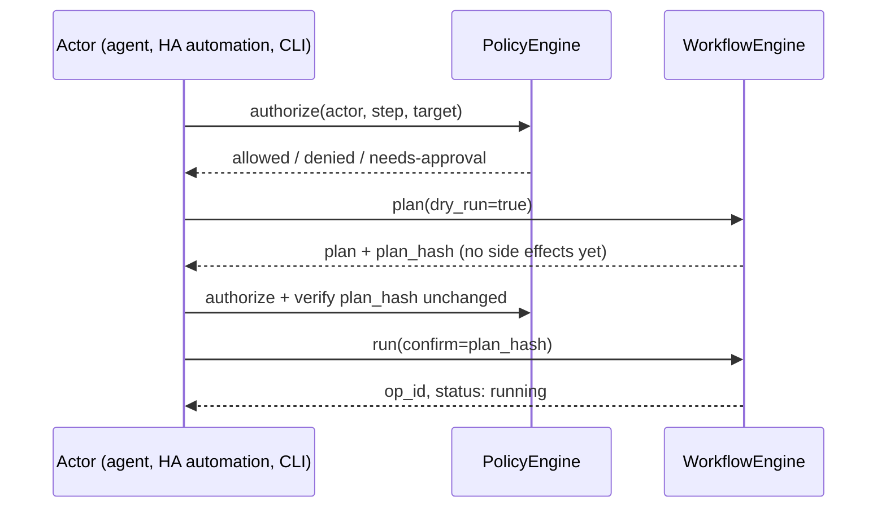
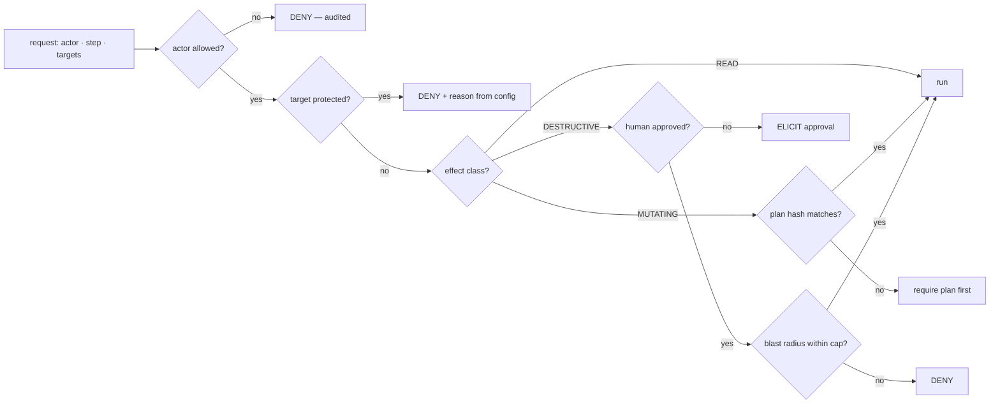

# Safety

> [!IMPORTANT]
> **Status: planned (S4).** There is no `PolicyEngine`, no protected-device enforcement, no plan-hash mechanism, and no blast-radius cap in the code today — none of `core/` exists yet. This documents the settled design from [`architecture.md`](architecture.md) §10–§11 so anyone reasoning about what `fleetctl` will and won't let happen has the full picture before it's built. For the threat model and reporting process, see [`../SECURITY.md`](../SECURITY.md) — this document doesn't repeat it.

This document is for anyone who will eventually point `fleetctl` at real hardware — your own Fire Sticks, Shield, or PCs — or anyone building a consumer (Home Assistant, an MCP-based agent) on top of it. `fleetctl` is designed to be able to wipe an app's entire profile, disable dozens of system packages, install APKs, and reboot every device in the house. Every one of those has to be gated deliberately, because the alternative — an agent or automation running unattended with no gate — is not something this project is willing to ship.

## Effect classes: the highest-consequence declaration in the codebase

Every step a pack registers declares one of three effect classes:

| Class | Examples | Policy consequence |
|---|---|---|
| `READ` | `getprop`, `stat`, `ls`, `df` | No approval needed; routed to diagnostic logging only |
| `MUTATING` | `settings put`, a file push, `rm` on a scoped path | Audited; non-CLI actors need approval |
| `DESTRUCTIVE` | `rm -rf`, `pm disable-user`, `pm install`, a full profile deploy | Audited; approval required for every actor except a human at a CLI |

A pack author declares this once, on the step (see [`pack-authoring.md`](pack-authoring.md)). The policy layer keys every approval and audit-routing decision off this declaration — **not** off a hand-maintained list of "dangerous" step names. That distinction matters concretely: a new pack that adds a destructive step is gated automatically the moment it's registered, with zero changes anywhere else. An allow-list approach would have silently permitted it until someone remembered to update the list.

**Mislabelling a destructive step as `MUTATING` (or worse, `READ`) silently bypasses the approval gate.** There is no secondary check. This is why the pack-authoring checklist puts it first, and why S4's exit criterion — the gold device is structurally undeployable-to without a config edit — exists to prove the whole chain works before anything agent-facing (S6) is allowed to exist.

## Protected devices

A device can be marked protected in config, denying specific steps regardless of who's asking:

```yaml
# config/fleet.yml
policy:
  protected:
    - match: { tags: [gold] }
      deny: [kodi.deploy, device.maintain]
      reason: >
        Gold capture source. Prove changes on a disposable device first,
        then redeploy through the pipeline — never hand-edit.
```

This exists because of a rule that already lives in `firestick_manager`'s project memory today, enforced by nobody but the person who remembers it: the gold-source device — the one every Kodi capture is pulled from — should only ever be deployed to once a change is proven elsewhere. Today that's tribal knowledge. Under the policy layer it's a config rule the engine enforces for **every** actor, CLI included, and `protected` outranks everything else in the policy evaluation — see the decision flow below.

## Per-actor policy, gated on effect class

Every request to run a step or workflow carries an actor identity — `cli:*`, `ha:*`, `mcp:*` — and policy is expressed per actor, keyed on effect class rather than a per-step allow-list:

```yaml
policy:
  actors:
    "mcp:*":
      allow:   ["*"]
      confirm: [MUTATING, DESTRUCTIVE]     # by effect class, not by name
      require_plan: true

    "ha:*":
      allow:   ["*"]
      confirm: [DESTRUCTIVE]

    "cli:*":
      allow:   ["*"]
      confirm: []                          # a human at a terminal is the approval

  defaults:
    max_devices_per_run: 3                 # blast-radius cap
```

Every actor may reach any registered step or workflow — there's no closed allow-list to fall behind as new packs register steps. What differs per actor is **which effect classes require confirmation before running**. A human running the CLI is treated as their own approval. Home Assistant automations run unattended, so they get standing approval up through `MUTATING` and stop at `DESTRUCTIVE`. An MCP-driven agent needs confirmation for anything beyond `READ`, plus a matching plan hash.

Home Assistant becoming an actor under this model (`ha:*`) is a deliberate behaviour change from today, where the integration can do anything the underlying package can — see [`architecture.md`](architecture.md) §11 (D12). Expect to update HA automations and the Cyberpunk panel at cutover (S7).

## Plan-then-run with a plan hash

For anything beyond `READ`, the engine requires a plan step before a run step, and the run step must reference the hash of the exact plan that was just fetched:



If the fleet changed underneath the plan — a device came online, a newer build appeared — the hash no longer matches and the actor has to re-plan. This is what prevents "planned against one device, ran against six" when targets are expressed as tags rather than explicit ids. The plan itself is recorded as a `PLAN` audit event whether or not a run follows, so intent is on the record even when nothing executes (see [`observability.md`](observability.md)).

## Blast-radius caps

`max_devices_per_run` bounds how many devices a single run can fan out to, independent of how a `--batch`-equivalent target (a tag matching many devices) resolves. This is the backstop for the case a plan hash doesn't catch: a correctly-planned run against a target set that's simply larger than it should be for one operation.

## The full decision flow



Every branch that denies — including a protected-device denial and a blast-radius cap hit — is itself an audited event. A policy that silently refuses without a record is undebuggable, which is exactly the failure mode this design is built to avoid.

## Ordering: policy and audit come before MCP

`architecture.md` §14 calls out one sequencing rule as genuinely hard to walk back: **S4 (policy + audit hardening) lands before S6 (the MCP adapter).** Shipping agent-facing tools over a fleet with no policy layer and no audit trail is the one mistake in the build plan you can't cleanly undo after the fact — once an agent has run unaudited destructive operations against real devices, there's no retroactive fix. See [`roadmap.md`](roadmap.md) for the full stage sequencing.

## What this document doesn't cover

The threat model — what's in scope for a security report, standing risks like the ADB private key having no expiry, and the practices the project holds itself to around secrets and redaction — lives in [`../SECURITY.md`](../SECURITY.md). Read that alongside this document rather than looking for it here.
